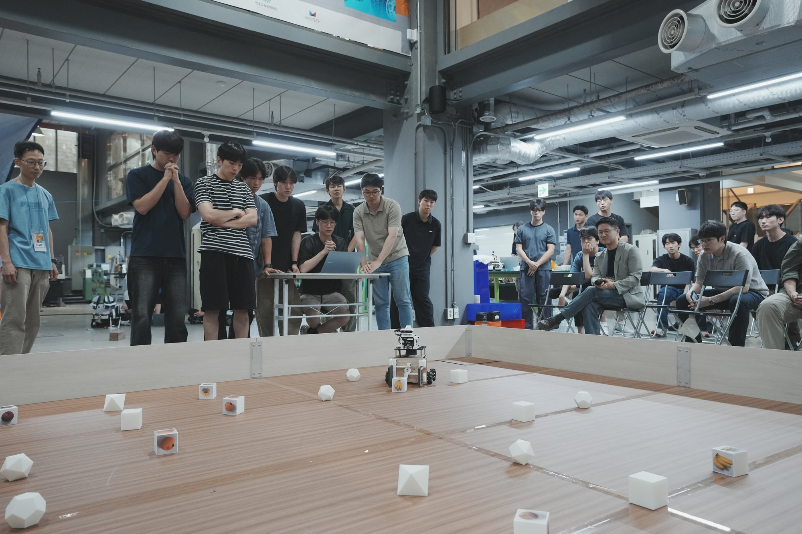
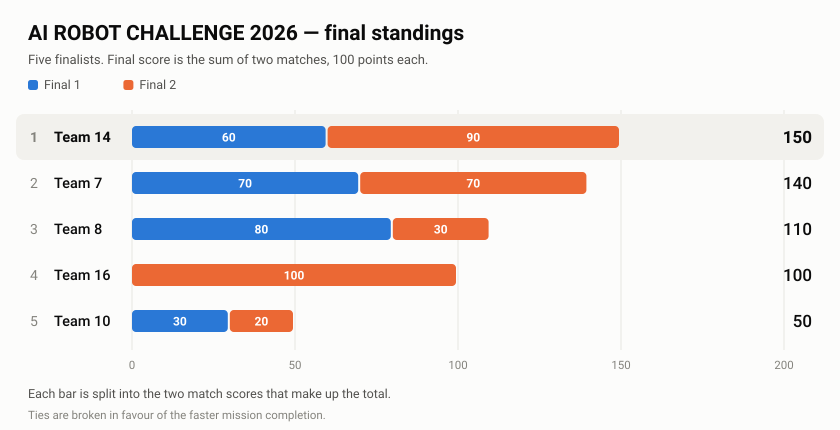
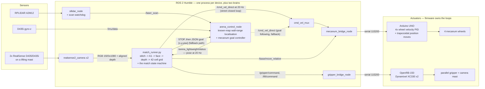
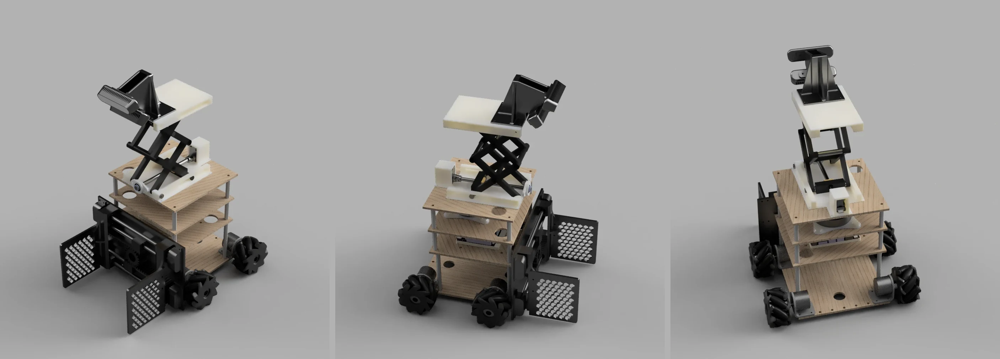
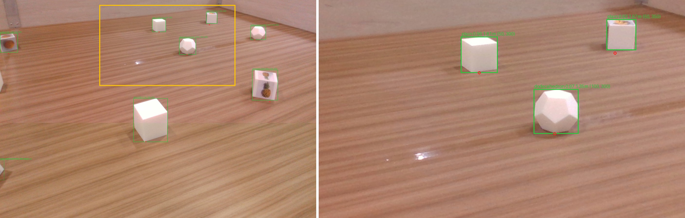

# DDONGGAE 똥개

**D**NN-based **D**etection of **O**bjects with **N**avigation and **G**oal-oriented **G**rasping
for **A**utonomous **E**rrands.

An autonomous mobile manipulator that finds, identifies, grasps and stores 8 cm objects in a
4 m × 4 m arena inside a 3-minute round — **no Nav2, no AMCL, no TF tree, and not one
hand-labelled training image.** 1st place of 16 teams at the SNU AI ROBOT CHALLENGE 2026.

### Why 똥개?

**똥개** (*ddong-gae*) is Korean for a mongrel — a scruffy, unpedigreed street dog. It is an
insult and a term of affection at the same time, depending entirely on how you say it. Ours was
said with affection, at volume: **달려라 똥개** — *"run, mutt!"* — which became the team chant.

The name came from the robot's single most consequential limitation: one gripper, **one object at a
time**. That turns a match from a search problem into a running problem — drive out, pick up, run
it all the way back to the bin in the opposite corner, repeat. Seven objects in three minutes is
seven round trips, so the robot spends almost the whole match sprinting across the arena carrying
one cube. It is a very familiar image.

So the joke is also the design brief. A **25-second budget per object** falls straight out of it
(180 s ÷ 7), and nearly every engineering decision here — the free "highway" along the empty band
of the arena, the street router, deleting Nav2 for a localiser 17–22× faster, cutting rotation
because turning was collapsing the pose estimate — exists to make those round trips shorter.

[](LICENSE)
[](docs/04-getting-started.md)
[](docs/04-getting-started.md)
[](docs/07-results-and-lessons.md)

<table>
  <tr>
    <td width="33.3%"></td>
    <td width="33.3%"></td>
    <td width="33.3%"></td>
  </tr>
</table>

<!-- STILL TO ADD:
     VIDEO       replace every <YOUTUBE_URL> in this file, media/video/README.md
                 and docs/07-results-and-lessons.md with the organisers' recording URL -->

> Full competition video: `<YOUTUBE_URL>` *(to be added when the organisers publish it)*

---

## Result

**1st of 16 teams**, SNU AI ROBOT CHALLENGE 2026. Five teams reached the final; the final standing is
the sum of two matches, 200 points maximum, ties broken by fastest mission completion.

<picture>
  <source media="(prefers-color-scheme: dark)" srcset="docs/assets/final-standings-dark.svg">
  
</picture>

Our two rounds, with the target classes drawn for each:

| | Targets | Collected | Score |
|---|---|---|---:|
| Final 1 | octahedron · pineapple | 3 fruit cubes | 60 |
| Final 2 | octahedron · banana | 3 shapes + 3 fruit cubes | 90 |

Scoring is 10 points per shape object and 20 per fruit cube, so one perfect match is 100 (4 shapes +
3 fruit cubes). We reached the final by placing in the qualifiers, which are weighted 10 % for the
first round and 90 % for the second; we scored 60 in both.

No match we ever ran was close to perfect, and we lost points three separate ways — all three are
documented at the same level of detail as the wins:

- **Qualifiers** — the apple printed on the arena cubes was a **yellowish, under-ripe apple**, not
  the red one announced beforehand. Our face model, trained on synthetic renders of a red apple,
  mis-predicted it. A textbook train/deploy colour domain gap.
- **Final 1** — the **gripper stopped reporting**. The robot routed to each object correctly, but
  the OpenRB board went quiet mid-match: one octahedron was carried and released without the grasp
  ever being confirmed (almost certainly an empty hand, and it scored nothing), and two more were
  refused outright because the gripper actively declared itself empty. Landing that one grasp would
  have made the match 70, not 60 — the run's own estimate. We also went 189.8 s against a 180 s
  budget, and the runner crashed on a seventh object seconds after it was dropped in.
- **Final 2** — **ran out of time.** The 180 s timeout expired while the last object was being
  grasped, and only what is inside the box at time-up scores.

Full post-mortem with measured numbers: [`docs/07-results-and-lessons.md`](docs/07-results-and-lessons.md).

---

## What it does

The robot starts in a 40 × 40 cm corner zone of a 4 m × 4 m walled arena that contains 28 white
3D-printed objects on a known 42-point, 50 cm grid — polyhedra worth 10 points each and cubes with
fruit photographs on three of their six faces worth 20 each. Two target classes are announced, the
second of them **one minute** before the start signal, after which nobody may touch the computer.
Within 180 seconds and with every computation on board a Jetson Orin Nano, it drives to the arena
centre, raises a camera mast, takes twelve stitched captures at 30° steps, votes each detection onto
the 42-cell grid, then works through the confirmed targets — the 20-point fruit set first, and in
the two finals ranked by expected value rather than distance — re-verifies each identity at close
range, grasps it, carries it to the storage box at the far end of the start wall and drops it on a
precomputed slot. Picking up the wrong object costs twice its value, so refusing to pick is a
legitimate — often optimal — outcome, and the collection loop is built around that asymmetry.



Nine long-lived processes, no custom message package — every structured payload is a
`std_msgs/String` carrying JSON, so the whole graph is `ros2 topic echo`-readable with nothing
built. The exhaustive graph, with every topic, QoS profile, JSON schema and serial line, is in
[`docs/03-ros2-interfaces.md`](docs/03-ros2-interfaces.md).

The solid `/cmd_vel_direct` edge is the one that carried every match. The mission runner sends the
arena node a `STOP` first — releasing its goal following — and then drives the base itself at 20 Hz
through [`navigation/street_nav.py`](navigation/street_nav.py), because the corridors are only
25 cm wide and the gripper sticks 26 cm out in front. Goal following is the dashed edge: the
fallback we kept for the legacy route (`--nav legacy`).

---

## The three parts

### [Hardware](hardware/README.md)



A 4-wheel mecanum base with a three-deck plate stack, a servo-driven camera mast carrying both
RealSense units, and one parallel gripper. The mast exists for one reason: it goes up for the
centre scan. A fruit cube's three photographed faces are its top and one opposing pair of sides,
so the **top** face is the only one visible from every direction — from chassis height it is
edge-on and contributes nothing, and whether you see a photograph at all comes down to which way
the cube happens to be turned. The 148.9 mm of stroke puts the top camera at 0.4986 m and steepens
the look-down enough to read those top faces, while also cutting how much the objects occlude each
other. Two microcontrollers own all motion primitives: an
Arduino UNO runs the four wheel-velocity PIDs and synchronised trapezoidal position moves
(`d dx dy dyaw` → `DONE,move`), and an OpenRB-150 owns the gripper and the mast lift on a single
tty. The headline fact is that two of the drive constants are **fitted, not measured** —
`wheel_radius_m` 0.0388 against a physical 0.040, and a rotation geometry of 0.198 m against a
physical 0.275 m — because a commanded 90° yaw produced 158° of real rotation until they were
recalibrated against the gyro. Copy the physical values and every position move is wrong.

### [Object detection](perception/README.md)

<a href="media/perception/scan.mp4"></a>

Three stages, in the configuration that played the finals: full-frame A1 shape segmentation on the
stitched dual-camera frame (`cube_like_object` / octahedron / dodecahedron / icosahedron), then
every cube crop batched into one 224 × 224 BGR face-identity pass (apple / orange / banana /
pineapple / plain), then a binary pair verifier (MobileNetV3, ONNX) as a second opinion on the
fruit faces, then depth back-projection into the map and a per-cell vote across the 12-shot spin.

Both YOLO stages started from **zero hand-labelled images** — the training set was rendered in
BlenderProc. That stopped being the whole story on the last night: the face weight that played the
two finals is a fine-tune on photographs of the actual arena objects, hand-checked by an operator,
and the banana/pineapple verifier that ran beside it was retrained the same way. On a held-out
arena set (60 scenes, 573 objects) A1 scores box mAP50 0.831 / mAP50-95 0.729 — published next to the
0.9941 it scores on the split it was trained on, because that is the number that would have
fooled us.

### [Navigation](navigation/README.md)


One `rclpy` node, no Nav2 and no framework underneath it. The arena is a known empty rectangle and
the LiDAR plane at 0.32 m clears every 8 cm object, so every return is a wall: the localiser scores
each beam against the **analytic** ray/rectangle range of the four walls, ~30 float operations per
beam, pure Python standard library with no numpy in the hot path.

The approach we replaced — generic occupancy-grid scan matching, the Nav2/AMCL way — took
**345–449 ms** per solve on this robot. Ours takes **20.35 ms** on a synthetic 1080-beam scan and a
median of **28.2 ms** on the Jetson across 2,132 real scans. At a 10 Hz LiDAR that is the difference
between running 3–4 scans behind and comfortably inside one scan period; the old latency is why the
pose used to jump and the driven path used to bend. Yaw comes from integrating gyro-z forward
between scans, which is what makes a 90°-symmetric square arena solvable at all.

The mission layer that drives all three — [`mission/match_runner.py`](mission/README.md), 5,291
lines — and the [Isaac Sim kinematic surrogate](simulation/README.md) that ran the *same* file
against ground truth are documented separately.

---

## Highlights

- **We deleted Nav2 and measured why.** Full occupancy-grid scan matching: 345–449 ms per solve,
  with pose yaw jumping and driven paths bending. The closed-form wall-range replacement is ~90
  lines and 17–22× faster. The price is stated too: the map must be a known correct rectangle, the
  initial pose must be seeded by an operator, and there is no dynamic obstacle avoidance worth the
  name. [ADR-0001](docs/adr/0001-drop-nav2.md).
- **Every weight started from BlenderProc renders — and the last night broke that.** Right up to the
  qualifiers, nothing in the project had been hand-labelled: when the organisers clarified the face
  rule four days out, the fix was three lines and a re-render instead of a re-annotation. Then the
  arena's apple turned out to be the wrong colour, and the answer was photographs of the real
  objects, an operator relabelling ~74 crops by eye and dropping ~60 more, and an overnight
  fine-tune. That weight, and a banana/pineapple verifier retrained the same way, are what played
  the two finals. The synthetic-only claim is true of the qualifiers, not of the trophy.
- **Two runtime contracts that fail silently.** Mind the RGB↔BGR convention, and mind the gap
  between the size the model was trained at and the `imgsz` it is called with on the robot. Get
  either wrong and accuracy collapses — with no error raised and every log line still looking
  healthy. Details in [`perception/docs/models.md`](perception/docs/models.md).
- **Batch, don't loop: 3.86×.** Five crops through one `predict()` call take 10.9 ms; the same five
  crops in a Python `for` loop take 42.2 ms. Nothing about the model changes. The same discipline
  took the whole pipeline from 1.29 FPS (the earlier 4-stage cascade) to 3.83 FPS on an identical
  30 s capture.
- **The street router.** Because the rulebook only ever places objects on a 50 cm grid, the midlines
  between grid rows and columns are 25 cm corridors that are free *by construction* — so the router
  snaps onto a fixed street grid and verifies clearance instead of inflating a costmap (a 0.31 m
  circumscribed inflation marks every legal street blocked). After the 2026-07-20 fix: 0 of 28
  targets intruded on an object cell, minimum clearance 0.250 m, against 6 intrusions and 4.8 cm
  before it.
- **Sensorless grasp verification.** The gripper has no force sensor and its current reading is
  useless (an empty hand saturates at ~113 raw against a goal of 120). The *settled finger-position
  gap* separates cleanly instead: 3.0–3.2° empty versus 14.1° holding an icosahedron, threshold
  8.0°, and the whole check fits in 0.85 s.
- **The match was planned in simulation, not on the robot.** A perfect round is 7 objects in 180 s
  — a **25-second budget per object** — and a wrong pickup costs *double* the object's value. The
  Isaac Sim kinematic surrogate runs `mission/match_runner.py` unmodified against known ground
  truth, with a per-object phase breakdown (route / face / approach / grasp / carry), so time could
  be attributed rather than guessed at. That is where excess rotation was identified as the thing
  collapsing the localiser, and where an ~8 s deadband-parking-plus-settling grind was found and
  removed. No physics required — just the real state machine, a real map and a clock.
  [`simulation/README.md`](simulation/README.md)

---

## Quickstart

Three of these need no robot, no GPU, no ROS installation and no model weights.

```bash
git clone https://github.com/YenCho/ddonggae
cd ddonggae

# 1. the mission logic, self-testing: GT parser, street router (incl. the 28-object
#    regression case), 42-cell snap, storage slot layout, competition candidate filter
python3 mission/match_runner.py --offline

# 2. the unit tests that need no ROS — 47 pass in ~2 s
#    (localisers, mecanum kinematics + odometry, stitch geometry, grasp alignment, web UI)
python3 -m pytest tests/ -q --ignore=tests/test_controllers.py

# 3. with ROS 2 Humble: build the four packages, then run the full suite
source /opt/ros/humble/setup.bash
colcon build --symlink-install --base-paths hardware/ros2 navigation/ros2 third_party
source install/setup.bash && python3 -m pytest tests/ -q

# 4. the perception weights (not in git — Ultralytics derivatives, AGPL-3.0)
scripts/fetch_models.sh
```

`match_runner.py --offline` prints its self-test in Korean; the shipped script logs in Korean
throughout, and the reasoning in those log lines and code comments is translated into these docs
rather than deleted.

Then: [`docs/04-getting-started.md`](docs/04-getting-started.md) to bring the stack up on a robot,
and [`docs/05-field-runbook.md`](docs/05-field-runbook.md) for the competition-day procedure as it
was actually operated. Read [`docs/04` §10](docs/04-getting-started.md) first if you intend to
reproduce results — the stitch calibration, the camera mount geometry, the venue photometry and the
TensorRT engines are ours and do not transfer.

---

## Repository layout

```
.
├── hardware/        the machine: Arduino UNO + OpenRB-150 firmware, the two ROS 2 bridge
│                    packages, the numbered 00..53 bring-up/calibration chain, URDF + meshes
├── perception/      fieldlib.py (the shared runtime contract), geometry.py, the stitch and
│                    photometry calibration, training entry points, offline evaluators
├── navigation/      arena_lightweight_control — the entire Nav2-free localisation and
│                    control stack, its map, its launch file and its web operator console
├── mission/         match_runner.py, the 5,291-line program that played every match, plus
│                    field_autopilot.py (bring up / health-check / capture / teleop / down)
├── simulation/      Isaac Sim kinematic surrogate: same topics, same mission file, known
│                    ground truth. Explicitly not a physics validator
├── docs/            01..08 numbered guides, five ADRs, CREDITS  ->  docs/README.md
├── scripts/         the wrappers actually typed in the field, run_match_day.sh first
├── tests/           pytest; no robot, no GPU
├── third_party/     vendored sllidar_ros2 (BSD-2), pinned to the revision that competed
└── media/           robot renders, competition photographs, the scan clip and run figures
```

---

## What didn't work

Three ideas that looked obviously correct, were built, were measured, and lost — a binary
apple-vs-orange / banana-vs-pineapple verifier pair that was *more* accurate in isolation yet cost
11 points of face-level accuracy as a decision rule (85.7 % with verifiers off versus 74.3 % for the
best gated configuration, over a 780-configuration sweep on 175 real face patches) — though that
verdict was about the *synthetic-trained* verifiers, and a banana/pineapple one retrained on real
photographs earned its place back in the finals; a distance gate
that was tuned for three weeks and turned out to be masking a two-line inference bug; and
ground-contact ranging, which is exact for a cube and systematically long for a sphere-like
polyhedron, producing 0/4 icosahedron grasps on 2026-07-20 before it was replaced by depth
sampling.

All three, plus the three competition failures and ten transferable lessons, are in
[`docs/07-results-and-lessons.md`](docs/07-results-and-lessons.md).

---

## Team

Seven people built this robot. Names, GitHub accounts, how the work split, and the tooling
disclosure are in [`docs/CREDITS.md`](docs/CREDITS.md).

---

## License, citation, acknowledgements

The code and documentation in this repository are **MIT** licensed ([`LICENSE`](LICENSE)). Two
things in it are not:

- **Model weights** are Ultralytics YOLO derivatives and therefore **AGPL-3.0**. They are published
  as GitHub Release assets, fetched by `scripts/fetch_models.sh`, and are not in this tree.
- **Training textures and backgrounds are not redistributed.** The fruit-face texture pool is
  built from three public datasets (65 % Fruits-360, CC BY-SA 4.0, among others — web-scraped
  images were deliberately excluded), but the share-alike and attribution obligations, and the
  COCO 2017 background terms, are theirs to carry; only the generation and filtering scripts are
  published. See [`NOTICE`](NOTICE) for the full third-party list, including the vendored Slamtec
  `sllidar_ros2` driver (BSD-2-Clause).

The competition rules are the organisers' property and are paraphrased, never reproduced, in
[`docs/01-competition-and-rules.md`](docs/01-competition-and-rules.md).

To cite this work, use [`CITATION.cff`](CITATION.cff) (GitHub's "Cite this repository" button reads
it directly):

```bibtex
@software{ddonggae_2026,
  title  = {DDONGGAE: an autonomous polyhedron-collecting robot},
  author = {Cho, Yeonwoo and Kim, Jaeyoung and Jang, Minjoon and Lim, Junhwan
            and Kim, Minseok and Kim, Junseo and Han, Seojun},
  year   = {2026},
  url    = {https://github.com/YenCho/ddonggae},
  license = {MIT}
}
```

**Acknowledgements** — the organisers of the SNU AI ROBOT CHALLENGE 2026
for the arena, the rulebook and the venue; Slamtec, ROBOTIS, Intel RealSense, NVIDIA (Isaac Sim),
Ultralytics and the BlenderProc and Blender projects, whose work this robot is built on top of and
whose licences are enumerated in [`NOTICE`](NOTICE).
