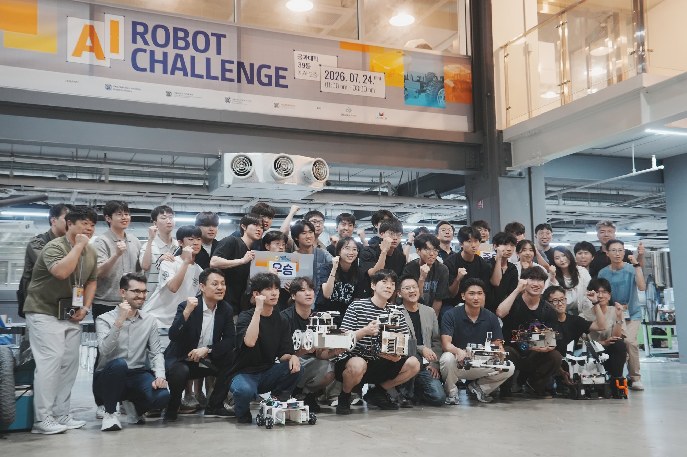

# The Competition and Its Rules

Every design decision in this repository answers to a specific rule. This page states the
constraints in our own words, then maps each one to the code it produced.

> **Authority.** This is a paraphrase written for readers of this repository. The organiser's
> official rulebook (final version frozen 2026-07-13) is the only authoritative text; where this
> page and the rulebook disagree, the rulebook wins. No organiser text or figure is reproduced
> here — the diagrams below are our own redrawings from the geometry our code actually uses.

**Result:** Team 14 placed **1st of 16 teams**. Qualifier 1 scored 60 points (10 % of the
qualifying weight), Qualifier 2 scored 60 points (90 % weight). The final was the sum of two
matches: Final 1 = 60, Final 2 = 90, **150 total**.

<p align="center">
  
</p>

<p align="center"><em>SNU AI ROBOT CHALLENGE 2026 — 2026-07-24, Seoul National University,
Engineering Building 39. Sixteen teams, one arena, three minutes each.</em></p>

---

## 1. The task in one paragraph

A single robot starts inside a marked zone in a 4 m × 4 m walled arena that contains 28 white
3D-printed objects. In **3 minutes**, fully autonomously and with all computation performed
on board, it must recognise which objects belong to the two announced target classes, drive to
them, pick them up, and deposit them inside a 40 cm × 40 cm storage box in the opposite corner.
Only what is inside the box when time expires scores. Picking up the wrong thing is worse than
picking up nothing.

---

## 2. The arena

| Property | Value |
| --- | --- |
| Floor | 4.00 m × 4.00 m, flat plywood |
| Perimeter fence | 30 cm high, matte white acrylic |
| Start zone | 40 cm × 40 cm, bottom-right corner |
| Storage zone | 40 cm × 40 cm, bottom-left corner |
| Object placement candidates | 42 grid points, 50 cm pitch |
| Objects actually placed | 28, drawn at random from the 42 points by the organiser's program |
| Lighting | no restriction stated — the venue's own lighting is what you get |

### Coordinate systems

The organiser's coordinates have their origin at the **bottom-left (storage) corner**, in
centimetres. Our software uses a map frame with its origin at the **arena centre**, in metres.
The conversion is a pure translation and lives in one place:

```python
# perception/fieldlib.py
def official_cm_to_map(x_cm, y_cm):
    return x_cm / 100.0 - 2.0, y_cm / 100.0 - 2.0
```

| | Official | Map |
| --- | --- | --- |
| Arena centre | (200, 200) cm | (0.00, 0.00) m |
| Storage box | (0, 0)–(40, 40) cm | (−2.00, −2.00)–(−1.60, −1.60) m (`mission/match_runner.py` uses `STORAGE_RECT_MAP`) |
| Start pose (robot centre) | (380, 20) cm, heading +y | (1.80, −1.80) m, yaw +90° (`perception/fieldlib.py:81`) |
| Centre scan point | (225, 225) cm | (0.25, 0.25) m (`perception/fieldlib.py:86`) |

### The 42-point object grid

Candidate points are every 50 cm on `x ∈ {50 … 350}` (7 columns) and `y ∈ {100 … 350}`
(6 rows) — **7 × 6 = 42 points**, of which 28 are occupied. Verified in code at
`perception/fieldlib.py:32`:

```python
GRID_XS_CM = tuple(range(50, 351, 50))   # 50,100,150,200,250,300,350
GRID_YS_CM = tuple(range(100, 351, 50))  # 100,150,200,250,300,350
```

```text
 y=400 ┌───────────────────────────────────────────┐
       │                                           │
 y=350 │   ·    ·    ·    ·    ·    ·    ·         │  row 6
 y=300 │   ·    ·    ·    ·    ·    ·    ·         │
 y=250 │   ·    ·    ·    ·    ·    ·    ·         │   42 candidate points
 y=200 │   ·    ·    ·    ·    ·    ·    ·         │   28 of them occupied
 y=150 │   ·    ·    ·    ·    ·    ·    ·         │
 y=100 │   ·    ·    ·    ·    ·    ·    ·         │  row 1
       │                                           │
       │        ←── always empty: y < 100 ──→      │  the "bottom highway"
  y=40 ├──────┐                           ┌────────┤
       │STORAGE                           │ START  │
   y=0 └──────┴───────────────────────────┴────────┘
      x=0    x=40                      x=360     x=400
             ↑                                 ↑
           x=50 …………… 50 cm pitch ………… x=350
```

Two consequences fall straight out of this geometry, and both are load-bearing in our code:

1. **The band `y < 100` cm never contains an object.** An 8 cm object centred on the `y = 100`
   row reaches down to only `y ≈ 96` cm. The strip between the storage zone and the start zone
   is therefore permanently free — we call it the bottom highway and route through it.
2. **The gap between two adjacent occupied points is 50 − 8 = 42 cm.** The rules allow robots up
   to 40 cm wide, so a maximum-size robot cannot reliably cross between columns. Ours has a
   half-width of 0.095 m; adding the object half-width of 0.04 m and 0.065 m of pose-error margin
   gives the 0.20 m lateral clearance test at `mission/match_runner.py:332`
   (`STREET_CLEAR_M = 0.20`), comfortably inside the 0.25 m half-corridor. That is why we could
   afford an axis-aligned "street" router driving the 25 cm-offset midlines between grid rows and
   columns instead of avoiding the object field altogether.

---

## 3. The objects

All objects are white 3D prints, **8 cm tall when resting on the floor**. Two sets share the
same arena simultaneously.

### Set 1 — shape-based (16 objects, 10 points each)

| Shape | Count |
| --- | --- |
| Cube | 4 |
| Octahedron | 4 |
| Dodecahedron | 4 |
| Icosahedron | 4 |

One target shape is announced on the **morning of the match day** and does not change afterwards.

### Set 2 — image-based (12 objects, 20 points each)

White cubes with a fruit photograph applied to **three of their six faces**. The three photos on
one cube may be different pictures but are always the same fruit.

| Fruit | Count |
| --- | --- |
| Apple | 3 |
| Orange | 3 |
| Banana | 3 |
| Pineapple | 3 |

The target fruit is announced **immediately before the match**, and different teams can be given
different fruits. Teams get **one minute** after the announcement to change their program or
settings, then must step away from the computer.

A Set 2 cube whose photographed faces are all turned away from the camera is geometrically
identical to a Set 1 cube. Our perception stack models this explicitly: the face classifier has a
fifth class, `plain`, and `plain` is also the perceptual identity of a Set 1 cube — the match
runner treats `cube` as an alias for `plain` (`mission/match_runner.py:439`, `SHAPE_ALIAS`).

Objects that leave the arena during a match are not returned.

---

## 4. Scoring

| Event | Points |
| --- | --- |
| Set 1 target object inside the storage box at time-up | **+10** each |
| Set 2 target object inside the storage box at time-up | **+20** each |
| Any non-target object placed (mispick) | **−2 × its own base value** (so −40 for a fruit cube) |
| Human physical intervention | **−2** per instance (waived if the final score would be ≤ 0) |
| Maximum | **100** = 4 × 10 (Set 1) + 3 × 20 (Set 2) |

Ties at 100 are broken by the time taken to place all 7 objects.

The point table is a literal transcription in the runner:

```python
# mission/match_runner.py:440
POINTS = {**{c: 20 for c in fl.FRUITS},
          **{c: 10 for c in fl.POLYHEDRA | {"plain"}}}
```

Note the asymmetry that drives the whole policy: a mispicked fruit cube costs **−40**, i.e.
**two correct Set 1 pickups**. Uncertainty is expensive, so the expected-value-optimal move under
doubt is to *not* pick.

---

## 5. The storage box

| Property | Value |
| --- | --- |
| Footprint | 40 cm × 40 cm (outer boundary), bottom-left corner |
| Two sides | the arena's left and bottom walls |
| Other two sides | 3D-printed lips, 10 mm wide × 3 mm high |
| Judging | **top-down view**: an object protruding past the outer boundary does not count |
| Resting on the lip | allowed |
| Height / stacking | no limit; objects may be stacked |

Because judging is top-down and objects are 8 cm wide, an object's centre must land inside
`[4, 36]` cm on both axes. Our placement planner keeps 0.5 cm of margin on top of that
(`mission/match_runner.py:121`, `STORAGE_BOX_CM = 40.0`, `OBJ_HALF_CM = 4.0`) and precomputes a
fixed sequence of drop slots in a bowling-pin pattern, growing diagonally away from the corner,
with any pin whose predicted object position falls outside `[4.5, 35.5]` cm discarded before the
match ever starts (`storage_pins()`, `mission/match_runner.py:125`). The robot always faces the
corner at yaw −135° when placing, so the gripper reaches the deepest available pin.

---

## 6. The robot

| Constraint | Value |
| --- | --- |
| Number of robots | 1 |
| Maximum size | 40 × 40 × 40 cm |
| At the start signal | entirely inside the 40 × 40 cm start zone; no constraint on heading |
| Compute | NVIDIA Jetson Orin Nano required |
| Sensing | camera-based recognition required, at least one camera; extra cameras and sensors allowed |
| Off-board compute | **prohibited** — everything runs on the robot |

Our build: mecanum drive (4 wheels), two Intel RealSense D435/D435I on a servo-driven camera
mast, an RPLIDAR A2M12, an Arduino UNO motor controller, an OpenRB-150 driving a Dynamixel XC330
gripper and the mast lift, and a Jetson Orin Nano. See [`hardware/README.md`](../hardware/README.md).

---

## 7. Match procedure

The order is fixed:

1. The target fruit is announced.
2. **1 minute** to change program settings.
3. The robot is placed in the start zone.
4. Judges confirm nothing protrudes outside the zone.
5. Start signal; the team steps away from the computer.
6. **180 seconds** of fully autonomous operation.

Each team runs alone, as a time trial. A fault that a reset can clear does not end the match; an
unrecoverable fault may be declared a retirement.

Our runner budgets against exactly this number and reports overrun explicitly
(`mission/match_runner.py:2067`, `"match_budget_sec": 180`). Seven objects in 180 s is about
**25 s per object**, including the initial scan and every drop.

---

## 8. What this implies for the design

| Rule | Design consequence | Where |
| --- | --- | --- |
| Objects only ever sit on 42 known grid points, 50 cm apart | Search stops being continuous-space localisation and becomes **42-way occupancy + classification**. Every detection is snapped to the nearest grid point; the snap tolerance is ±25 cm, an order of magnitude larger than our pose error, so ranging noise is absorbed for free. | `snap_cell()`, `perception/fieldlib.py:182` |
| `y < 100` cm is always empty | All long-haul driving uses the **bottom highway**; the storage↔field commute never crosses the object field. | street router, `mission/match_runner.py:326` |
| Adjacent objects leave a 42 cm gap | Field traversal is restricted to an **axis-aligned street grid** on the 25 cm midlines with a 20 cm clearance test, rather than a general planner with an inflated costmap (a 0.31 m circumscribed inflation marks every legal street blocked). | `plan_route_street()`, `mission/match_runner.py:350` |
| Mispick costs 2× the object's value | **No non-target fallback exists.** The collection candidate list admits only cells whose identity is confirmed and un-conflicted, and the class is re-verified in the last moment before the gripper closes. Refusing to pick is a legitimate, often optimal, outcome. | `match_candidates()`, `mission/match_runner.py:454` |
| Set 1 quota is 4 and Set 2 quota is 3 | Once four shapes or three fruits are placed, remaining cells of that class cannot exist, so they are dropped from the candidate list — a cheap consistency check against perception errors. | `build_targets()`, `mission/match_runner.py:444` |
| Set 2 cubes are indistinguishable from Set 1 cubes when the printed faces are hidden | The perception stack needs a **two-stage** pipeline: full-frame shape segmentation first, then a per-cube face-identity model with an explicit `plain` class, and multi-view voting across a 12-shot spin so a cube seen from its blank side later gets identified from a better angle. | [`perception/README.md`](../perception/README.md) |
| Target fruit is announced 1 minute before the start | **No retraining, no reconfiguration on the day.** The target is a command-line argument to an already-loaded stack: `--target-shape icosahedron --target-fruit apple`. | [`docs/05-field-runbook.md`](05-field-runbook.md) |
| 180 s hard limit, ~25 s per object | With one gripper, one depot and capacity 1, every object is an independent round trip, so total distance is order-independent and the only lever on *count* is doing the cheap trips first. Every match collected the 20-point fruit set first; the finals went further and ranked candidates by `p · value / T_exp`, which prefers short round trips on its own because `T_exp` counts the drive back. Speed profiles (cruise/approach/place) are a single tunable triple. | `mission/docs/match-strategy.md` |
| Storage is judged top-down at a 40 cm boundary | Drop points are a **precomputed bowling-pin lattice** with the gripper-length offset already subtracted; geometrically impossible pins are removed before the match. Placement is fail-closed — if pose staleness or localisation confidence fails, the runner refuses to release rather than risk dropping outside the box. | `storage_pins()`, `mission/match_runner.py:125` |
| Robot must start inside a 40 cm zone, heading unconstrained | Rather than estimating the initial pose, we **seed** it: (1.80, −1.80) m, yaw +90°. The localiser starts from a known prior instead of a global search, which removes the 90°-symmetry ambiguity a square arena would otherwise create. | `START_POSE`, `perception/fieldlib.py:81` |
| All computation on board an 8 GB Orin Nano | Inference is batched and chunked, not looped: the 12-shot scan is one chunked A1 batch plus one face batch, with the east half inferred on a background thread while the west half is still being shot. Batching five crops into one `predict()` measured 10.9 ms versus 42.2 ms looped (3.86×), and unbatched full-scan inference exhausted the Orin's unified memory. | [`perception/docs/models.md`](../perception/docs/models.md) |
| Camera-based recognition is mandatory; LiDAR is optional | The LiDAR is used **only** for localisation against the known 4 × 4 m wall map — never for object detection. Nav2, AMCL and the particle filter were removed entirely. | [`navigation/README.md`](../navigation/README.md) |
| Venue lighting is unconstrained | Exposure, gain and white balance are **locked** to measured venue values rather than left on auto, because auto-exposure changes the colour statistics the face model was trained on. | [`perception/docs/stitching-and-calibration.md`](../perception/docs/stitching-and-calibration.md) |

---

## 9. How the rules were, and were not, satisfied

We publish the failures because they are the more useful half of the record.

| Match | Score | What happened |
| --- | --- | --- |
| Qualifier 1 | 60 | The apple printed on the arena cubes was a **yellowish, under-ripe apple**, not the red one described in advance. The face model, trained entirely on synthetic renders of a red apple, mis-predicted it. A textbook train/deploy colour domain gap. |
| Qualifier 2 | 60 | The same domain gap, the day after. The scan map again confirmed only **one** apple of the three on the field, so the round ended at 1/3 fruit with the shape quota full. |
| Final 1 | 60 | Three pineapples went perfectly. Then the OpenRB **stopped answering**: one octahedron was carried and released with the grasp never confirmed (an empty hand, and no points), and two more were refused because the board did report `empty`. That one grasp was worth 70, not 90. We also overran, at 189.8 s. |
| Final 2 | 90 | **Ran out of time** — the 180 s timeout expired while the last object was being grasped. |

Two of the three are rule-shaped failures rather than software failures in the abstract: the
3-minute limit turned a working pipeline into a partial score, and a one-minute pre-match settings
window is not enough to correct a domain gap you discover at the start signal. The full
post-mortem, with measured numbers, is in
[`docs/07-results-and-lessons.md`](07-results-and-lessons.md).

---

## Further reading

- [`docs/02-architecture.md`](02-architecture.md) — how the three subsystems compose, and why Nav2 was removed
- [`mission/docs/match-strategy.md`](../mission/docs/match-strategy.md) — scan-point saturation, collection ordering, storage slot layout
- [`docs/05-field-runbook.md`](05-field-runbook.md) — the procedure actually executed on competition day
