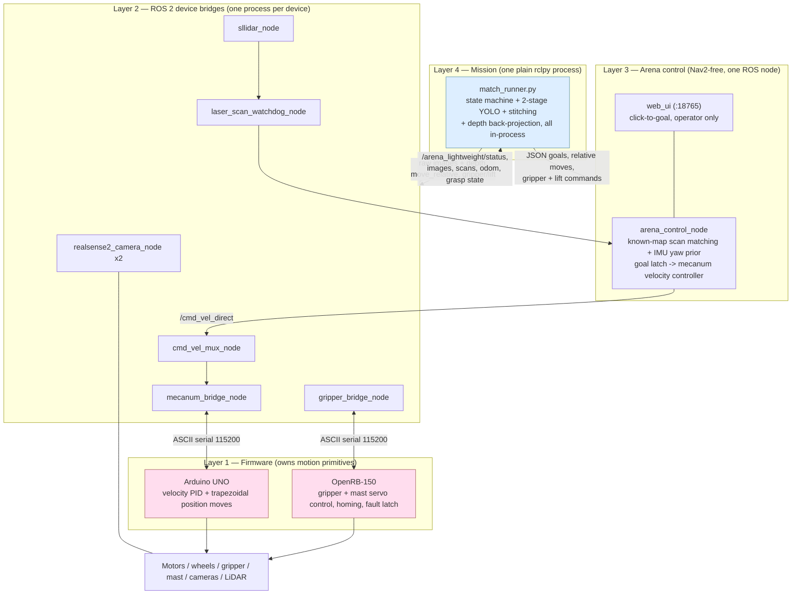

# 02 — System Architecture

How the robot is put together: what runs where, what talks to what, and why the boundaries
are drawn where they are.

The one-line version: **motion primitives live in firmware, device ownership lives in ROS 2
bridges, world state lives in a single localisation/control node, and the match itself is one
plain Python process that drives all of it over topics.** There is no Nav2, no AMCL, no
`robot_state_publisher`, no behaviour tree, and no custom ROS message package.

---

## 1. Physical compute topology

Three processors, connected by two USB serial links and one Dynamixel bus.

| Where | Hardware | What runs there | Link to the rest |
|---|---|---|---|
| **Onboard computer** | Jetson Orin Nano (8 GB) | All ROS 2 Humble nodes, both YOLO models, stitching, the match runner | USB3 to 2x RealSense, USB to LiDAR, USB-serial to Arduino and OpenRB |
| **Drive controller** | Arduino UNO | 4x quadrature encoder decode, per-wheel velocity PID, synchronised trapezoidal position profiles, 2x Cytron MDD10A output | ASCII lines @ 115200 8N1 |
| **Manipulator controller** | ROBOTIS OpenRB-150 | Gripper XC330 (current-based position mode) and camera-mast lift XC330 (ID 12, multi-turn), mast homing, torque-fault latch | ASCII lines @ 115200; Dynamixel bus @ 1 Mbps |

Sensors: 2x Intel RealSense D435/D435i on the servo-driven camera mast (top + near),
RPLIDAR A2M12 2D scanner, and the bottom D435i's IMU (used as a yaw prior, not for full
fusion). Everything is on the robot; there is no off-board compute and no network dependency
during a match.

---

## 2. The four layers



The detailed topic-by-topic graph (every publisher, subscriber, QoS profile and serial
line) is in [03-ros2-interfaces.md](03-ros2-interfaces.md). This document only explains the
shape.

---

## 3. Layer 1 — firmware owns the motion primitives

The Arduino sketch (`hardware/firmware/arduino_mecanum/mecanum_encoder_control.ino`) is not
a dumb PWM relay. It exposes two independent control modes over one serial line:

| Command | Mode | Firmware does |
|---|---|---|
| `m <vx> <vy> <wz>` | velocity | mecanum inverse kinematics, then per-wheel velocity PID with feedforward |
| `d <dx> <dy> <dyaw>` | position | synchronised trapezoidal profile on all four wheels; replies `OK move`, then `DONE,move,...` or `ERR move timeout` |
| `pid` / `ppid` / `geom` / `sign` / `mstyle` | config | gains, geometry, wiring polarity and driver-board PWM encoding, all settable at runtime |

Everything is pushed from the ROS bridge at startup (`push_firmware_config`), so the
measured robot geometry lives in one YAML file
(`hardware/ros2/robot_bringup/config/real.yaml`: `wheel_radius 0.0388`, `half_length 0.108`,
`half_width 0.090`, `encoder_cpr 1320`, per-wheel motor and encoder signs) and is *pushed
down* rather than compiled in. Changing wiring polarity or swapping a motor driver never
requires reflashing.

Why put the loops in firmware:

* **Jitter.** A 10 Hz Python control loop on a Jetson that is simultaneously running two
  RealSense pipelines and two YOLO models cannot close a wheel velocity loop. The Uno can.
* **Deterministic short moves.** The last 10 cm before a grasp are the moves that matter.
  `d dx dy dyaw` gives a repeatable displacement with a completion signal, which is a much
  stronger primitive than "publish a Twist and hope". The match runner uses closed-loop
  arena goals for long hauls and `d` moves for centimetre-scale approach and storage
  placement.
* **Safety.** The firmware stops on its own if commands stop arriving; the ROS bridge has a
  0.5 s `command_timeout_sec` on top of that
  (`hardware/ros2/robot_bringup/config/real.yaml:74`).

The same philosophy applies to the OpenRB-150. It owns the gripper's current-based position
mode, the current-fault latch, a 3 s watchdog, and — critically — the **mast home capture**:
the lift's zero is the servo position observed the first time the lift is initialised after
power-on, and the top of travel is `LIFT_STROKE_TICKS = 31641` from there (measured: bottom
`POS_RAW 33122`, top `1481`). That home only exists in the board's RAM.

> **One TTY, one owner.** Opening the OpenRB serial port toggles DTR and reboots the board,
> which destroys the captured lift home; a subsequent `LIFT_TO_TOP` then drives the mast into
> its hard stop. `gripper_bridge_node` is therefore the *only* process allowed to touch that
> port, and it carries an explicit `LIFT_*` pass-through on `/gripper/command` in addition to
> `/lift/command` so that no tool ever needs to open the tty directly. This is enforced in
> code and repeated in the field runbook.

---

## 4. Layer 2 — one bridge process per device

Each ROS node in this layer owns exactly one piece of hardware and translates between its
native protocol and topics. The competition bringup
(`hardware/ros2/robot_bringup/launch/real_competition_bridge.launch.py`) starts these and
nothing else:

| Process | Owns | Emits |
|---|---|---|
| `realsense2_camera_node` x2 | top D435 (`/camera_19/*`), near D435i (`/camera_54/*`) | RGB 1920x1080x15 + aligned depth 848x480x15, `camera_info`, `/imu/data` |
| `sllidar_node` (vendored) | RPLIDAR A2M12 @ 256000 baud | `LaserScan` on `/scan_raw` |
| `laser_scan_watchdog_node` | nothing — it is a rate/robustness shim | `/laser_scan` (+ `/scan` alias) at a steady 15 Hz |
| `static_transform_publisher` | — | static `base_link -> base_scan` |
| `cmd_vel_mux_node` | — | `/cmd_vel_motor` at 30 Hz |
| `mecanum_bridge_node` | Arduino UNO tty | `/chassis/odom`, `/joint_states`, `/motor/state`, `/base/move_result`, dynamic TF `odom -> base_link` |
| `gripper_bridge_node` | OpenRB-150 tty | `/gripper/state`, `/gripper/grasp`, `/lift/state` |
| `gripper_joint_command_bridge` | — | Isaac-parity shim: `JointState` aperture -> `OPEN`/`CLOSE` |

Two of these are worth calling out because they are fixes, not boilerplate:

**`laser_scan_watchdog_node`.** The entire localisation loop is one Python node consuming one
topic. A single USB hiccup on the LiDAR would freeze the pose estimate mid-drive. The
watchdog decouples driver jitter from consumer rate: publish-on-receive *plus* a 15 Hz timer
that re-emits the last scan while it is younger than `hold_stale_scan_sec = 1.25`, falling
back to an all-`inf` empty scan after that
(`hardware/ros2/robot_bringup/robot_bringup/laser_scan_watchdog_node.py:21-55`).

**`cmd_vel_mux_node`.** Priority order is `/cmd_vel_direct` > `/cmd_vel` > `/cmd_vel_nav`,
each with a 0.4 s freshness timeout. When *every* source is stale it does not go silent — it
actively publishes a zero `Twist`, so the firmware's own timeout is a second line of defence
rather than the only one
(`hardware/ros2/robot_bringup/robot_bringup/cmd_vel_mux_node.py:29-32, 91`).

---

## 5. Layer 3 — arena control, and the two edges of the TF tree

`arena_control_node` (`navigation/ros2/arena_lightweight_control/arena_lightweight_control/arena_control_node.py`)
is the only node that knows where the robot is. It matches `/laser_scan` against a 0.02 m/px
occupancy grid of the 4 m x 4 m arena (`navigation/ros2/arena_lightweight_control/maps/stadium.yaml`),
gated by an IMU gyro-z yaw prior, latches a goal, and emits a `Twist` on `/cmd_vel_direct`
through a mecanum goal controller.

Deliberate omissions, each of which removes a failure mode:

* **No `map -> odom` TF and no AMCL.** The map-frame pose is kept internally and shipped as
  a JSON blob on `/arena_lightweight/status`. Nothing in the system needs to do a TF lookup
  to know where the robot is, so nothing can fail on a missing or late transform.
* **The TF tree is two edges**: dynamic `odom -> base_link` from `mecanum_bridge_node`, and
  static `base_link -> base_scan`. No URDF is loaded at match time. Camera and gripper
  geometry are measured numeric constants in `perception/fieldlib.py:35-56` (e.g.
  `NEAR_MOUNT_DOWN` forward 0.1874 m, height 0.3143 m, tilt 53.20°; mast stroke 14.89 cm)
  rather than TF frames — because the mast moves, and a frame that is only correct at two
  discrete heights is more dangerous than an explicit per-height calibration dictionary.
* **`depth=1` sensor QoS on the scan subscription.** When matching falls behind, stale scans
  must be *dropped*, not queued: a backlog of five 300 ms scans once made the pose estimate
  seconds-stale. The comment survives in the code at `arena_control_node.py:352-358`.

The embedded web UI (port 18765) is an operator tool — click-to-goal, live map, gripper
buttons. It was not used during matches (the competition bring-up leaves `ENABLE_WEB_UI` off and
overrides `LAUNCH_PYTHON_UI` to false), but it is how almost all
of the driving was debugged.

---

## 6. Layer 4 — the mission is a script, not a node

The competition brain is `mission/match_runner.py`: a 2,508-line plain `rclpy` process, not
a ROS package node. It subscribes to the camera, depth, `camera_info`, odom, scan, IMU,
status and gripper topics; it publishes goals, relative moves, gripper and lift commands.
It runs the image stitch, both YOLO stages, the pair verifiers and the depth back-projection
**in its own process**.

This is unusual enough to justify:

* **One process, one GPU context.** Two YOLO models plus two RealSense pipelines already
  strain an 8 GB unified-memory Orin Nano. Splitting perception into separate nodes would
  mean multiple CUDA contexts and copying full-resolution images across DDS. Inference batch
  sizes had to be chunked (A1 in chunks of 8, face in chunks of 32) because a single 65-crop
  batch exhausted memory outright — that kind of tuning is far easier inside one process.
* **Sequencing is inherently procedural.** "Raise mast, drive, spin 8 times, lower mast,
  then for each target: route, face, measure, verify, grasp, carry, place" is a script. A
  behaviour tree or a node-based state machine buys nothing here and costs a rebuild cycle
  on every edit — and edits were happening hourly in the last 48 hours before the
  competition.
* **It is testable without ROS.** `match_runner.py --offline` self-tests the argument
  parser, the ground-truth layout parser, the corridor/street router and the two-set
  candidate filter using nothing but numpy. A 2,500-line hardware script with no test story
  would be indefensible; this is the pragmatic answer.
* **The stack keeps running when the brain dies.** The runner can be killed and restarted
  mid-session without touching the hardware bridges, the mast home, or the localiser lock.

There *is* a ROS-node state machine in the project history (`robot_task_planner`), written in
June for a Nav2 + semantic-mapping design. It was never launched at the competition and is
not in this repository.

---

## 7. Why JSON over `std_msgs/String` instead of custom messages

There are **no custom messages in this system**. `robot_interfaces` was created and left
empty. Every structured payload is a `std_msgs/String` carrying JSON:

| Topic | Payload |
|---|---|
| `/arena_lightweight/goal` | `{"x": 0.25, "y": 0.25}` (optional `"yaw"`) |
| `/arena_lightweight/pose` | pose seed |
| `/arena_lightweight/status` | the whole world state: pose, localisation quality + latency, goal, controller state, scan sectors, gripper echo |
| `/base/move_relative` | `{"dx":, "dy":, "dyaw":, "max_v":}` |
| `/base/move_result` | `{"ok":, "reason":, ...}` |
| `/motor/state`, `/gripper/state`, `/gripper/grasp`, `/lift/state` | telemetry blobs |
| `/gripper/command`, `/lift/command` | plain verbs: `OPEN`, `CLOSE`, `SET_DEG 120`, `LIFT_TO_TOP` |

The reasoning:

1. **The consumer is a script outside the colcon workspace.** `match_runner.py` runs from a
   checkout, not an installed package. Depending on a custom interface package would mean
   the mission layer could not run until the workspace was built and sourced — exactly the
   coupling we wanted to avoid at 2 a.m. in a venue.
2. **Schema evolution costs nothing.** Adding `attempt` to a measurement record, or
   `place_gate` to a cycle record, is a one-line change on the producer. With an `.msg` file
   it is an interface rebuild plus a rebuild of every package that depends on it. In the last
   72 hours the status payload changed almost daily.
3. **Everything is inspectable and replayable with stock tools.** `ros2 topic echo
   /arena_lightweight/status` is a complete, human-readable state dump with no custom
   message definitions on the debugging machine. `ros2 bag record` of the 13-topic field list
   replays without building anything.
4. **The cost is real and we accepted it**: no type checking, no IDL documentation, and
   JSON parse errors are runtime warnings rather than compile errors (see
   `arena_control_node.py:1053-1063`, which logs and ignores a malformed goal). For a
   single-robot, single-team, three-month project the trade favoured iteration speed. For a
   system with multiple consumer teams it would not.

Note the asymmetry: **sensor data uses standard messages** (`LaserScan`, `Image`,
`CameraInfo`, `Imu`, `Odometry`, `JointState`, `Twist`) because those already exist and
tooling depends on them. JSON is used only where we would otherwise have had to *invent* a
message type.

---

## 8. The match state machine

Verified against `mission/match_runner.py` (`E2ERunner.run()` at line 2116 and the stage
methods it calls). The docstring's own summary:

```
STARTUP → SEED → MAST_UP → GOTO_CENTER → SCAN(12x30° CW) → MAST_DOWN
        → COLLECT { ROUTE → FACE → APPROACH → GRASP → CARRY } xN → REPORT
```



```mermaid
stateDiagram-v2
    [*] --> STARTUP
    STARTUP --> SEED: models preloading in background thread
    SEED --> GOTO_CENTER: localisation locked (latency < 150 ms) else exit 4
    state GOTO_CENTER {
        [*] --> LEG1: diagonal dash into the object-free highway (y = -1.40 m)
        LEG1 --> PRESHOT: one mast-down north shot, owns the 4 near cells
        PRESHOT --> MAST_UP: issued non-blocking, raises during leg 2
        MAST_UP --> LEG2: north along the 25 cm street to (0.25, 0.25)
        note right of LEG2: the highway band is object-free by rule,\nso the diagonal is allowed there and only there
        LEG2 --> [*]
    }
    GOTO_CENTER --> SCAN: mast raise confirmed, else exit 5
    state SCAN {
        [*] --> CAPTURE: 12 shots, 30 deg CW spin, 0.5 s settle
        CAPTURE --> MAST_DOWN: issued non-blocking, descends during inference
        MAST_DOWN --> INFER: east half inferred in a background thread\nwhile the west half is still being shot
        INFER --> VOTE: snap to the 42-cell grid, vote identity per cell\n(near-field cells re-inferred on the raw frame at 512)
        VOTE --> [*]
    }
    SCAN --> COLLECT
    state COLLECT {
        [*] --> PICK_TARGET
        PICK_TARGET --> ROUTE: fruit set first; in the finals ranked by p*score/T_exp
        ROUTE --> FACE: north-locked street closed loop to the mini-goal
        FACE --> APPROACH: rotate to face the cell
        state APPROACH {
            [*] --> MEASURE: up to 6 tries, depth back-projection
            MEASURE --> HOP: if range > 0.50 m, hop to leave 0.40 m, re-measure
            HOP --> VERIFY
            MEASURE --> VERIFY
            VERIFY --> ADVANCE: A1+face+pair one last time; skip only on a definite contradiction
            ADVANCE --> [*]: single move to GRIP_FORWARD_M = 0.115 m
        }
        APPROACH --> GRASP
        GRASP --> CARRY: held, or unconfirmed (no feedback) - carry anyway
        GRASP --> PICK_TARGET: gripper actively reports empty, twice
        state CARRY {
            [*] --> STAGING: drift to (-1.40, -1.40), building -135 deg en route
            STAGING --> GATE: status fresh < 1.0 s and within 0.45 m of staging
            GATE --> PLACE: advance to the bowling-pin slot, release, retreat 0.35 m
            GATE --> ABORT_RELEASE: gate fails twice, release where standing
            PLACE --> [*]
            ABORT_RELEASE --> [*]
        }
        CARRY --> PICK_TARGET: quota not yet met
        PICK_TARGET --> [*]: quota met or no candidates left
    }
    COLLECT --> REPORT
    REPORT --> [*]: report.json, grid_map.json/png, score estimate, PASS/PARTIAL/FAIL
```

### What each stage actually does

| Stage | Code | Behaviour |
|---|---|---|
| **STARTUP** | `main()`, `start_model_preload()` | YOLO import + CUDA warm-up (~10 s) starts on a background thread immediately, so it overlaps operator checklists, health checks and driving. |
| **SEED** | `stage_seed()` :861 | Publishes the start pose `(1.8, -1.8, +90°)` = official `(380, 20) cm`, then polls `/arena_lightweight/status` for up to 3 s. Requires a localisation report with latency < 150 ms, otherwise **exit code 4** — driving blind is never allowed. |
| **GOTO_CENTER** | `stage_goto_center()` | Leg 1 is a straight diagonal into the "highway" line `y = -1.40 m`, which the rules make provably empty (no object row below official y = 100 cm) — a diagonal is safe *there* precisely because the band has no grid points in it. Leg 2 runs north along the 25 cm street between grid columns to the scan point `(0.25, 0.25)` = official `(225, 225) cm`. Once the robot is in the field, diagonals are forbidden: they pass directly over grid points. |
| **MAST_UP** | `stage_mast(..., wait=False)` :889 | Issued non-blocking so the ~6 s lift overlaps leg 2; `stage_mast_wait()` synchronises before any capture, because both the stitch calibration and the back-projection mounts are height-dependent. Unconfirmed mast position is **exit code 5**. |
| **SCAN** | `stage_scan()` | 12 captures at 30° steps with a 0.5 s settle. The east half is inferred on a background thread while the west half is still being shot, so collection can start on a partial map. Detections are snapped to the 42-cell grid and voted per cell. |
| **MAST_DOWN** | inside `stage_scan()` | Issued immediately after the last capture, before inference, so the descent overlaps batched YOLO. |
| **COLLECT** | `stage_collect()` :1979, `collect_one()` :1688 | Loop over targets. Sub-phases below. |
| **REPORT** | `stage_report()` :2048 | Writes `report.json` with per-cycle phase timings, an estimated score, quota progress, the total against the 180 s budget with an explicit overrun flag, and a PASS/PARTIAL/FAIL verdict. |

`COLLECT` sub-phases, each timed into `report.cycles[].phases`:

| Sub-phase | What it does |
|---|---|
| **ROUTE** | `street_nav.StreetNavigator` drives the base itself: align x on the highway, run north up the 25 cm street, stop at a **mini-goal** one grid diagonal south-east of the object, all with the heading locked north because the gripper protrudes 26 cm and only a north-facing robot fits the corridor. The only rotations in a cycle are ±45° at the mini-goal. `plan_route()` — diagonal dash, axis-aligned L, street grid, perpendicular detour — is the `--nav legacy` fallback and the carry-path planner. |
| **FACE** | Rotate to point at the target cell. `align_leg_yaw()` elsewhere minimises rotation by exploiting the fact that a square mecanum robot can travel on any of its four faces: it aligns to the nearest of `yaw + k·90°`, never rotating more than 45° and skipping entirely inside ±15°. |
| **MEASURE** | Up to 6 attempts (`MEASURE_TRIES`), each ~0.6 s on failure. Range comes from the **depth median at the contact pixel**, not from ground-plane back-projection; ground is kept only as a fallback for invalid depth pixels and is always logged as `y_ground_ref` so the bias keeps being measured. |
| **VERIFY** | `verify_target()` runs A1 + face + pair once more on the final approach frame — the last chance, because after the advance the object sits ~11 cm in front of the gripper and can no longer be recognised. For a fruit target it aborts only when it sees the *confusion-pair partner* (a different pair's fruit is treated as noise); a `plain` reading or no detection is undecidable, so it passes and trusts the scan identity. The re-inference runs on a thread with a 0.5 s budget — past that it gives up and grasps rather than burn the clock. Cells opened as consistency-factor probes are the exception: there the check is strict, and anything short of a positive identification aborts. |
| **GRASP** | `CLOSE`, then wait for `/gripper/grasp` `state == "held"`. Success is *measured*, not assumed: the bridge waits 0.6 s for the finger position to go flat, samples for 0.25 s, and latches `held` on a median position gap ≥ 8.0°. An empty hand measures 3.0–3.2°, a grasped icosahedron 14.1°. Motor current is explicitly rejected as a discriminator (it saturates at ~113 raw even empty-handed) and kept only as a torque-alive gate ≥ 60. What counts as failure was narrowed on 2026-07-23: only an *active* `empty` verdict triggers the retry (`OPEN`, +0.02 m, `CLOSE`) and then the skip. Silence — the board not answering at all — is recorded as `grasp_unconfirmed` and the robot carries on, because an intermittent OpenRB was costing whole cycles. Final 1 is what that rule looks like when it loses: an octahedron was carried and released with an empty hand. |
| **CARRY / PLACE** | Rewind the approach move, restore north, run the street south, then **drift** to staging `(-1.40, -1.40)`: the translation and the −135° turn happen at the same time, so the robot arrives already square-on to the storage lip instead of stopping to rotate. Then the placement gate, advance to the next bowling-pin slot, a 2.5 cm push, release, retreat, re-close. Objects on the southernmost row skip the street entirely and drift straight from the mini-goal. |

### Two gates that exist because of specific incidents

**The placement gate** (`collect_one()` :1856-1895). On 2026-07-21 at 16:18 the localiser was
confidently wrong and the robot dropped an object in the START corner believing it was at
staging. The gate now checks status freshness (< 1.0 s) and deviation from staging
(< 0.45 m), retries the move once, and if it still fails **releases where it stands** —
outside the box, worth 0 points but incurring no penalty — rather than carrying the object
into the next cycle where the approach `OPEN` would drop it anywhere. Fail-closed, on
purpose.

**The stall gate.** A firmware `ERR move timeout` during the storage advance means the robot
is pushing against a wall. Re-advancing would just burn another 8 s in the same stall, so the
runner retreats 0.10 m, drops, and flags the placement as suspect
(`rec["place_stall"] = True`).

---

## 9. Where the architecture helped, and where it did not

It helped: the mission layer could be edited and rerun in seconds without a colcon build; a
crashed runner never took the hardware down; every run left a machine-readable `report.json`
that self-scored against the rulebook; and the JSON topics meant a rosbag could be replayed
on a laptop with no workspace at all.

It was not enough in **Final 1**. One process owning one tty is a clean rule, but it makes
that process a single point of failure, and the day of the finals is when we found out how
many ways it can fail.

The first way we did fix. At 05:12 that morning the bridge died on a `termios.error` that
the exception handler did not catch, and nothing brought it back. By the finals there were
three layers against that: the bridge swallows `termios.error` and reconnects, the launch
file respawns the node after 2 s, and the bring-up sequence refuses to report a healthy
stack unless the gripper board answers — it tries a four-step self-heal first
(`ensure_gripper_alive`: kill orphan duplicates, wait for the respawn, kick the launch
child, and only then start a standalone).

The second way we did not. In Final 1 the process stayed alive; the OpenRB simply stopped
answering. That is a different failure, and the rule the robot follows in that case was a
deliberate choice made the evening before: only an *active* `empty` verdict aborts a grasp,
while silence is recorded and the cycle continues. It was the right trade for an
intermittently flaky board — and in Final 1 it meant one octahedron was carried across the
arena and released with an empty hand. That grasp alone would have made the match 70; the
other two octahedra were refused because the gripper did declare itself empty, and we also
overran 180 s. What we would add next is not a respawn — we have that — but a *positive*
liveness check on the grasp verdict itself, so silence stops being treated as consent.

**Final 2** ran out of time: the 3-minute timeout hit while grasping the last object. The
architecture's latency-hiding tricks (background model preload, non-blocking mast moves
overlapped with driving, batched inference) were all responses to exactly this pressure, and
they were not quite enough.

---

## Further reading

* [03-ros2-interfaces.md](03-ros2-interfaces.md) — every topic, message type, QoS profile and serial line
* [navigation/README.md](../navigation/README.md) — why Nav2 was removed and what replaced it
* [perception/README.md](../perception/README.md) — the two-stage detection pipeline
* [mission/docs/match-strategy.md](../mission/docs/match-strategy.md) — scan saturation, target quotas, storage layout
* [05-field-runbook.md](05-field-runbook.md) — how this was actually operated on competition day
