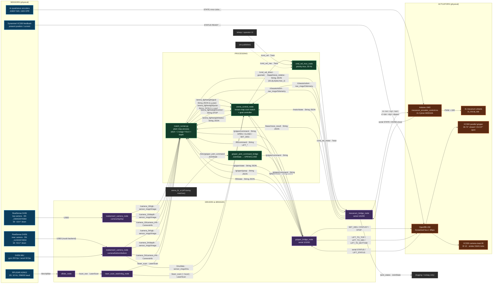
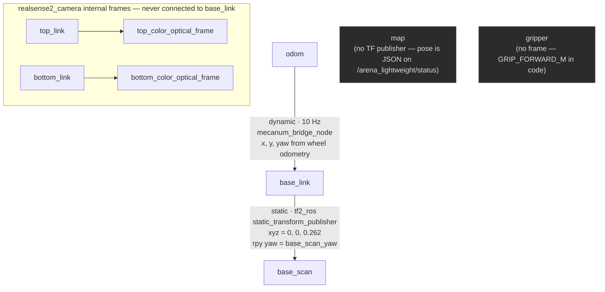

# 03 — ROS 2 Interfaces: sensor → bridge → motion

This is the wiring diagram of the competition robot: every sensor, the bridge that
translates it, and the exact topic that ends up moving a wheel.

The graph is deliberately small. Nine long-lived processes, no Nav2, no AMCL, no
`robot_state_publisher`, no custom message package. Every structured message in this
system is a `std_msgs/String` carrying JSON — that was a conscious trade (zero interface
build steps, `ros2 topic echo` is always readable) and it is why the tables below list
payload keys instead of `.msg` files.

---

## 1. The whole data flow



### How to read it in one sentence per chain

| Chain | Path |
|---|---|
| **Where am I** | RPLIDAR → `sllidar_node` → `/scan_raw` → watchdog → `/laser_scan` → `arena_control_node` known-map matcher → pose in `/arena_lightweight/status` |
| **Which way am I facing** | D435i gyro → `/imu/data` → `arena_control_node` yaw prior (blocks the 90° quadrant flip a square arena invites) |
| **What is on the floor** | 2x RealSense RGB+depth → `/camera_19/*` + `/camera_54/*` → `match_runner.py` stitch → A1 segmentation → face segmentation → depth back-projection → arena coordinates |
| **Drive there** | `match_runner.py` → `/arena_lightweight/goal` → `arena_control_node` controller → `/cmd_vel_direct` → mux → `/cmd_vel_motor` → `mecanum_bridge_node` → `m vx vy wz` → Arduino PID → 4 wheels |
| **Fine positioning** | `match_runner.py` → `/base/move_relative` → `mecanum_bridge_node` → `d dx dy dyaw` → firmware trapezoidal profile → `DONE,move` → `/base/move_result` |
| **Grasp** | `match_runner.py` → `/gripper/command CLOSE` → `gripper_bridge_node` → `SET_DEG 36.74` → XC330; position-gap verdict comes back on `/gripper/grasp` |
| **Look further** | `match_runner.py` → `/lift/command LIFT_TO_TOP` → `gripper_bridge_node` → OpenRB → mast lift servo, raising both cameras by 14.89 cm |

---

## 2. Topic table

Rates are the configured/measured rates of the competition stack (mecanum drive,
`launch_python_ui=false`). "R" = publisher rate.

### 2.1 Sensing

| Topic | Type | Publisher | Subscribers | Rate | Purpose |
|---|---|---|---|---|---|
| `/camera_19/rgb` | `sensor_msgs/Image` | `realsense2_camera_node` (top) | `match_runner.py` | 15 Hz | Top half of the stitched frame. Remapped from `/camera/top/top/color/image_raw`. `1920x1080x15` |
| `/camera_19/depth` | `sensor_msgs/Image` | `realsense2_camera_node` (top) | `match_runner.py` | 15 Hz | Aligned-to-color depth, resampled to the colour resolution. Depth stream itself is `848x480x15` |
| `/camera_19/camera_info` | `sensor_msgs/CameraInfo` | `realsense2_camera_node` (top) | `match_runner.py` | 15 Hz | Intrinsics for depth back-projection |
| `/camera_54/rgb` | `sensor_msgs/Image` | `realsense2_camera_node` (bottom) | `match_runner.py`, `arena_control_node` (only if `enable_internal_image_processing:=true`, default false) | 15 Hz | Bottom half of the stitch; also the grasp-alignment camera |
| `/camera_54/depth` | `sensor_msgs/Image` | `realsense2_camera_node` (bottom) | `match_runner.py` | 15 Hz | Depth used for the actual object range measurement |
| `/camera_54/camera_info` | `sensor_msgs/CameraInfo` | `realsense2_camera_node` (bottom) | `match_runner.py` | 15 Hz | Intrinsics |
| `/imu/data` | `sensor_msgs/Imu` | `realsense2_camera_node` (bottom, `unite_imu_method=2`) | `arena_control_node` | ~200 Hz (gyro rate) | Gyro-z integrated yaw prior for the localizer |
| `/camera/top/gyro/sample`, `/camera/top/accel/sample` | `sensor_msgs/Imu` | top camera | — | — | Remapped but disabled (`enable_top_imu:=false`) |
| `/scan_raw` | `sensor_msgs/LaserScan` | `sllidar_node` (topic `scan` remapped) | `laser_scan_watchdog_node` | 10 Hz | Raw lidar, `frame_id=base_scan`, SensorDataQoS |
| `/laser_scan` | `sensor_msgs/LaserScan` | `laser_scan_watchdog_node` | `arena_control_node`, `match_runner.py`, `arena_tk_ui` | 10 Hz (see §2.5) | The scan everything actually consumes |
| `/scan` | `sensor_msgs/LaserScan` | `laser_scan_watchdog_node` | — | 10 Hz | Alias kept for legacy tools; no subscriber in the competition stack |

### 2.2 Base feedback

| Topic | Type | Publisher | Subscribers | Rate | Purpose |
|---|---|---|---|---|---|
| `/chassis/odom` | `nav_msgs/Odometry` | `mecanum_bridge_node` | `arena_control_node` (yaw gate), `match_runner.py` | 10 Hz | Wheel odometry integrated from the four encoder counters. `odom` → `base_link` |
| `/joint_states` | `sensor_msgs/JointState` | `mecanum_bridge_node` | — | 10 Hz | `front_left_wheel_spin`, `front_right_wheel_spin`, `rear_left_wheel_spin`, `rear_right_wheel_spin`; position in rad, velocity in rad/s. Recorded, not consumed |
| `/motor/state` | `std_msgs/String` (JSON) | `mecanum_bridge_node` | `arena_control_node`, `match_runner.py` | 2 Hz | `{drive_type, connected, serial_port, serial_error, e_stop_active, feedback_ok, firmware_mode, position_move_active, geometry, …}` — the health signal used by the preflight check |
| `/base/move_result` | `std_msgs/String` (JSON) | `mecanum_bridge_node` | `match_runner.py` | on completion | `{ok, reason, wheel_errors_rad, elapsed_sec}` for each `/base/move_relative` |

### 2.3 Manipulation feedback

| Topic | Type | Publisher | Subscribers | Rate | Purpose |
|---|---|---|---|---|---|
| `/gripper/state` | `std_msgs/String` (JSON) | `gripper_bridge_node` | `arena_control_node`, `match_runner.py` | 5 Hz (serial `STATUS?` polled at 2 Hz) | `present_deg`, `present_raw`, `current_raw`, `voltage_raw`, `hardware_error`, `torque_enabled`, `grasp_state` |
| `/gripper/grasp` | `std_msgs/String` (JSON) | `gripper_bridge_node` | `match_runner.py` | on each CLOSE verdict | `{state: held\|empty, pos_gap_deg, current_raw}` — the grasp success test (§4.3) |
| `/lift/state` | `std_msgs/String` (JSON) | `gripper_bridge_node` | `match_runner.py` | on each `LIFT_STATUS`/`LIFT_HOME_SET` line | `ready, pos_raw, current_raw, moving, hw_error, torque, home_set, home_raw, stroke` |

### 2.4 Commands

| Topic | Type | Publisher | Subscribers | Rate | Purpose |
|---|---|---|---|---|---|
| `/arena_lightweight/goal` | `std_msgs/String` (JSON) | `match_runner.py`, `arena_tk_ui`, web UI | `arena_control_node` | on demand | `{"x":…, "y":…, "yaw":…}` in map metres. `yaw` optional; `default_goal_yaw_rad=nan` means "no final rotation" |
| `/arena_lightweight/pose` | `std_msgs/String` (JSON) | `match_runner.py`, `arena_tk_ui`, web UI | `arena_control_node` | on demand | Pose seed for the scan matcher, e.g. the START pose `(1.8, -1.8, π/2)` |
| `/arena_lightweight/control` | `std_msgs/String` | `match_runner.py`, `arena_tk_ui`, web UI | `arena_control_node` | on demand | `STOP` / `CLEAR` / `CLEAR_GOAL` — all three clear the active goal. Anything else is logged and ignored |
| `/arena_lightweight/status` | `std_msgs/String` (JSON) | `arena_control_node` | `match_runner.py`, `arena_tk_ui` | 4 Hz (`status_period_sec=0.25`) | The whole robot state blob: `pose`, `goal`, `command`, `command_phase`, `controller_type`, `obstacle_front_m`, `scan_sector_ranges`, `scan_age_sec`, `localization`, `gripper_status`, `motor_state`, `debug_odom`, `debug_imu`, `imu_prior`, `perception` |
| `/cmd_vel_direct` | `geometry_msgs/Twist` | `arena_control_node` | `cmd_vel_mux_node` | 20 Hz (`control_rate_hz`) | Priority-1 velocity. Published continuously, zero when idle |
| `/cmd_vel` | `geometry_msgs/Twist` | teleop / external | `cmd_vel_mux_node` | — | Priority-2 velocity (manual driving) |
| `/cmd_vel_nav` | `geometry_msgs/Twist` | **none in this stack** | `cmd_vel_mux_node` | — | Priority-3 slot left over from the Nav2 era. Kept wired, never fed |
| `/cmd_vel_motor` | `geometry_msgs/Twist` | `cmd_vel_mux_node` | `mecanum_bridge_node` | 30 Hz | The single velocity input of the base |
| `/base/move_relative` | `std_msgs/String` (JSON) | `match_runner.py` | `mecanum_bridge_node` | on demand | `{"dx":m, "dy":m, "dyaw":rad, "max_v":m/s}` — firmware-side closed-loop relative move. `max_v` caps the wheel speed for that move only |
| `/gripper/command` | `std_msgs/String` | `match_runner.py`, `arena_control_node`, `gripper_joint_command_bridge` | `gripper_bridge_node` | on demand | `OPEN`, `CLOSE`, `STOP`, `SET_DEG <deg>`, or any `LIFT_*` (passthrough) |
| `/lift/command` | `std_msgs/String` | `match_runner.py` | `gripper_bridge_node` | on demand | `LIFT_*` only; anything else is rejected with a warning |
| `/mk1/gripper_joint_command` | `sensor_msgs/JointState` | `arena_tk_ui` (disabled during matches), Isaac Sim | `gripper_joint_command_bridge` | on demand | Simulation-parity path: aperture sign → `OPEN`/`CLOSE` |
| `/safety/e_stop` | `std_msgs/Bool` | **none** | `mecanum_bridge_node` | — | Manual kill switch, driven by `ros2 topic pub` if needed. `true` zeroes the twist, aborts an active move and writes `stop` |
| `/detected_objects/map_objects` | `std_msgs/String` (JSON) | none in this stack | `arena_control_node` (only if `enable_object_avoidance:=true`, default false) | — | Reactive keep-out boxes. Off during the competition |

### 2.5 Two things the topic list does not tell you

**`/laser_scan` is 10 Hz, not 15 Hz.** The watchdog node has a 15 Hz timer, but on the
field it is launched with `publish_on_receive=true`, `republish_fresh_scan=false`,
`hold_stale_scan_sec=0.0` and `publish_empty_scan=false`
(`navigation/ros2/arena_lightweight_control/launch/lightweight_real.launch.py:143-146`).
Every one of the timer's fallback branches is therefore disabled and the node degenerates
into a pass-through: one output scan per input scan, at the lidar's 10 Hz
(`hardware/ros2/robot_bringup/robot_bringup/laser_scan_watchdog_node.py:126-148`). The
node still earns its place — it owns the `frame_id` fixup and the `/scan` alias, and
raising `hold_stale_scan_sec` turns short lidar dropouts into held scans instead of a
stalled localizer — but the "steady 15 Hz republish" behaviour was not active in the
competition configuration.

**`arena_control_node` subscribes to `/imu/data` twice.** Once as `debug_imu_topic`
(default QoS, RELIABLE) and once as `imu_topic` with a BEST_EFFORT sensor profile
(`navigation/ros2/arena_lightweight_control/arena_lightweight_control/arena_control_node.py:385-406`).
The RealSense driver publishes BEST_EFFORT, so the RELIABLE subscription is QoS-incompatible
and receives nothing — the `debug_imu` field of `/arena_lightweight/status` is empty on the
real robot. The working path is the second subscription. The Korean comment at line 396
records exactly this discovery: *"RealSense IMU publishes BEST_EFFORT — a RELIABLE
subscription gets nothing due to QoS incompatibility."*

---

## 3. Bridge table

Four processes translate between ROS 2 and something that is not ROS 2.

| Bridge node | Converts | Physical device | Port | Baud | Grammar |
|---|---|---|---|---|---|
| `mecanum_bridge_node`<br/>`hardware/ros2/robot_hardware/robot_hardware/mecanum_bridge_node.py` | `Twist` / move-JSON ⇄ ASCII lines | Arduino UNO + 2x Cytron MDD10A | `/dev/serial/by-id/usb-Arduino__www.arduino.cc__Arduino_14101-if00`<br/>fallbacks: `/dev/serial/by-path/platform-3610000.usb-usb-0:2.3.1:1.0`, `/dev/ttyACM0` | 115200 8N1 | §3.1 |
| `gripper_bridge_node`<br/>`hardware/ros2/robot_hardware/robot_hardware/gripper_bridge_node.py` | `String` ⇄ ASCII lines | OpenRB-150 → Dynamixel bus | `/dev/serial/by-id/usb-ROBOTIS_OpenRB-150*-if00`<br/>fallback: `/dev/serial/by-path/platform-3610000.usb-usb-0:2.3.3:1.0` | 115200 (PC side)<br/>1 000 000 (Dynamixel bus) | §3.2 |
| `sllidar_node` (vendored, `third_party/sllidar_ros2`) | Slamtec binary protocol → `LaserScan` | RPLIDAR A2M12 | `/dev/rplidar` (udev symlink, CP2102 `10c4:ea60`) | 256000 | `channel_type=serial`, `angle_compensate=true`, `scan_frequency=10.0`, `frame_id=base_scan`, `respawn=true` |
| `realsense2_camera_node` x2 | librealsense → `Image`/`CameraInfo`/`Imu` | D435 (top) / D435i (bottom) | USB3, selected by serial number | — | See §3.3 |

### 3.1 Arduino UNO — wheel velocity and position grammar

Source of truth: `hardware/firmware/arduino_mecanum/mecanum_encoder_control.ino:26-63`.
One command per line, 115200 baud, `\n` terminated.

```
m <vx_mps> <vy_mps> <wz_rad_s>
    Body velocity command (velocity mode). +x forward, +y left, +wz CCW.
w <fl> <fr> <rl> <rr>
    Wheel angular velocity targets in rad/s (velocity mode).
d <dx_m> <dy_m> <dyaw_rad>
    Relative body displacement (position mode). Runs a synchronized
    trapezoidal profile on all four wheels, replies "OK move", then
    "DONE,move,..." when settled or "ERR move timeout".
pw <fl_rad> <fr_rad> <rl_rad> <rr_rad>
    Relative wheel position deltas in rad (position mode).
p <fl_pwm> <fr_pwm> <rl_pwm> <rr_pwm>
    Direct signed PWM, -255..255 (disables closed loop until next m/w/d).
pid <kp> <ki> <kd> <min_pwm> <max_pwm> <ff_slope> <integral_limit>
    Velocity PID + feedforward tuning (shared by all wheels).
ppid <kp> <kd> <max_rad_s> <accel_rad_s2> <tol_rad> <hold_ms> <min_rad_s>
    Position loop tuning.
geom <wheel_radius_m> <half_length_m> <half_width_m>
    Kinematics geometry used by m/d commands.
sign <m_fl> <m_fr> <m_rl> <m_rr> <e_fl> <e_fr> <e_rl> <e_rr>
    Per-wheel motor output signs and encoder counting signs (+1/-1).
    Lets bring-up fix wiring polarity without reflashing.
mstyle <fl> <fr> <rl> <rr>
    Per-wheel PWM encoding (0=DIR_HIGH_PWM_LOW, 1=PWM_HIGH_DIR_LOW).
z       Zero encoder counters.
stop    Stop all motors, abort any position move.
stream <0|1>   Enable/disable periodic STATE lines.
pins    Print pin map.
test [pwm] [ms]   Drive each wheel forward/reverse in sequence.
?       Print help.
```

Telemetry back, at 10 Hz while streaming (`REPORT_INTERVAL_MS = 100`):

```
STATE,<ms>,<fl_ticks>,<fr_ticks>,<rl_ticks>,<rr_ticks>,<fl_pwm>,<fr_pwm>,<rl_pwm>,<rr_pwm>,<mode>
    mode: 0 = idle/pwm, 1 = velocity, 2 = position
DONE,move,<fl_err_rad>,<fr_err_rad>,<rl_err_rad>,<rr_err_rad>
ERR move timeout
READY
```

**Who writes what.** The bridge writes `m vx vy wz` every 50 ms while a velocity command
is fresh (`mecanum_bridge_node.py:462`), and `d dx dy dyaw` once per
`/base/move_relative` (`:436`). A live non-zero `cmd_vel` preempts an in-flight position
move (`:392-394`); conversely the bridge stops streaming `m` while the firmware owns a
position move (`:457-461`).

**Firmware config is pushed from ROS, not compiled in.** On every (re)connect —
including after an Arduino auto-reset — `push_firmware_config()` sends
`stop`, `geom`, `pid`, `ppid`, `sign`, `stream 1` (`:286-309`). This is why the geometry
and gains live in `hardware/ros2/robot_bringup/config/real.yaml` and not in the sketch.
There is a 0.3 s pre-delay and a 60 ms gap between lines, for a reason worth repeating:
the UNO's RX buffer is 64 bytes, and immediately after `READY` the firmware is busy
printing ~500 characters of help text, so a burst of config lines overflows and gets
truncated into `ERR usage`. Measured on 2026-07-15: the `pid` line was lost and
`stream 1` never applied, so no odometry was published at all.

Measured geometry actually sent (`real.yaml:56-73`, all re-measured after the mecanum
conversion):

| Parameter | Value | How it was obtained |
|---|---|---|
| `wheel_radius_m` | 0.0388 | The wheels are 80 mm, so the physical radius is 0.040; a configured 0.034 produced 112–116 % of commanded travel on the lidar-measured move test. 0.0388 is the *effective* contact radius |
| `half_length_m` | 0.108 | Effective rotation geometry after the X-config roller remount; `(L+W)=0.198` rather than the physical 0.275, because a 90° `dyaw` command physically turned 158° with the nominal value |
| `half_width_m` | 0.090 | as above |
| `encoder_cpr` | 1320 | JGB37-520 measured no-load tick rate = spec 11 PPR × 4 × 30 |
| `motor_signs` | `[-1,-1,-1,-1]` | All four drivers wired so +PWM = reverse |
| `encoder_signs` | `[1,-1,1,-1]` | FR/RR encoder A/B swapped |
| `max_linear_x/y_mps`, `max_angular_rps` | 0.9 / 0.6 / 2.0 | Raised from the 0.24/0.20/0.8 bring-up safety caps once firmware `MAX_WHEEL_RAD_S` went 16 → 30 |
| `speed_kp/ki/kd` | 10.0 / 8.0 / 0.0 | Re-tuned under floor load; no-load gains sagged the front-left wheel by up to −18 % at low speed |
| `position_tolerance_rad` | 0.30 | Widened three times (0.035 → 0.08 → 0.20 → 0.30). At 0.20, carrying an object made half of all single moves fail to settle, burning 36–74 s per run on 5 s timeouts. 0.30 ≈ 11.7 mm of wheel travel, well inside the ±55 mm grasp tolerance |
| `position_hold_ms` | 50 | Lowered from 100 for the same reason |

Pin map (`mecanum_encoder_control.ino:9-19`, and the runtime `pins` command):

| Wheel | DIR | PWM | Encoder A | Encoder B |
|---|---|---|---|---|
| Front left | D4 | D5 | D8 | D9 |
| Front right | D7 | D6 | A0 | A1 |
| Rear left | D2 | D3 | A2 | A3 |
| Rear right | D12 | D10 | D11 | A5 |

> The header comment lists rear-right encoder A as `A4`; the firmware's own `pins`
> output reports `encA=D11` and `dead=A4`. A4 was damaged during bring-up and the channel
> was rewired to D11 — trust the `pins` output, not the header.

### 3.2 OpenRB-150 — gripper and camera mast grammar

Source of truth: `hardware/firmware/openrb_gripper_mast/openrb_gripper.ino:802-985`.
PC serial 115200; the board fans out to two XC330 servos on one 1 Mbps Dynamixel bus.

| Command | Effect |
|---|---|
| `OPEN` | Gripper to `FULL_OPEN_DEG = 214.37` |
| `CLOSE` | Gripper to `CLOSED_DEG = 36.74` |
| `SET_DEG <deg>` | Absolute gripper angle |
| `SET_RATIO <0..1>` | Angle as a fraction of the open/closed span |
| `GRIP <deg> <current_raw>` | Move to angle with an explicit goal current (grip force) |
| `SET_CURRENT <raw>` | Set grip current, clamped to 10…120 raw |
| `STATUS?` | Emit `STATUS READY <0\|1> POS_RAW … POS_DEG … POS_RATIO … CURRENT_RAW … VOLTAGE_RAW … HW_ERROR … TORQUE …` |
| `STOP` | Torque off the gripper |
| `TORQUE_ON`, `REBOOT`, `CLEAR_FAULT` | Fault recovery |
| `DXL_POWER_ON` / `DXL_POWER_OFF` / `DXL_POWER_CYCLE` | Bus power. **Power-off clears the lift home capture** |
| `PING`, `SCAN [max_id]`, `SET_DXL …` | Bus discovery / reconfiguration |
| `LIFT_MOVE <ticks>` | Relative mast move, clamped to `LIFT_MAX_MOVE_TICKS = 40000` |
| `LIFT_TO_TOP` | Mast up: `LIFT_STROKE_TICKS − LIFT_TOP_MARGIN_TICKS` from home |
| `LIFT_TO_MID` | Exactly half the `LIFT_TO_TOP` target |
| `LIFT_TO_BOTTOM` | Return to the captured home tick |
| `LIFT_STATUS?` | Emit `LIFT_STATUS READY … POS_RAW … CURRENT_RAW … MOVING … HW_ERROR … TORQUE … HOME_SET … HOME_RAW … STROKE …` |
| `LIFT_STOP`, `LIFT_TORQUE_ON`, `LIFT_TORQUE_OFF`, `LIFT_SET_HOME` | Mast control |

Measured mast constants (`openrb_gripper.ino:56-66`):

| Constant | Value | Meaning |
|---|---|---|
| `LIFT_DXL_ID` | 12 | Second XC330 on the same bus |
| `LIFT_STROKE_TICKS` | 31641 | Measured bottom `POS_RAW 33122` ↔ top `POS_RAW 1481`; ≈ 7.7 turns |
| `LIFT_RAISE_SIGN` | −1 | Raising *decreases* the tick count |
| `LIFT_TOP_MARGIN_TICKS` | 800 | ≈ 0.2 turn of clearance from the hard stop |
| `LIFT_GOAL_CURRENT_RAW` | 600 | XC330 is 1 mA/LSB; stall is ~1.5 A |

**One process may hold this tty. Only one.** The mast has no absolute encoder across
power cycles: the firmware captures "home" as wherever the servo is at the first lift
initialisation after DXL power-on. Opening the serial port again asserts DTR, which
resets the OpenRB — the home capture is lost, the gripper force-opens, and a subsequent
`LIFT_TO_TOP` drives into the hard stop. `gripper_bridge_node` is therefore the sole
legal owner of the port, and it accepts `LIFT_*` on both `/lift/command` and
`/gripper/command` purely so that nothing else ever needs to open the device
(`gripper_bridge_node.py:510-513, 525-530`).

### 3.3 RealSense — the parameters that are not defaults

Both cameras are launched by the same helper
(`hardware/ros2/robot_bringup/launch/real_competition_bridge.launch.py:15-118`) and
remapped to short names. `camera_19` and `camera_54` are named after their measured
down-tilt in degrees (~18–19° and ~53–54°), not after any hardware ID.

| Setting | Value | Why |
|---|---|---|
| `rgb_camera.color_profile` | `1920x1080x15` | FHD stitch input |
| `depth_module.depth_profile` | `848x480x15` | **Must stay 16:9.** A 4:3 profile (640x480) crops the stereo imager horizontally, cutting depth H-FOV from ~87° to ~65° — narrower than the 69° RGB FOV — so the left and right edges of the FHD frame had *no* aligned depth at all. That was the cause of position-estimate failures on edge objects (2026-07-21) |
| `rgb_camera.enable_auto_white_balance` | `false` | Two cameras converging independently split colour and brightness across the stitch seam |
| `rgb_camera.enable_auto_exposure` | `false` | Same reason. Measured 2026-07-20 over 81 stitch pairs: locking WB but leaving exposure automatic left a +12.4 Y mismatch at the seam with the mast up |
| `rgb_camera.power_line_frequency` | `2` (60 Hz) | Fluorescent flicker banding |
| bottom camera `LD_LIBRARY_PATH` | `$REALSENSE_RSUSB_LD_LIBRARY_PATH` | The bottom D435i only enumerates reliably with a locally built RSUSB-backend librealsense |
| `unite_imu_method` | `2` (bottom only) | Merges gyro+accel into a single `/imu/data` |

**The photometry lock lives in two places.** The launch arguments carry the shipped values —
white balance `3500.0`, exposure `320`, gain `64`
(`real_competition_bridge.launch.py:171-177`). Separately, the arena photometry calibration
recorded on 2026-07-20 (`perception/calibration/photometry/arena.json`) holds a mast-up venue
sweep at exposure `200`, gain `64`, WB `4600`, together with the seam metrics it produced
(ΔY −6.19, ΔR/G 0.145 across the stitch band). Both are properties of a specific room; the
procedure for re-measuring them is in [`04-getting-started.md`](04-getting-started.md) §10.4.

---

## 4. TF, frames, and the geometry that is *not* in TF

### 4.1 The actual TF tree



That is the entire tree. Three deliberate absences:

1. **No `map` → `odom`.** There is no AMCL. `arena_control_node` scan-matches against
   `navigation/ros2/arena_lightweight_control/maps/stadium.yaml` (0.02 m/px, origin
   `[-2.5, -2.5, 0]`) and publishes the resulting pose as JSON on
   `/arena_lightweight/status`. Nothing looks it up through TF.
2. **No `robot_state_publisher`, so no URDF-derived frames.** `hardware/cad/urdf/robot_mk3_mecanum_sim_80mm.urdf`
   exists but is loaded only by the simulation bringup.
3. **No camera → base transform.** The mount extrinsics live in Python constants
   (§4.2) because they change when the mast moves, and because the depth
   back-projection needs a *ground-plane-fitted* tilt, not a CAD number.

The `odom` → `base_link` transform is published (`publish_tf:=true` from the launch
override) but has **no consumer** in the competition stack — nothing in
`navigation/`, `mission/` or `perception/` constructs a `TransformListener`. It exists
for rosbag replay and RViz debugging.

`base_scan_yaw` is applied twice, on purpose: once as the static TF's yaw, and once as
`arena_control_node`'s `scan_yaw_offset_rad`, which rotates the scan before matching.
The launch default is π (lidar 0° facing the robot's rear, the MK3 mount); the field
stack overrides it to **0.0** (`perception/fieldlib.py:876`) because the mecanum
reassembly rotated the lidar 180°.

### 4.2 Measured mount geometry (in code, not in TF)

All values from `perception/fieldlib.py:35-54`. `forward_m` is measured from the base
centre, `height_m` from the floor, `tilt_deg` is pitch-down.

| Mount | `forward_m` | `height_m` | `tilt_deg` | Provenance |
|---|---|---|---|---|
| `TOP_MOUNT_DOWN` | 0.198 | 0.3497 | 18.44 | Depth ground-plane fit, RMS 2.4 mm; tape 35.0 / 35.1 cm |
| `NEAR_MOUNT_DOWN` | 0.1874 | 0.3143 | 53.20 | Depth ground-plane fit, RMS 0.9 mm; tape 30.5 / 30.8 cm |
| `TOP_MOUNT_UP` | 0.198 | 0.4986 | 19.39 | Depth fit RMS 2.7 mm; tape 50.0 / 49.7 cm |
| `NEAR_MOUNT_UP` | 0.1874 | 0.4600 | 53.24 | Depth fit RMS 1.7 mm (79 % inliers); tape 45.9 cm |
| `TOP_MOUNT_MID` | 0.198 | 0.4242 | 18.92 | Interpolated for firmware `LIFT_TO_MID`; **not field-fitted** |
| `NEAR_MOUNT_MID` | 0.1874 | 0.3872 | 53.22 | Interpolated; **not field-fitted** |
| Lidar (`base_link` → `base_scan`) | 0.0 | 0.262 | 0 | Launch argument `base_scan_z` |
| Grasp forward depth | 0.115 | — | — | `GRIP_FORWARD_M`, measured contact distance to the gripper front plate |

Two corrections are baked into these numbers and worth stating plainly, because both
cost us grasps:

- **Both cameras ride the mast.** A 2026-07-18 measurement concluded the bottom camera
  was chassis-fixed. It was wrong: the mast had never actually been raised during that
  run, and the frames were merely *labelled* `mastup`. The tape measure settles it —
  top 35.1 → 49.7 cm, bottom 30.8 → 45.9 cm, deltas of 14.6 / 15.1 cm against a
  14.89 cm lift stroke. Both cameras move together.
- **The pre-2026-07-16 nominal values overestimated forward distance by ~17 %**, which
  showed up as grasps landing 2–5 cm short.

Two known gaps, stated rather than hidden: `forward_m` has never been measured by any
calibration (a plane fit cannot recover it), and the −1.0° to −2.5° camera roll is not
modelled by `pixel_to_ground`, so lateral error of a few centimetres is possible at the
frame edges.

### 4.3 Grasp verdict thresholds

Not TF, but the same class of hard-won constant. `gripper_bridge_node` decides whether a
CLOSE actually caught something from the *position gap*, not the current
(`real.yaml:121-133`):

| Parameter | Value | Measured basis |
|---|---|---|
| `grasp_pos_gap_deg` | 8.0 | Empty hand settles at a 3.0–3.2° gap; an icosahedron held gives 14.1°. 8.0 sits mid-way with ~5° margin on each side |
| `grasp_current_raw_min` | 60 | Current is *useless* as a discriminator: in current-based position mode with goal current 120, an empty gripper still saturates at ~113 raw pushing its own fingers. It is only used to confirm the jaw is loaded at all |
| `grasp_check_delay_sec` | 0.6 | Position goes dead-flat at ~577 ms empty, ~537 ms holding |
| `grasp_check_window_sec` | 0.25 | Two samples of the 0.2 s watchdog tick |

Total verdict latency ≈ 0.8 s, down from 1.3 s.

---

## 5. The cmd_vel priority mux

`hardware/ros2/robot_bringup/robot_bringup/cmd_vel_mux_node.py`. One publisher wins;
everything else is dropped.

| Priority | Topic | Timeout | Publisher in the competition stack |
|---|---|---|---|
| 1 | `/cmd_vel_direct` | 0.4 s | `arena_control_node` (20 Hz) |
| 2 | `/cmd_vel` | 0.4 s | teleop / operator only |
| 3 | `/cmd_vel_nav` | 0.4 s | none |

Output: `/cmd_vel_motor` at 30 Hz. If every source is stale, the mux publishes a zero
`Twist` — the base is never left coasting on a dead command.

**The selection rule is not plain priority, and the exception matters.** A source only
wins if its latest message is *non-zero*; zero commands fall through to the next
priority (`cmd_vel_mux_node.py:86-100`). Without this, `arena_control_node` — which
publishes `/cmd_vel_direct` continuously, including zeros while idle — would hold
priority 1 forever and permanently block manual teleop on `/cmd_vel`. That is exactly
what happened on 2026-07-17. If *all* live sources are zero, the highest-priority live
source's zero is forwarded, so the stop still propagates.

Downstream, `mecanum_bridge_node` applies its own 0.5 s `command_timeout_sec` and clamps
the twist twice: first against `max_linear_x_mps` / `max_linear_y_mps` /
`max_angular_rps` (0.9 / 0.6 / 2.0), then against `max_wheel_rad_s` (26.0) through the
mecanum inverse kinematics, so a diagonal command cannot saturate one wheel and silently
distort the direction of travel.

Note that `/base/move_relative` bypasses the mux entirely: it goes straight into
`mecanum_bridge_node` and hands motion control to the firmware. A non-zero velocity
command arriving during such a move preempts it and reports
`{"ok": false, "reason": "preempted by cmd_vel"}`.

---

## 6. Process inventory

What is actually running during a match, and how it is started.

| Process | Package / file | Started by |
|---|---|---|
| `realsense2_camera_node` (top) | `realsense2_camera` | `real_competition_bridge.launch.py:225` |
| `realsense2_camera_node` (bottom) | `realsense2_camera` | `real_competition_bridge.launch.py:235` |
| `sllidar_node` | `third_party/sllidar_ros2` | `real_competition_bridge.launch.py:245`, `respawn=true` |
| `laser_scan_watchdog_node` | `hardware/ros2/robot_bringup` | `real_competition_bridge.launch.py:279` |
| `static_base_scan_tf` | `tf2_ros` | `real_competition_bridge.launch.py:327` |
| `cmd_vel_mux_node` | `hardware/ros2/robot_bringup` | `real_competition_bridge.launch.py:344` |
| `mecanum_bridge_node` | `hardware/ros2/robot_hardware` | `real_competition_bridge.launch.py:393` (`drive_type:=mecanum`) |
| `gripper_bridge_node` | `hardware/ros2/robot_hardware` | `real_competition_bridge.launch.py:427` |
| `gripper_joint_command_bridge` | `hardware/ros2/robot_bringup` | `real_competition_bridge.launch.py:446` |
| `arena_control_node` | `navigation/ros2/arena_lightweight_control` | `lightweight_real.launch.py:150` |
| `arena_tk_ui` | `navigation/ros2/arena_lightweight_control` | `lightweight_real.launch.py:340` — **`LAUNCH_PYTHON_UI=false` during matches** |
| `match_runner.py` | `mission/match_runner.py` | Run by hand; not a ROS package node |

Field-day environment, set by `perception/fieldlib.py:875-881` before invoking
`scripts/run_lightweight_arena_control.sh`:

```
BASE_SCAN_YAW=0.0
DRIVE_TYPE=mecanum        # also selects controller_type=mecanum
IMU_TOPIC=/imu/data
LAUNCH_CAMERAS=true
LAUNCH_PYTHON_UI=false
```

Every launcher also exports `FASTRTPS_DEFAULT_PROFILES_FILE` pointing at a UDP-only Fast
DDS profile and aborts if the file is missing. Without it the multi-process graph on the
Jetson was not reliable.

An alternative differential-drive bridge (`motor_bridge_node` + `base_control.py`) is
kept in the tree as the MK3 lineage. It is selected by `drive_type:=diff` and was **not**
on the actuator path at the competition. Its velocity PI loop runs in the ROS node with a
PWM feedforward table (`hardware/calibration/motor_pwm/latest_pwm_calibration.csv`), not
in firmware — the opposite of the mecanum design.

---

## 7. Deliberately absent

Things an experienced ROS 2 reader will look for and not find, with the reason:

| Missing | Reason |
|---|---|
| Nav2, AMCL, costmaps, `/navigate_to_pose` | Replaced by known-map scan matching plus a direct goal controller. A 4 m x 4 m arena with a known map and 3-minute rounds does not repay a global planner's latency |
| `robot_state_publisher` / URDF TF | Nothing consumes TF at run time; the URDF is a simulation asset |
| Custom `.msg` / `.srv` / actions | The `robot_interfaces` package is an empty shell. Structured data travels as JSON in `std_msgs/String` |
| A ROS state-machine node | The match brain is `mission/match_runner.py`, a plain `rclpy` process. It keeps YOLO inference, stitching and depth back-projection in one address space with no serialization hop |
| `/competition/control` | A `reset\|start\|stop\|pause\|resume` CLI exists, but its only subscribers were the superseded state machine and dashboard. It was not on the match path |
| `robot_localization` / EKF | Wheel odometry and the gyro yaw prior are consumed directly by the scan matcher; no filter node in between |
