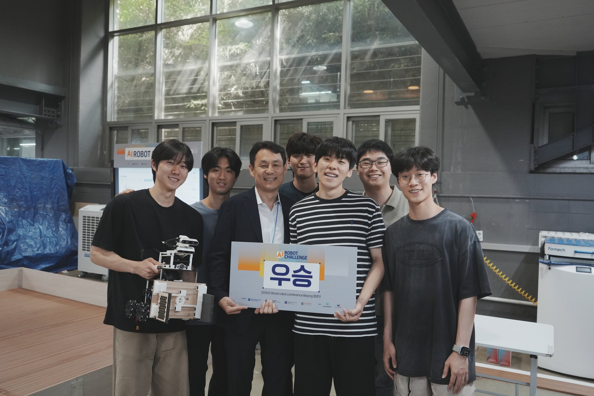

# Results and Lessons

This page is the record: what the robot scored, what we measured while building it, and the three
ways it failed in front of judges. The failures are documented at the same level of detail as the
wins, because they are the part of this repository that is hardest to get anywhere else.

**Full competition run (official video): `<YOUTUBE_URL>`**

---

## 1. The result

Team 14 placed **1st of 16 teams** at the SNU AI ROBOT CHALLENGE 2026.

Sixteen teams entered. The qualifiers are scored as a weighted pair — the first round counts for
10 % and the second for 90 % — and we scored 60 in both. Five teams advanced. The final standing is
the plain sum of two matches, 200 points maximum, with ties broken in favour of the faster mission
completion.

### Final standings

| | Team | Final 1 | Final 2 | Total |
| ---: | --- | ---: | ---: | ---: |
| **1** | **Team 14** | 60 | 90 | **150** |
| 2 | Team 7 | 70 | 70 | 140 |
| 3 | Team 8 | 80 | 30 | 110 |
| 4 | Team 16 | 0 | 100 | 100 |
| 5 | Team 10 | 30 | 20 | 50 |

The margin was **10 points**, but the number that mattered to us was our own spread: **60 and 90**,
with no collapse in either match.

That was the design goal, not luck. A robot that refuses uncertain objects, re-verifies a target
before closing on it, and treats a wrong pickup as costing double gives up the occasional perfect
run in exchange for never scoring near zero. Consistency across both matches is what the whole
refusal-to-guess design was buying, and it is what the final standing rewarded.

  

### Our two finals

| | Target classes | Collected | Score |
| --- | --- | --- | ---: |
| Final 1 | octahedron · pineapple | 3 fruit cubes | 60 |
| Final 2 | octahedron · banana | 3 shapes + 3 fruit cubes | 90 |

Scoring is 10 points per shape object and 20 per fruit cube, so a perfect match is 100 — four shapes
and three fruit cubes. Nothing we ran was ever close to that, and two of the four matches lost
points to causes that had nothing to do with recognition accuracy.

---

## 2. Measured numbers

Everything below was measured on the real robot or on real captured data unless the row says
otherwise. Numbers we never measured are not in this table.

### Localisation and control

| Quantity | Value | Where measured |
| --- | --- | --- |
| Full known-map scan matching (the generic occupancy-grid matcher, as inherited from the Nav2/AMCL era) | **345–449 ms** per solve, with pose yaw jumping and the driven path bending | 2026-07-04 22:54 run on the real robot; this measurement is why the general matcher — and Nav2 with it — was dropped in favour of `wall_range` |
| `wall_range` localiser, synthetic 1080-beam scan | **20.35 ms** (32 beams, ~272 coarse+refine candidates) | `navigation/ros2/arena_lightweight_control/arena_lightweight_control/map_localization.py` |
| Same localiser, standalone / on the Jetson Orin Nano | **8–10 ms / 41 ms** against a 50 ms budget | `arena_control_node`, `localization_warn_latency_ms` watchdog |
| Localisation error, synthetic scan | **2 cm** after the short-return fix (**65 cm** before it) | short returns were being discarded as occlusions; the scan plane at 0.32 m is above every 8 cm object, so nothing can occlude a wall — they are penalised instead |
| Pose jitter during in-place rotation | **1.5–2 cm** | street-dataset A/B analysis, 2026-07-18. The grid snap tolerance is ±25 cm, so this is absorbed for free |
| Drive envelope on the arena floor | **1.22 m/s** at PWM saturation, **0.9 m/s** operational, strafe **0.6 m/s** (~90 % transfer through the rollers), **2.9 rad/s** rotation | motor bringup sweeps, `hardware/bringup_tools/53_max_speed.py` |

### Perception

| Quantity | Value | Where measured |
| --- | --- | --- |
| Stitch calibration residual, FHD-native, mast up | **0.78 px RMS**, max 1.26 px over 6 manual correspondences; fitted rotation +0.479°, scale 1.0085/0.9921 | `perception/calibration/stitch/up.json` (`residual_px`), fitted 2026-07-21 04:59 |
| Seam quality before/after calibration (640-era fit, 22 fresh pairs) | seam ΔY **+12.4 → +0.8** px; left/right disparity **5.56/5.88 → 1.59/1.16** px | live re-shoot with `perception/tools/stitch_calibrator.py --report` |
| A1 object segmenter, `val = train` | box mAP50 0.9941 / mAP50-95 0.9784 — **a meaningless number, published to show why** | Ultralytics validation on the training split |
| A1 object segmenter, held-out arena set (60 scenes, 573 objects) | **box mAP50 0.831 / mAP50-95 0.729; mask mAP50 0.821 / mAP50-95 0.558** | purpose-built mimic-arena eval set, 2026-07-08 |
| Face model, real 70-crop holdout (`topfruit_face_s_v3ft`, the shipped weight) | fruit **43 ok / 6 wrong-confirm / 1 missed**; plain **17 ok / 3 false-fruit** | real arena crops with hand-checked ground truth |
| Face model, same holdout, previous standard (`preferred_v2`) | fruit 35 ok / 13 wrong-confirm / 2 missed; plain 15 ok / 5 false-fruit | same set, same script (`perception/eval/face_model_compare.py`) |
| Face inference batching | **5 crops: 10.9 ms batched vs 42.2 ms looped — 3.86×** | Ultralytics `predict()` on the Orin Nano |
| 2-stage pipeline vs the earlier 4-stage ABC cascade, identical 30 s CPU capture | **3.83 FPS (259.9 ms/frame) vs 1.29 FPS (713.7 ms/frame)** — 2.97× | fair same-capture comparison, 2026-07-02 |
| Asymmetric fruit voting (5 sessions, 361 detections) | plain majority vote identified **1** fruit cube; K ≥ 2 faces at conf ≥ 0.5 identified **9**; K = 1 identified 10 but flipped an octahedron on a single false positive | offline re-tally over 5 real capture sessions; the rule shipped as `CELL_FRUIT_K`/`CELL_FRUIT_CONF`, `perception/fieldlib.py:70-71` |
| Full-frame YOLO inference on the robot | **43 ms ≈ 23 FPS** | Jetson Orin Nano, stitched frame |

### Grasping

| Quantity | Value | Where measured |
| --- | --- | --- |
| Grasp discrimination — settled finger-position gap | **empty hand 3.0–3.2°, holding an icosahedron 14.1°**, threshold **8.0°** (≈5° of margin on both sides) | hardware measurement 2026-07-17; `grasp_pos_gap_deg` parameter in `gripper_bridge_node` |
| Servo current as a grasp discriminator | **useless** — current-based position mode saturates at ~113 raw with an empty hand vs 120 held. Demoted to a "torque is alive" gate (≥ 60) | same session |
| Grasp settling time | **577 ms empty / 537 ms held** → the whole check shrank from 1.3 s to **0.85 s** per pick | settling-curve capture; fits inside the firmware's 3 s auto-open watchdog |
| Camera mount plane fits (4 measured mounts) | **0.9–2.7 mm RMS**, each cross-checked with a tape measure | `perception/fieldlib.py:41-46` |

### Sim / real parity (Isaac Sim, kinematic surrogate only)

Physics was never validated in simulation — that was a deliberate policy, and physical validation
happened on the robot. What the simulator *was* used for is running the unmodified field runner
end to end, and reproducing photometry.

| Quantity | Value | Where measured |
| --- | --- | --- |
| Sim floor-band luminance after the lighting sweep | sim **Y 109.8 / 109.5** vs real **107.6 / 113.8**; p99 **166 / 165** vs real 152–167; saturation **0 %** | `simulation/scripts/lowlight_lighting_sweep.py`, converged at key 331.9 / fill 232.3 |
| Isaac renderer: DLSS → DLAA | top-camera detection range **1.9 m → 3.0 m** — DLSS's half-resolution upscale destroys 14–30 px far objects | `/rtx/post/dlss/execMode=3` |
| Isaac renderer: auto-exposure histogram left on | image Y pinned at ~**205** regardless of lighting changes, silently cancelling the whole sweep | fixed with `/rtx/post/histogram/enabled=false` |
| Depth ranging in a full sim run | **100 % of measurements came from depth**, 0 ground-plane fallbacks; a 0.530 m measurement → 0.13 m defensive hop → re-measured 0.411 m (predicted landing 0.40 m) → grasp succeeded | 2026-07-21 parity session |
| Full E2E run in sim (run 4) | 28/28 cells scanned in 24 s, 3 collection attempts, **2 grasped / 2 placed**, COLLECT phase 108.9 s | same session, same `mission/match_runner.py` that ran on the robot |

### The last full rehearsal on the real robot

Run `20260721_155127`, the best of five consecutive E2E runs on the real arena the evening before
the competition (`--votes-k 1 --fruit-k 1 --range-mode depth --pair off`, speed profile `normal`):

| Metric | Value |
| --- | --- |
| Cells scanned from one centre point with an 8 × 45° spin | 28 |
| Correct against hand-entered ground truth | **23** |
| Wrong identity | 5 |
| Ghost cells (detected where nothing is) | **0** |
| Missed cells | **0** |
| Collection attempts / grasped / placed | 3 / 2 / 2 |
| Total time | **180.4 s** against a 180 s budget → verdict `PARTIAL` |

All five identity errors were fruit-vs-fruit: 2 × orange→apple, 2 × pineapple→apple, 1 × orange→plain.
Zero ghosts and zero missed cells means **detection and localisation were solved; identity was not.**
That single line predicted the competition: everything we lost, we lost to fruit identity, to the
clock, or to a crash — never to "the robot could not find the object".

---

## 3. The three failures

### 3.1 Qualifiers — the apple was the wrong colour

**What happened.** The apple printed on the arena's fruit cubes was a **yellowish, under-ripe
apple**. The pre-competition description said red. Our face model, trained on ~48 k web-sourced
fruit cutouts of which the apple pool was overwhelmingly red, mis-predicted it.

**Root cause.** A textbook train/deploy colour domain gap, and one we had already been warned
about by our own data. The whole spring was spent fighting apple↔orange confusion in the *other*
direction: the renderer's apple red-band HSV clamp ran *before* the per-channel BGR gains, so
gains re-leaked apple hue into the orange band (measured 50 % leakage before the fix, 0.0 % after,
over 200 strong-jitter trials). We fixed the renderer's colour handling but never questioned the
*premise* — that "apple" means "red".

**The fix that should have existed.** Not a better model. A **colour-agnostic apple**: the apple
texture pool should have been sampled across ripeness (green, yellow-green, yellow-red, red) the
same way the orange pool was rebuilt to 4,643 cutouts after the realism-asymmetry finding. The
hue-bucket ablation we ran on 2026-07-02 shows we had exactly the tool for this — it moved apple's
"orange" dominant-hue bucket from 166 to 109 and "yellow" from 13 to 4. We used it to *narrow* the
apple distribution. It should have been used to widen it along the ripeness axis while keeping
the orange band clamped. Cost: one re-render.

There is also a rules-level lesson: the target fruit is announced **one minute** before the match.
A domain gap you discover at the start signal cannot be fixed by retraining. Any part of the
pipeline that depends on an assumption about the physical objects has to be robust before you walk
into the venue, or exposed as a flag you can flip in 60 seconds.

### 3.2 Final 1 — the gripper stopped answering

**What happened.** The three pineapples went perfectly: routed, verified, grasped, carried, placed.
Then the OpenRB-150 went quiet. Cycle 4 approached an octahedron, closed, and got **no verdict at
all** from the grasp check — so, by the rule we had chosen the evening before, the robot carried on
and released an almost certainly empty hand over the box. Cycles 5 and 6 approached two more
octahedra and this time the board did answer, `empty`, twice each, so both were skipped. A seventh
was grasped and dropped in at 189.8 s — past the buzzer — and the runner then died in `rclpy` on
the retreat move. **60 points official; the run's own estimate was 70, counting the unconfirmed
placement.**

**Root cause — and what was already fixed.** A different gripper failure had hit us at 05:12 that
same morning: a `termios.error` raised from `reset_input_buffer` that our `except (OSError,
serial.SerialException)` did not catch, killing the node with nothing to restart it. That one we
diagnosed from its traceback and fixed before the finals, in three layers:

1. The bridge swallows `termios.error` at all five serial call sites and reconnects, instead of
   letting it escape as a fatal exception.
2. `respawn=True, respawn_delay=2.0` on `gripper_bridge_node`, matching the LiDAR driver that had
   taught us the lesson first.
3. Bring-up refuses to declare the stack healthy unless the gripper board actually answers, and
   tries a four-step self-heal before giving up: clear orphan duplicates, wait out the launch
   respawn, kick the launch child, and only then start a standalone bridge.

So Final 1 was **not** the failure we had already fixed. The process stayed alive the whole match;
the board simply stopped replying. What decided the outcome was a policy choice, not a missing
supervisor. On the evening of 07-23 we narrowed what counts as a failed grasp: only an *active*
`empty` verdict triggers the retry-then-skip, while silence is recorded as `grasp_unconfirmed` and
the cycle proceeds. That was the right trade against an intermittently flaky OpenRB — it stops one
dropped reply from costing a 25-second round trip — and it is exactly the rule that carried an
empty hand across the arena in cycle 4.

**The fix that should still exist.** Not a respawn; we have one. A *positive* liveness requirement
on the grasp verdict itself: treat "no answer" as its own state rather than folding it into "carry
on", and demand a fresh reply within the 0.85 s the check already takes. Silence should cost one
cycle, not one placement. The mast re-home caveat stays either way — reopening the OpenRB tty
toggles DTR, which reboots the board and wipes the RAM-held lift home, so any restarted bridge must
re-capture floor-home before it accepts a `LIFT_*` command.

### 3.3 Final 2 — ran out of time

**What happened.** The 180 s timeout expired while the robot was grasping its last object. That
object was already worth points on the field but scored zero, because only what is inside the
storage box at time-up counts.

**Root cause.** The budget was never comfortable and we knew it. The last full rehearsal finished
at **180.4 s** — over budget — and the run report has an explicit overrun flag for exactly this
reason (`summary.match_budget_sec = 180`, `mission/match_runner.py:2067`). Seven objects in 180 s
is ~25 s per object including the scan; we were running at three attempts per match.

Where the time went, from the instrumented phase timings:

- **In-place rotation.** Every rotation costs seconds *and* degrades yaw estimation (LiDAR smear
  during the turn, mecanum slip in odometry). The 2026-07-21 leg-alignment rewrite already cut
  this: instead of snapping the body to the cardinal direction of travel (up to 180° of rotation),
  it aligns to the nearest of `yaw + k·90°` — at most 45°, skipped entirely inside ±15°, on legs
  shorter than 0.35 m, on the final leg, and anywhere in the object-free bottom highway.
- **Dead-zone parking.** When the arena controller's approach deceleration falls below the
  firmware's PWM dead zone, the robot parks 0.17–0.35 m short of the goal and burns the full 25 s
  timeout. Measured three times in one match = 75 s lost. Fixed by a stall detector (no 3 cm of
  progress in 1.0 s → early exit to the caller's fallback) and by widening the goal tolerance to
  0.25 m so the last few centimetres are absorbed by the next phase instead of by a settling grind.
- **Rotate-then-strafe at the storage box.** Fixed on 07-22, and it is where the robot got its
  kick. The carry no longer stops to turn: `drive_drift()` sends the translation toward staging and
  the yaw command for −135° **at the same time**, so the robot slews into the storage heading while
  it is still crossing the arena and arrives already square-on to the lip. The receiving side had
  always been ready — `MecanumController.compute_command()` emits `(vx, vy, wz)` together in its
  `holonomic_drive` phase and the goal message parses an optional `yaw` — the caller simply never
  filled it in until then. Two rounds of tuning followed: dedicated drift gains
  (`--drift-yaw-rate 1.5`, `--drift-kp-yaw 2.5`, against 0.8/1.5 for ordinary driving) because the
  ordinary yaw rate was the floor on a 135° turn, and then a two-stage gain that drops back to the
  driving values once the heading error is inside 15°, because holding the aggressive gain to the
  end made the robot zigzag and smeared the LiDAR scan.

---

## 4. What did not work

Three ideas that looked obviously correct, were built, were measured, and lost.

### 4.1 The pair verifiers made accuracy worse

The design was appealing: after the 5-class face model votes, run a *binary* specialist on the
warped face patch — apple-vs-orange, banana-vs-pineapple — as a second opinion. Both verifiers
trained well (AO val acc 0.9826, BP val acc 0.9784) and both fixed the specific failure they were
built for in isolation (the real bunch-printed banana cube went from `pineapple 0.758` to
`banana ≥ 0.996`, 4/4 correct; bunch-holdout flip rate 25.02 % → 0.00 %).

Then we ran the full sweep on the robot's own data: **780 configurations** (verifier choice × gate
style × vote threshold) evaluated on **175 real face patches** from full street-capture frames.

| Configuration | Face-level accuracy |
| --- | --- |
| **Verifier OFF** | **85.7 %** |
| AO `v2_anchor` + asymmetric gate | 74.3 % |
| AO `v2` + asymmetric gate | 71.4 % |

The cell-level metric was useless for deciding: 144 of 780 configurations scored a perfect 22/22,
so it had no discriminating power at all — which is itself the methodological lesson. At face
level the gate cost 11 percentage points, and the mechanism was specific: the banana/pineapple
head kept flipping **correct** bananas to pineapple, taking that error class from 3 to 9–11. On a
separate holdout the ranking held (OFF 86.7 %, best). The result directly contradicted our own
integration guide, which had been written from a curated 155-crop set; we published the
contradiction rather than the assumption, and shipped `--pair off`.

A late repeat on 2026-07-24 over 771 accumulated real crops confirmed it from the other direction:
a retrained AO verifier changed only **5 identities (0.6 %)** versus the old one, and the gate was
observed swapping orange→apple **48–49 times** — the exact direction we were trying to fix.

**Lesson.** A component that is more accurate in isolation can still be a worse *decision rule* in
the system, because it fires on the cases the primary model already got right. Evaluate the gate,
not the classifier. And when your headline metric saturates, it is not a good metric.

### 4.2 The distance gate was only hiding a bug

`cube_too_far` rejected cubes whose mask short side fell below a pixel threshold, on the reasoning
that far-away cubes produce unreadable faces and unresolved noise. Raising the threshold visibly
cleaned up the output, so the recommendation was to raise it to 100 px or more.

Then we found the two runtime contract violations — the face model was being called at
`imgsz=640` (it is trained at 224, and 640 collapses confidence from ~0.9 to 0.1–0.4) and being
fed PIL's RGB array instead of cv2 BGR (which flips orange↔plain and apple↔pineapple). After fixing
both, we re-ran the same sweep over 5 sessions and 361 detections:

| `short_side` threshold | ≈ distance | `cube_too_far` | unresolved | fruit observations |
| ---: | ---: | ---: | ---: | ---: |
| **45 px (default)** | 1.09 m | 113 | **4** | **27** |
| 70 px | 0.70 m | 202 | 0 | 16 |
| 100 px | 0.49 m | 244 | 0 | 8 |
| 130 px | 0.38 m | 256 | 0 | 5 |

The "unresolved noise" the gate existed to clean up went from 69 to 4 without the gate doing
anything — it was never distance, it was the inference bug. With the bug gone, raising the
threshold only destroyed good information: fruit observations collapsed 27 → 5, and grids whose
best class was `plain` were wholesale relabelled `cube_too_far`. The recommendation inverted.

**Lesson.** A threshold that "cleans up" your output is a suspect. Before tuning it, verify that
the thing it is cleaning up is noise rather than a defect upstream of it. We tuned a gate for
three weeks against a symptom of a two-line bug.

### 4.3 Ground-contact ranging

To measure how far away an object is, the approach code back-projected the **lowest pixel of the
object's silhouette** onto the known floor plane. For a cube resting on the floor this is exact:
the bottom of the silhouette *is* the ground contact.

For a sphere-like polyhedron it is not. The lowest silhouette point is a tangent **in the air**,
so the back-projection lands beyond the true contact and the range comes out systematically long:
**+27 to +64 mm predicted at object heights of 4–7 cm, +5 to +10 cm measured.** That was enough to
push measurements past the 0.50 m defensive-hop threshold. The old hop then landed the robot at
~0.25 m, where the near camera (forward 0.187 m, height 0.314 m, tilt 53.2°, 42° vertical FoV) can
no longer see the contact point at all — so re-measurement failed **5/5** and the robot achieved
**0/4 icosahedron grasps** on 2026-07-20.

The fix reads the **depth median at the contact pixel** (sampled 3 px above it, scaled by
resolution/640, valid range 0.1–4.5 m), which is shape-independent. Ground-plane back-projection
is kept only as a fallback for invalid depth pixels, and its value is still logged every time as
`y_ground_ref` so the bias keeps being measured rather than assumed gone. The hop landing was
moved to 0.40 m, the median of the 0.36–0.51 m band where measurements actually succeeded. Both
paths remain selectable via `--range-mode depth|ground`.

**Lesson.** The assumption was true for the class we tested with, and the class we tested with was
the one that had the most objects. Geometry that is exact for one shape family and silently biased
for another is worse than geometry that is approximate for both, because the failure is invisible
in aggregate metrics.

### 4.4 Three smaller negatives, stated for the record

- **A low-LR extra fine-tune of the A1 detector** gained **+0.0002** on the (leaky) validation
  split and lost **1.5–2.5 pp on every held-out metric**. Rejected.
- **EfficientNet-B0 instead of MobileNetV3-Small** for the pair verifier: render-only 6/15 real
  oranges (worse), +anchor 12/15 (exact tie), at ~2.5 ms vs 0.95 ms on ONNX-Runtime CPU. The
  bottleneck was data, not capacity.
- **Five round-1 retrained face models** scored 0.858–0.9024 mask mAP50-95 on synthetic
  validation and **all five lost on the real robot** (21/22 for the incumbent vs 16–18/22). Root
  cause: every render machine used the same default seed and image ids, so only ~22.8 k of 53.7 k
  scenes were unique and duplicates leaked across the train/val split. Per-machine seeds fixed it.

---

## 5. Transferable lessons

1. **Delete the framework when the prior is strong enough.** A known empty 4 × 4 m square does not
   need AMCL. Closed-form ray/rectangle intersection against the four walls is ~30 float operations
   per beam and solved in 20 ms where full scan matching took 345–449 ms — in pure Python, with no
   numpy in the hot path. The win was not optimisation; it was refusing to solve the general problem.
2. **Exploiting a prior has a price, and you must pay it explicitly.** The same square that makes
   localisation cheap makes it 4-fold ambiguous. That cost us whole rehearsal runs until we made
   yaw *known* by integrating gyro-z forward between scans — after which the x/y solution is unique
   and can be re-solved globally every scan instead of tracked in a fragile local window.
3. **Publish your `val = train` numbers.** Our A1 detector read 0.9941 box mAP50 on the split it was
   trained on and 0.831 on a purpose-built held-out set. Both numbers are in the model card. The
   0.9941 is the more useful one, because it is the number that would have fooled us.
4. **Measure the decision, not the component.** The pair verifiers were more accurate than the face
   model at their own binary task and made the system worse. The distance gate improved a metric
   while destroying information. In both cases the component-level number was real and irrelevant.
5. **Runtime contracts are part of the model.** `imgsz=224` and BGR input are not implementation
   details — violating either silently halves the system's accuracy while every log line still
   looks healthy. They belong in the model card, in an assert, and in the integration test.
6. **Batch, don't loop.** 5 crops through one `predict()` call: 10.9 ms. The same 5 crops in a
   Python loop: 42.2 ms. Nothing about the model changed. Most of our 43-experiment runtime
   optimisation burst was frame-level batching, not model swaps.
7. **Instrument every motion, including the ones you think are free.** In-place rotation was
   originally unmeasured, which is exactly why it never appeared in the bottleneck report — while
   being the largest single time sink *and* the dominant cause of localisation collapse.
8. **Sensorless does not mean unmeasurable.** The gripper has no force sensor and its current
   reading is useless (empty-hand current saturates at ~113 of a 120 goal). The settled
   *position gap* — 3.0–3.2° empty vs 14.1° held — separates cleanly with ~5° of margin on each
   side. Look for the signal your actuator already produces.
9. **A three-minute match is a systems problem, not an algorithms problem.** We lost Final 2 to the
   clock while holding an object. Model loading is overlapped with operator input and driving; the
   mast raise overlaps a driving leg; the mast lower overlaps batch inference. Every one of those
   is worth more than a point of mAP.
10. **Write down why a constant has its value.** Nearly every threshold in this repository carries
    the date and the field observation that produced it. Those comments are the reason this
    document could be written at all, four days after the competition, from code rather than memory.

---

## 6. Read next

- [`docs/01-competition-and-rules.md`](01-competition-and-rules.md) — the constraints these results were produced under
- [`perception/docs/models.md`](../perception/docs/models.md) — the two runtime contracts in full
- [`navigation/README.md`](../navigation/README.md) — the localiser that replaced Nav2
