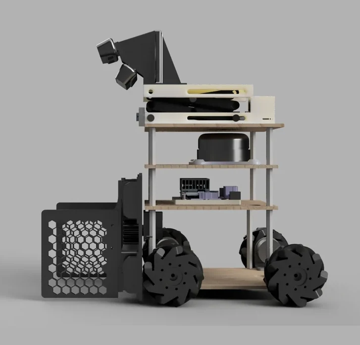
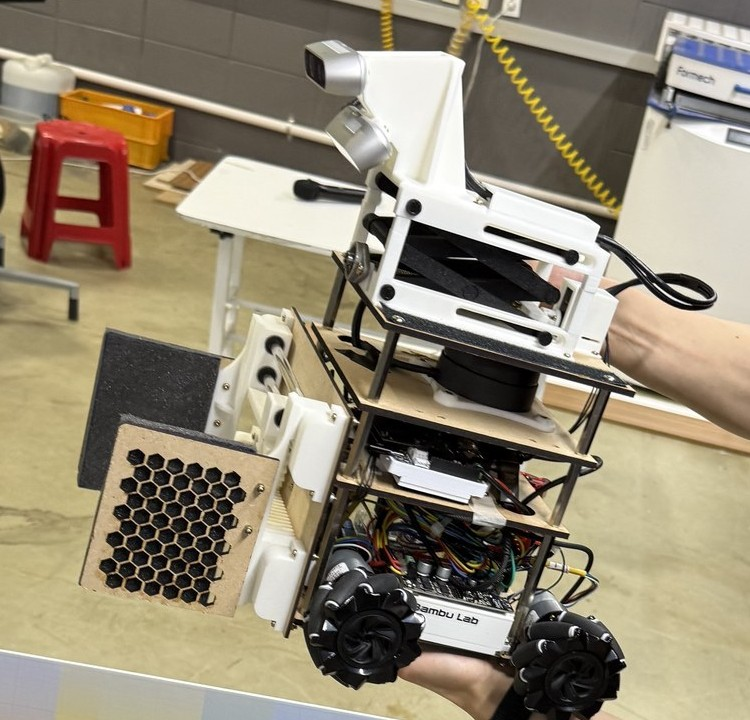
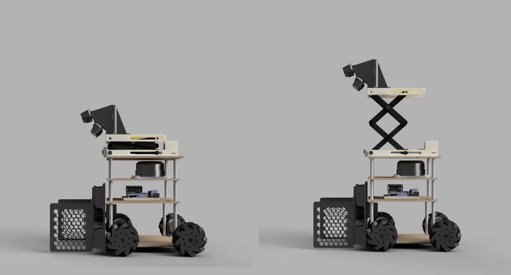

# Hardware


<p align="center">
  
  
</p>
<p align="center"><em>The CAD and the thing that played the matches, from about the same angle.
Wheel centres are 0.30 m front to rear and 0.25 m across.</em></p>
Everything on this robot that touches a wire: two firmware images, the two ROS 2 packages
that speak their serial protocols, the calibration constants those bridges load, the
bring-up chain that measures those constants, and the CAD.

This is the machine that won 1st place of 16 teams at the SNU AI ROBOT CHALLENGE 2026 (qualifiers 60 + 60 pts, finals 60 + 90 = 150 pts).

---

## 1. What the robot is

A 4-wheel mecanum differential-strafe base, roughly 0.30 m (wheel centre to wheel centre,
front to rear) × 0.25 m (left to right), with a three-deck plate stack, a servo-driven
camera mast, and a single parallel gripper at the front. It works a 4 m × 4 m arena in
3-minute rounds: find objects on a known 42-point grid, drive to one, grasp it, carry it
to the storage box, repeat.

| Subsystem | What it is | Where it is defined |
|---|---|---|
| Drive | 4 × JGB37-520 12 V 333 rpm gearmotor with quadrature encoder, mecanum wheels in X configuration | [`docs/wiring-and-firmware.md`](docs/wiring-and-firmware.md) |
| Motor drivers | 2 × Cytron MDD10A (2 channels each, PWM + DIR sign-magnitude) | [`docs/wiring-and-firmware.md`](docs/wiring-and-firmware.md) |
| Motion controller | Arduino UNO — 4 encoders, 50 Hz velocity PID, cascaded position loop, trapezoidal profiles | `firmware/arduino_mecanum/mecanum_encoder_control.ino` |
| Gripper | Dynamixel XC330 (ID 0), parallel jaws, current-based position mode | [`docs/gripper-and-mast.md`](docs/gripper-and-mast.md) |
| Camera mast | Dynamixel XC330 (ID 12), multi-turn lift, 148.9 mm measured stroke | [`docs/gripper-and-mast.md`](docs/gripper-and-mast.md) |
| Servo controller | OpenRB-150 — one USB tty, one Dynamixel bus at 1 Mbps, Protocol 2.0 | `firmware/openrb_gripper_mast/openrb_gripper.ino` |
| Cameras | Intel RealSense D435 (top) + D435i (near) — both ride the mast | `ros2/robot_bringup/launch/real_competition_bridge.launch.py` |
| LiDAR | Slamtec RPLIDAR A2M12, 256000 baud, mounted at `base_link` z = 0.262 m, yaw = π | `ros2/robot_bringup/launch/real_competition_bridge.launch.py:192-212` |
| Gyro | The D435i's IMU (`enable_bottom_imu` default `true`, remapped to `/imu/data`) — used by the localizer to make arena yaw observable | `ros2/robot_bringup/launch/real_competition_bridge.launch.py:57-58,150` |
| Compute | NVIDIA Jetson Orin Nano — the two RealSense units and the LiDAR plug into it directly; the UNO and the OpenRB-150 go through a powered USB hub, which held their ttys far more reliably than the Jetson's own ports did | [`docs/wiring-and-firmware.md`](docs/wiring-and-firmware.md#2-boards-buses-and-who-owns-what) |
| Power | 12 V battery → both MDD10A boards; encoders and logic off the Arduino 5 V rail; common ground is mandatory. Boot the Jetson with the 12 V kill switch **off** and switch it on afterwards, or the OpenRB-150 will not enumerate reliably | [`docs/wiring-and-firmware.md`](docs/wiring-and-firmware.md#boot-the-jetson-with-the-12-v-kill-switch-off) |

<p align="center">
  
</p>
<p align="center"><em>The one moving part that changes what the robot can see: the mast down (left) and up
(right), same scale, same ground line. The stroke is 148.9 mm measured. Both RealSense units ride the
top plate, so the two heights are two camera extrinsics and two stitch calibrations — most of what
<a href="../perception/README.md">perception/</a> has to keep straight follows from this picture.</em></p>

It goes up for exactly one thing: the centre scan. What separates a 20-point fruit cube from a
10-point plain one is a photograph on three of its six faces — the **top** face and one opposing
pair of sides. Only the top face is visible from every direction: the two fruit sides face away
half the time, depending on how the cube was set down. And from chassis height the top face is
edge-on, contributing a few pixels at the 1–2 m ranges the scan works at. So a mast-down scan is
left guessing on cube identity from an unlucky yaw. The 148.9 mm lift steepens the look-down enough
to read the top faces regardless of yaw, and buys less mutual occlusion between objects across a
2.15 m scan radius on the way. Everything else in the match runs mast-down — the pre-shot and the
pre-grasp re-check are both short-range work for the near camera — which is why the descent is
commanded the instant the last scan frame is taken. Full argument, with the measured fruit-face
hit rates: [`perception/docs/grid-voting.md`](../perception/docs/grid-voting.md).

Deck geometry, as modelled in `cad/urdf/robot_mk3_mecanum_sim_80mm.urdf` (collision boxes,
so these are the plate outlines, not machining drawings):

| Deck | Size | Height above ground |
|---|---|---|
| Lower plate | 190 × 250 × 6 mm | 0.173 m |
| Middle plate | 190 × 210 × 6 mm | 0.258 m |
| Upper plate | 190 × 170 × 6 mm | 0.333 m |

Modelled chassis mass is 2.4 kg (simulation value, not a weighed figure).

### Three microcontrollers, three rules

1. **Arduino UNO owns motion.** It is not a dumb PWM slave. Geometry, both PID sets,
   per-wheel motor and encoder polarity and even the driver's PWM encoding style are all
   runtime serial commands, and a single `d <dx> <dy> <dyaw>` makes the firmware run a
   synchronized 4-wheel trapezoidal move and report the residual error per wheel. There is
   no host-side control loop on the mecanum path.
2. **OpenRB-150 owns the gripper *and* the mast, on one tty.** Opening that serial port
   from a second process toggles DTR, reboots the board, wipes the mast's RAM-held home
   position and force-opens the gripper. Exactly one process may hold it — see
   [the one-process rule](docs/gripper-and-mast.md#5-one-process-owns-the-tty).
3. **The LiDAR is treated as unreliable by design.** `laser_scan_watchdog_node`
   republishes `/scan_raw` at a fixed rate onto `/laser_scan` (+ a `/scan` alias), holds a
   stale scan for a bounded window and can emit an explicit empty scan on total loss, so
   the localizer never sees a gap.

---

## 2. Directory map

```
hardware/
├── firmware/
│   ├── arduino_mecanum/mecanum_encoder_control.ino   THE flashed competition firmware (UNO)
│   └── openrb_gripper_mast/openrb_gripper.ino        THE flashed competition firmware (OpenRB-150)
├── ros2/
│   ├── robot_hardware/      mecanum_bridge_node, gripper_bridge_node, kinematics, odometry
│   └── robot_bringup/       real_competition_bridge.launch.py, cmd_vel mux, scan watchdog, real.yaml
├── bringup_tools/           numbered rebuild chain 00..53 (flash → signs → CPR → PID → LiDAR → accuracy)
├── calibration/motor_pwm/   PWM→rad/s sweeps (legacy differential-drive generation)
├── cad/
│   ├── urdf/                mecanum URDF (80 mm wheels) + the generator that produced it
│   ├── meshes/              STL visual meshes referenced by the URDF
└── docs/
    ├── bom.md                    bill of materials
    ├── wiring-and-firmware.md    pin map, MDD10A, both serial protocols, the PID cascade
    └── gripper-and-mast.md       sensorless grasp detection, mast homing, the one-tty rule
```

ROS 2 nodes shipped here (`ros2/robot_hardware/setup.py`, `ros2/robot_bringup/setup.py`):

| Node | Role |
|---|---|
| `mecanum_bridge_node` | **The competition base driver.** `/cmd_vel_motor` → serial `m`; `/base/move_relative` → serial `d` → `/base/move_result`; `STATE` stream → `/chassis/odom`, `/joint_states`, `/motor/state` |
| `gripper_bridge_node` | Sole owner of the OpenRB tty. `/gripper/command`, `/lift/command` → serial; `/gripper/state`, `/lift/state`, `/gripper/grasp` |
| `cmd_vel_mux_node` | Priority mux `/cmd_vel_direct` > `/cmd_vel` > `/cmd_vel_nav` → `/cmd_vel_motor`, each with a 0.4 s staleness timeout, zero Twist at 30 Hz when all sources go stale |
| `laser_scan_watchdog_node` | `/scan_raw` → `/laser_scan` + `/scan`, fixed rate, bounded stale-hold |
| `motor_bridge_node` | **Legacy** differential-drive driver (MK3, host-side PI + calibrated PWM feedforward). Superseded by the 2026-07-14 mecanum conversion; retained so the diff→mecanum history is legible |

---

## 3. How to rebuild it

### 3.1 Order the parts

Start from [`docs/bom.md`](docs/bom.md). Two things there are not substitutable without
code changes:

- **All four motors must have encoders.** The position loop is per-wheel; a rear wheel
  without an encoder cannot participate in a synchronized move.
- **The motor driver must be sign-magnitude (PWM = speed, DIR = direction).** The firmware
  supports the older inverted-PWM style too, but only as a runtime `mstyle` switch, and
  the shipped defaults assume MDD10A.

### 3.2 Assemble and wire

Follow [`docs/wiring-and-firmware.md`](docs/wiring-and-firmware.md). The one mechanical
trap: mecanum wheels must be mounted in **X configuration** viewed from above (FL/RR
rollers tilt one way, FR/RL the other). Mount them in O configuration and every strafe
command becomes a rotation.

### 3.3 Flash and calibrate

The bring-up chain in `bringup_tools/` is numbered in execution order, and **each script
prints the exact constants to paste into `ros2/robot_bringup/config/real.yaml`**. Scripts
00–31 talk to the Arduino over raw serial and require the ROS bridge to be stopped; 40+
require the ROS stack to be running.

| Step | Tool | What it produces | Robot state |
|---|---|---|---|
| 00 | `00_flash_firmware.sh` | Compiles and uploads via `arduino-cli` (`arduino:avr:uno`) | Bridge stopped |
| 10 | `10_wheel_selftest.py` | The firmware `sign` line and the `motor_signs` / `encoder_signs` YAML snippet | On blocks, wheels free |
| 20 | `20_encoder_cpr_calib.py` | `encoder_cpr` — turn each wheel N revolutions by hand and count ticks | On blocks |
| 30 | `30_pid_step_tune.py` | Velocity PID gains from step responses (rise / overshoot / steady-state error per wheel) | On blocks |
| 31 | `31_pid_floor_verify.py` | Re-verifies those gains **under floor load**, forward and reverse | On the floor |
| 40 | `40_lidar_orientation_check.py` | Recommended `base_scan_yaw` — catches a LiDAR mounted 180° out | LiDAR driver up |
| 50 / 51 / 52 | `50_move_accuracy.py`, `51_move_accuracy_lidar.py`, `52_single_wall_verify.py` | Effective wheel radius and effective rotation geometry, from tape measure, from LiDAR localization, or from a single wall + gyro | Bridge running |
| 53 | `53_max_speed.py` | The drivetrain saturation point per axis | Bridge running, speed caps raised |

### 3.4 Understand which constants are "effective", not physical

This is the most important thing to carry over if you rebuild. Two numbers in
`ros2/robot_bringup/config/real.yaml` are **fitted**, not measured with a ruler, and
copying the physical values instead will make every position move wrong:

| Parameter | Shipped value | Physical value | Why they differ |
|---|---|---|---|
| `wheel_radius_m` | **0.0388** | 0.040 (80 mm wheel) | 2026-07-15: with 0.034 configured, commanded straight-line moves travelled 112–116 % of the command against a LiDAR reference. The effective contact radius absorbs roller slip and tyre compression. |
| `half_length_m` + `half_width_m` | **0.108 + 0.090 = 0.198** | 0.150 + 0.125 = 0.275 | 2026-07-15, after re-seating the wheels in X configuration and recalibrating against the gyro: a commanded 90° yaw produced 158° of real rotation. The rotation factor `(L+W)` is fitted, not geometric. |

Re-measure both with `bringup_tools/51_move_accuracy_lidar.py` (or `52_single_wall_verify.py`
if you have no arena) whenever the wheels or the floor surface change.

### 3.5 Run it

```bash
source /opt/ros/humble/setup.bash
source install/setup.bash
DRIVE_TYPE=mecanum bash scripts/run_real_competition_bridge.sh
```

> **`DRIVE_TYPE=mecanum` is not optional.** `real_competition_bridge.launch.py` declares
> `drive_type` default `diff`
> (`ros2/robot_bringup/launch/real_competition_bridge.launch.py:134-139`) and the wrapper
> script defaults `DRIVE_TYPE=diff`, both inherited from the differential-drive generation.
> Omit the export and you get the legacy differential-drive bridge talking to mecanum
> firmware, which will not move correctly.

The launch also hard-codes device paths that are specific to one Jetson carrier board and
one set of boards (`/dev/serial/by-path/platform-3610000.usb-...`, camera serial numbers,
`/dev/rplidar`). Replace these with your own `by-id` paths or udev rules before first run.

---

## 4. Document map

| Document | Read it for |
|---|---|
| [`docs/bom.md`](docs/bom.md) | Parts list, quantities, substitution notes |
| [`docs/wiring-and-firmware.md`](docs/wiring-and-firmware.md) | Arduino pin map, MDD10A and encoder wiring, the complete serial grammar for **both** boards, the PID cascade, the firmware-owned motion primitives, and the five serial-layer bugs that were fixed on the field |
| [`docs/gripper-and-mast.md`](docs/gripper-and-mast.md) | The XC330 gripper's safe arc and current limits, sensorless grasp detection by settled position gap, the camera mast's limit-switch-free homing, and the one-process-owns-the-tty rule |
| [`bringup_tools/README.md`](bringup_tools/README.md) | The bring-up chain, in the original Korean |
| `firmware/arduino_mecanum/README.md` | Original Korean firmware notes. **Its pin table is stale** — use the table in `docs/wiring-and-firmware.md` |
| [`../docs/03-ros2-interfaces.md`](../docs/03-ros2-interfaces.md) | The whole sensors → topics → bridges → actuators graph |

---

## 5. Known hardware limitations, published deliberately

- **The rear-right encoder A channel is dead.** The firmware runs the rear-right wheel in
  single-channel counting mode by default (`rrSingleChannel = true`,
  `firmware/arduino_mecanum/mecanum_encoder_control.ino:191`), inferring direction from the
  last commanded PWM sign. It loses accuracy around direction reversals. It competed like
  this. Details and the pin-documentation contradiction are in
  [`docs/wiring-and-firmware.md`](docs/wiring-and-firmware.md#4-the-rear-right-encoder-a-pin).
- **Position-move tolerance was relaxed three times** (0.035 → 0.08 → 0.20 → 0.30 rad) because
  static friction chatter made tight tolerances time out under load. At 0.30 rad the residual
  wheel error is about 11.7 mm, against a grasp lateral tolerance of ±55 mm. The trade was
  accuracy we did not need for time we did.
- **In Final 1 the gripper stopped answering.** The bridge process stayed alive; the OpenRB just went quiet, and by the rule we had chosen the night before — only an active `empty` aborts a grasp — the robot carried an unconfirmed (empty) hand to the box. The crash-and-no-restart failure is a different one, from 05:12 that morning, and it was fixed before the finals. The robot reached the object and could not close
  on it; that match would have scored 90. Gripper-side software failure is visible as the
  hand letting go rather than freezing, by design — see
  [`docs/gripper-and-mast.md`](docs/gripper-and-mast.md#14-the-3-second-watchdog-is-a-dead-man-switch).
- **In Final 2 the 3-minute timeout hit** while grasping the last object.
