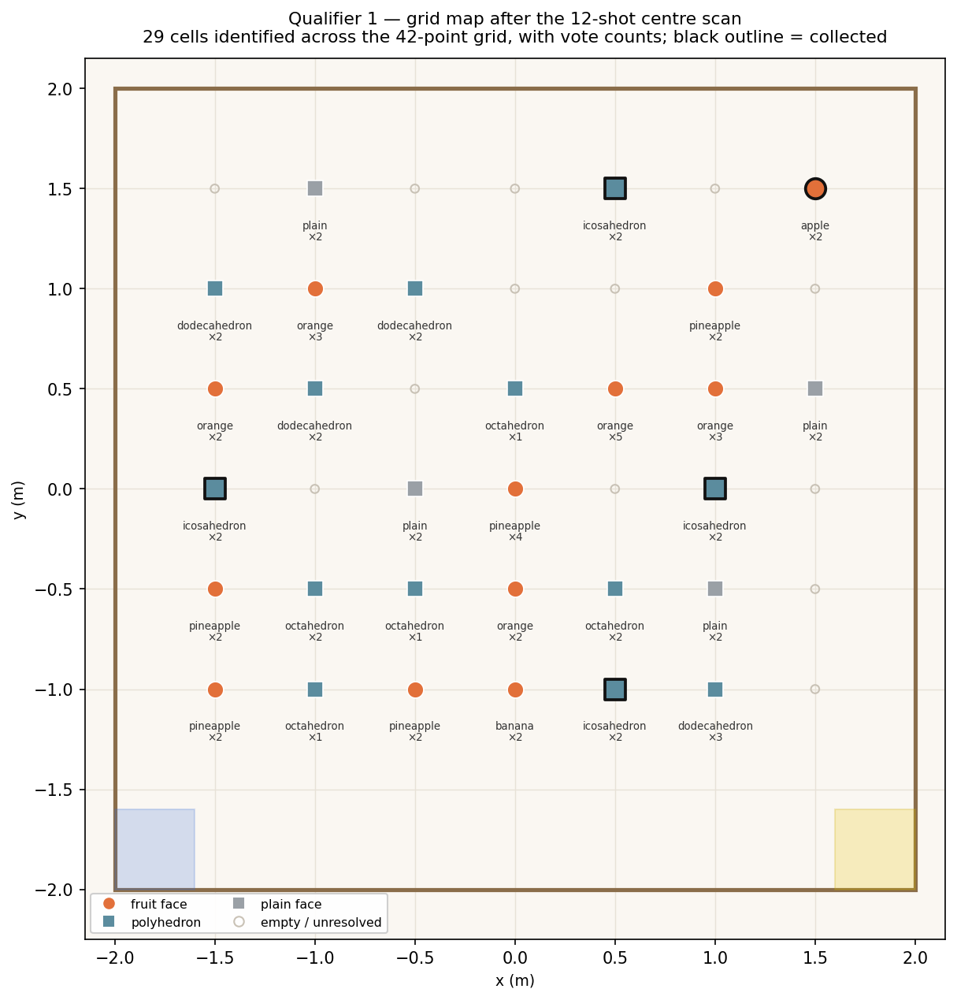
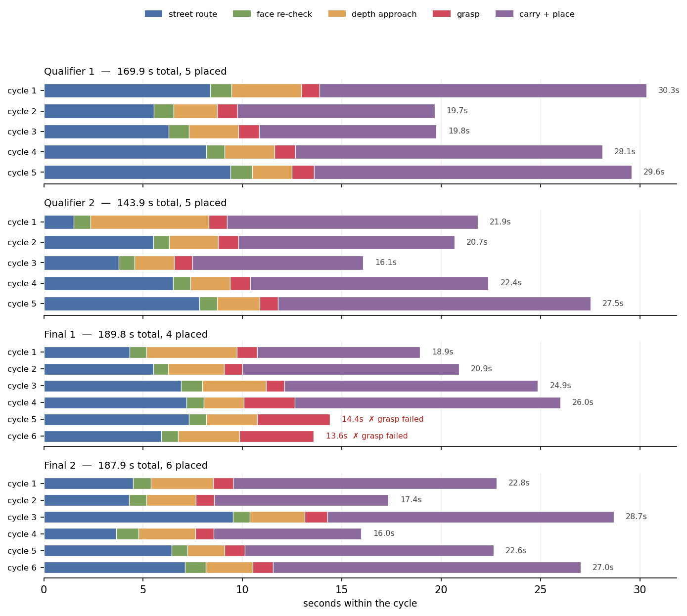

# Mission — the match runner

`mission/match_runner.py` is the program that plays a match. It is **not** a ROS node: it is a
single standalone `rclpy` client (2,508 lines) that drives the three subsystems — hardware bridges,
perception, and the Nav2-free arena controller — purely over topics, using the shared contract
library `perception/fieldlib.py`.

Everything the robot did on competition day went through this one file, launched by `scripts/run_match_day.sh`.

```
STARTUP → SEED → MAST_UP → GOTO_CENTER → SCAN (12 × 30° CW) → MAST_DOWN
        → COLLECT { ROUTE → FACE → APPROACH → GRASP → CARRY } × N → REPORT
```

Why a client script and not a node: it needs to block, prompt an operator, run YOLO in-process, and
write a self-scoring report. Nothing in it needs to be a lifecycle-managed node, and keeping it out
of the launch graph meant we could edit and rerun the match logic between two runs on the field
without rebuilding a colcon workspace.

> The shipped script logs in Korean and its module docstring still refers to the original repository
> layout (`scripts/dev/field_ops/e2e_match_test.py`). The commands below use this repository's paths.

---

## 1. Running a match

Two commands, in this order, on the Jetson.

```bash
source /opt/ros/humble/setup.bash && source install/setup.bash

# 1. bring the stack up, health-check it, seed the START pose
python3 -u mission/field_autopilot.py up

# 2. play the match (Set 1 target = icosahedron, Set 2 target = apple)
python3 mission/match_runner.py --yes --target-shape icosahedron --target-fruit apple
```

`field_autopilot.py up` runs the operator checklist (battery on / robot in the start zone facing
north / mast at the bottom / gripper clear / arena clear), launches all bridges (killing stale
duplicates first — two motor bridges on one Arduino tty corrupt commands), checks topic health, and
seeds the start pose. Exit 0 = go, exit 2 = a required component is missing. Its other verbs are
`check` (diagnose only), `record` (dataset capture: raw top/near RGB + depth pairs, YOLO debug
overlays, a rosbag and per-frame pose), `teleop` (keyboard driving), `down` (stop everything and
report leftovers). `--offline` makes `up`/`check` self-diagnose without ROS.

`match_runner.py` re-does its own health check and checklist, so it is safe to run it directly.

Other useful invocations:

```bash
# rehearsal with a known ground-truth layout, 3 objects, no placement
python3 mission/match_runner.py --gt-text "apple:150,200;plain:250,300" --max-objects 3 --no-place

# reuse a scan you already have (mast stays down)
python3 mission/match_runner.py --skip-scan --map-file logs/field_ops/<ts>_e2e/grid_map.json

# skip the scan entirely and use the ground-truth layout as the map (approach/place only)
python3 mission/match_runner.py --gt-map --gt-file gt.txt

# no ROS, no ultralytics — parser / GT / router / candidate-filter self-test
python3 mission/match_runner.py --offline
```

`gt_layout_generator.html` (open it in a browser) rolls a rule-legal 28-of-42 layout from a seed and
emits the matching `--gt-text ... --target-shape ... --target-fruit ...` command line, so a rehearsal
layout is reproducible and you never type 28 objects by hand.

---

## 2. CLI reference

Every flag, with its default.

### Target policy (competition mode)

| Flag | Default | Meaning |
|---|---|---|
| `--target-shape {cube,plain,octahedron,dodecahedron,icosahedron}` | none | Set 1 target shape, announced on the morning of the match. 10 pts each. `cube` is an alias for `plain` — a cube with no fruit face has perceptual identity `plain`. |
| `--target-fruit {apple,banana,orange,pineapple}` | none | Set 2 target fruit, announced right before the match. 20 pts each. |
| `--shape-quota N` | `4` | How many Set 1 targets are in the arena (rulebook default). |
| `--fruit-quota N` | `3` | How many Set 2 targets are in the arena (rulebook default). |
| `--order {nearest,fruit-first,shape-first}` | `nearest` | Collection order. `fruit-first` prefers the 20-pt set while any remain. |
| `--target-class CLS` | none | **Rehearsal only.** Prefer cells of one class, falling back to nearest-any if none are confirmed. Mutually exclusive with `--target-shape` / `--target-fruit`, which are strict (no non-target fallback ever). |
| `--max-objects N` | target mode: `sum(quotas) + 5` (= 12); otherwise `3` | Hard cap on collection cycles. The loop also exits early once every quota is filled. |

### Ground truth and map

| Flag | Default | Meaning |
|---|---|---|
| `--gt-text "cls:x,y;..."` | `""` | Object layout in official cm (grid points only: x ∈ 50…350, y ∈ 100…350, 50 cm pitch). Used for the scan-vs-truth confusion table. |
| `--gt-file PATH` | `""` | Same, from a file. |
| `--gt-map` | off | Drive to the scan point but skip the scan; use the GT layout as the map. Tests approach + placement only. Mast deliberately stays **down** (approach ranging uses the near camera). |
| `--skip-scan` | off | Skip scan and travel; load a previous map. Requires `--map-file`. |
| `--map-file PATH` | `""` | `grid_map.json` from an earlier run. |
| `--mast-up` | off | In `--gt-map` mode, raise the mast anyway (lift hardware check only). |

### Scan

| Flag | Default | Meaning |
|---|---|---|
| `--scan-shots N` | `8` | Steps the 360° spin is divided into. |
| `--scan-mode {step,continuous}` | `step` | `step` stops at each heading; `continuous` shoots while rotating. |
| `--scan-mast {up,mid}` | `up` | Mast height for the scan. `mid` needs firmware `LIFT_TO_MID` **and** a `perception/calibration/stitch/mid.json`; the runner refuses to start otherwise. |
| `--scan-settle S` | `0.35` | Post-rotation settle before the shot (motion-blur guard; was 0.6 s until 2026-07-20). |
| `--votes-k N` | `3` | Votes needed to confirm a cell (`fieldlib.CELL_VOTES_MIN`). |
| `--fruit-k N` | `2` | Strong fruit-face votes needed to confirm a fruit identity (`fieldlib.CELL_FRUIT_K`). |
| `--pair {on,off}` | `on` | Binary pair re-verifiers (apple-vs-orange, banana-vs-pineapple) as a second opinion. Auto-disables if the ONNX files are missing. |

### Approach, grasp, placement

| Flag | Default | Meaning |
|---|---|---|
| `--range-mode {depth,ground}` | `depth` | How the object's range is computed. `depth` = median depth at the contact pixel; `ground` = back-project the silhouette's lowest pixel onto the floor plane. `ground` was the default until 2026-07-21 and is systematically long on round shapes (see `mission/docs/match-strategy.md`). |
| `--no-place` | off | Grasp only, then put the object back and move on. |
| `--place-anyway` | off | Carry and place even if the grasp feedback never says `held`. Skips the re-grasp retry when feedback is simply absent, so a genuinely gripped object is not dropped by an `OPEN`. |
| `--release-ticks T` | `450` (≈ 39.6°) | Gripper opening at drop-off, **relative to the current finger position**. A full open hits the storage wall, and an absolute angle is meaningless while the fingers are stopped on an object. XC330 = 4096 ticks / 360°. |
| `--no-place-settle` | off | Skip pose stabilisation on the return path (0.2 m back-off, 0.2 s goal settle). Removing it was tried on 2026-07-20 and rolled back; default is on. |

### Speed

| Flag | Default | Meaning |
|---|---|---|
| `--speed-profile {safe,normal,fast}` | `normal` | Three speeds at once — cruise / approach / place in m/s: `safe` 0.5 / 0.4 / 0.3, `normal` 0.8 / 0.6 / 0.4, `fast` 0.95 / 0.7 / 0.45. `fast` is ≈95 % of the measured hardware limit (~1.0 m/s). |
| `--max-v V` | none | Override cruise only, ignoring the profile. |

Cruise speed is pushed to the arena node with `ros2 param set /arena_control_node max_linear_mps`
at startup. Before that was added (2026-07-20) the profiles silently did nothing on goal-following
drives, because `do_goto` uses the arena node's closed-loop controller and never carried a speed.

### Operations and debugging

| Flag | Default | Meaning |
|---|---|---|
| `--yes` | off | Skip all operator prompts (checklist, mast confirmation, gripper-missing confirmation). Use for a real match. |
| `--launch-stack` | off | Start the arena stack via `BridgeManager` and retry the health check up to 12 times while it boots. |
| `--dry-run` | off | Log motion/gripper/lift commands instead of sending them. Still scans and infers if frames are available; synthesises cell votes from GT if not. |
| `--offline` | off | ROS-free, ultralytics-free self-test; exits immediately after. |

Argument errors exit with **2** (argparse default), which collides with the health-gap exit code —
read the message, not just the code.

---

## 3. What each stage does

Timings below are real-robot measurements where stated; where a number comes from an Isaac Sim
kinematic run it is labelled as such, because the simulator's drive dynamics are not the robot's.

| Stage | What happens | Timing |
|---|---|---|
| **STARTUP** | GT prompt → optional stack launch → `rclpy` init → duplicate motor-bridge cleanup → topic health check (8 s listen) → operator checklist. A background thread starts loading YOLO the moment the program starts. | model preload ≈10 s (import + weights + CUDA warm-up), fully overlapped with the above |
| **SEED** | Publishes the start pose `(1.8, −1.8, +90°)` map = official `(380, 20) cm`, facing +y, then polls arena status every 0.25 s for up to 3 s and requires a localisation latency < 150 ms. Exits **4** if the localiser never locks. | ~1.5 s |
| **MAST_UP** | `LIFT_TO_TOP` through `/lift/command` (never the tty directly — opening the tty resets the board via DTR and loses the lift home). Issued non-blocking so the climb overlaps driving. Completion is `MOVING=0` **or** an elapsed-time bound, whichever comes first. | measured: up ≈7 s, down ≈6 s; mid ≈4 s is an estimate (half the stroke), never measured |
| **GOTO_CENTER** | One diagonal, then one street leg (`street_diag`). The diagonal is a single holonomic move from the start pose to `(0.25, −1.40)`, the highway line, capped at 0.6 m/s. It stops there rather than running straight to the pre-shot at `(0.25, −1.25)`: crossing the x = +0.5 m object row 15 cm further north leaves only ~3 cm between the north-facing gripper tip and the southernmost silhouette, so the last 15 cm is a street move instead. Then the pre-shot, then leg 2 north along x = +0.25 m to the scan point `(0.25, 0.25)` map = official `(225, 225) cm`. The mast raise overlaps all of it. The two-leg right-angle route (`street_L`) survives only as the fallback when the pre-shot is off. | **10.1–10.7 s** across the four competition matches (stage total, includes the pre-shot capture) |
| **SCAN** | Releases the arena goal, then 12 shots at 30° CW steps with a 0.5 s settle each. Immediately after the last capture the mast-down command is issued (non-blocking) so the ~6 s descent overlaps inference. All shots are then stitched and inferred **in batches** — A1 in chunks of 8, face crops in chunks of 32 — because a single 65-image batch exhausted the Orin Nano's 8 GB unified memory (NvMap error 12 → CUDA allocator assert). Every detection is back-projected and voted onto the 42-cell grid. | **20.6–27.0 s** across the four competition matches (12 shots, stage total including the batched inference); per-run batch stage timings are in `report.scan.batch_timing` |
| **COLLECT** ×N | Per cycle: **ROUTE** (north-locked street loop to a mini-goal one grid diagonal south-east of the object) → **FACE** (±45° to the object) → **APPROACH** (sync mast-down, open gripper, measure with up to 6 retries, optional defensive hop, re-verify the class, one relative move) → **GRASP** (`CLOSE`, wait for `state == "held"`; retry only if the bridge actively reports `empty`, carry on if it says nothing) → **CARRY** (rewind the approach, street south, **drift** to staging `(−1.40, −1.40)` while turning to −135°, placement gate, advance into the pin with a 2.5 cm push, release, retreat 0.35 m, re-close). | approach ≈2.5–2.8 s normally, 3.4–4.9 s when all 6 measurement attempts fail (log analysis, 2026-07-21) |
| **REPORT** | Joins the background image-saving thread, scores the run against the rulebook, prints the summary, writes `report.json`. Runs in a `finally`, so a crash or Ctrl-C still produces a report. | — |

<p align="center">
  
</p>
<p align="center"><em>What SCAN hands to COLLECT: one identity and one vote count per cell, from a
single spin at the arena centre. The five cells outlined in black are the ones this match went on to
collect — chosen by expected value, not by distance.</em></p>

Two behaviours worth calling out because they cost real seconds:

* **Latency hiding is deliberate.** YOLO loads during GT entry and driving; the mast rises during
  highway leg 2; the mast descends during batch inference; scan PNGs are written on a background
  thread instead of inside the inference path.
* **Unspecified `max_v` is a trap.** A `-0.2 m` reverse once took ~8 s against a 1.1 s prediction.
  Cause: `move_relative` without `max_v` falls back to the firmware's `position_max_rad_s = 6.0`,
  i.e. **0.233 m/s**, and the firmware deadline (`profile × 2 + 5 s`) then timed out. Every relative
  move now passes an explicit speed, and `do_move` records elapsed-vs-expected into
  `report.move_stats` so this class of stall shows up without log archaeology.

Three perception details the SCAN row depends on: A1 runs on the stitched frame at
`A1_IMGSZ_STITCHED = 896`, and the cameras hold the arena photometry lock — exposure 200 / gain 64 /
white balance 4600 K, measured on site on 2026-07-20 and frozen in
`perception/calibration/photometry/arena.json`. The face weight in use was fine-tuned on
photographs of the real arena objects taken on 2026-07-24.

---

## 4. Outputs

<p align="center">
  
</p>
<p align="center"><em>Where the seconds went, from the four <code>report.json</code> files. A cycle is
routing plus a face re-check plus a depth-measured approach plus the grasp plus the carry back to
storage — the carry is the single largest slice, which is why the mini-goal is picked to shorten it.
Final 1's cycles 5 and 6 are the two grasps that came back empty.</em></p>


Everything lands in `logs/field_ops/<YYYYmmdd_HHMMSS>_e2e/`:

| File | Contents |
|---|---|
| `report.json` | The whole run. Rewritten after every stage and every cycle, so a run that dies mid-match still leaves a complete record up to that point. |
| `grid_map.json` | The confirmed 42-cell map: `cells[] = {cell, identity, votes, fruit_hits, conflict}` plus `presence[]`. Feed it back with `--skip-scan --map-file`. |
| `grid_map.png` | 440 × 440 px top-down render of the arena. Green dot = fruit cell, blue = polyhedron/plain, magenta = held on `conflicting_fruit`, orange ring = presence-only, plus the START and STORAGE zones. |
| `gt.json` | The layout the operator entered, if any. |
| `scan/shotNN_{top,near,stitched,overlay}.jpg` | Per shot: both raw camera frames (never only the stitched image), the stitched frame, and a debug overlay with boxes, class, confidence, range, snapped cell, and a red dot on the contact pixel. |
| `scan/shotNN_{top,near}_depth.png` | uint16 depth in mm (skipped on Pillow versions without uint16 support). |
| `stack_launch.log` | Only with `--launch-stack`. |

`report.json` keys that matter:

* `stages[]` — `{stage, ok, sec, detail}` for SEED / MAST_* / GOTO_CENTER / SCAN / COLLECT.
* `scan.shots[]` — per shot: yaw, detection count, votes cast, and every detection with
  `snap_err_m`, `status` (`vote` / `reject`) and `why` it was rejected.
* `scan.batch_timing` — seconds in stitch / A1 / geometry / face+pair.
* `scan.gt_compare` — ok / wrong / ghosts / missed against the entered layout. **Printed before
  collection starts**, so a bad scan is visible before the robot commits to picking anything.
* `cycles[]` — per collection: target cell, identity, `route`/`carry_route` waypoints and the reason
  the router chose them, `measure` (including `attempt`, `hop_attempt`, `src` = `depth`/`ground`,
  and `y_ground_ref` so the ground-vs-depth bias keeps being measured), `target_verify`,
  `place_gate`, `place_stall`, phase timings, `grasped`, `placed`, `fail`.
* `move_stats[]` — every relative move with elapsed vs expected seconds.
* `summary` — `score_est` (20 pts/fruit + 10 pts/shape actually placed), `placed_by_cls` vs quota,
  `total_sec` against the hard `match_budget_sec: 180`, effective parameters, and a
  `PASS` / `PARTIAL` / `FAIL` verdict.

---

## 5. Exit codes

| Code | Meaning |
|---|---|
| 0 | Ran to completion (a `PARTIAL` verdict still exits 0 — read the report). |
| 1 | Bad input the parser could not catch, e.g. `--map-file` points at a missing file; also `--offline` self-test failure. |
| 2 | Required topics missing at the health check. Also what argparse uses for a bad flag. |
| 3 | Operator aborted the physical checklist. |
| 4 | Localisation never locked after seeding. Driving without it is not safe. |
| 5 | Mast movement could not be confirmed. Stitching and back-projection calibration are height-dependent, so continuing would silently corrupt every measurement. |
| 6 | YOLO weights failed to load. |

The health check requires `/laser_scan`, arena status, `/motor/state`, both cameras' RGB **and**
depth, and `/chassis/odom`; IMU and gripper telemetry are optional topics, but the OpenRB board is
separately probed for real liveness — a board unplugged from USB keeps publishing
`{"width_mm": null, "error": true}`, and a topic-existence check happily passes that. That gap once
surfaced only at the first grasp attempt, minutes into a run: unrecoverable inside a 3-minute match.

---

## 6. The `--offline` self-test

A 2,500-line hardware script cannot be unit-tested conventionally, so the pure functions test
themselves with no ROS and no ultralytics installed:

* the GT text parser and the GT-vs-scan comparison,
* the corridor router on three hand-built cases, plus a **regression case** on a full 28-object
  arena asserting the returned path actually clears every obstacle (on 2026-07-20 the detour branch
  computed a waypoint and never checked it, driving a carry route through 6 obstacle cells with 4.8 cm
  minimum clearance),
* the 42-cell snap,
* the storage pin layout (prints each pin's robot target and predicted object position, and which
  pins are rejected for putting the object outside the box),
* the competition candidate filter: non-target and conflicted cells excluded, an exhausted quota
  removing a class, `fruit-first` reordering.

Run it after any edit to the routing or target logic. It exits 1 if anything fails.

---

## 7. Where the reasoning lives

`mission/docs/match-strategy.md` — why the scan happens where it does, why measurements come from
depth instead of the ground plane, why a "plain" reading right before a grasp is not a reason to
skip, the storage geometry, and what we would change after losing points three different ways.
