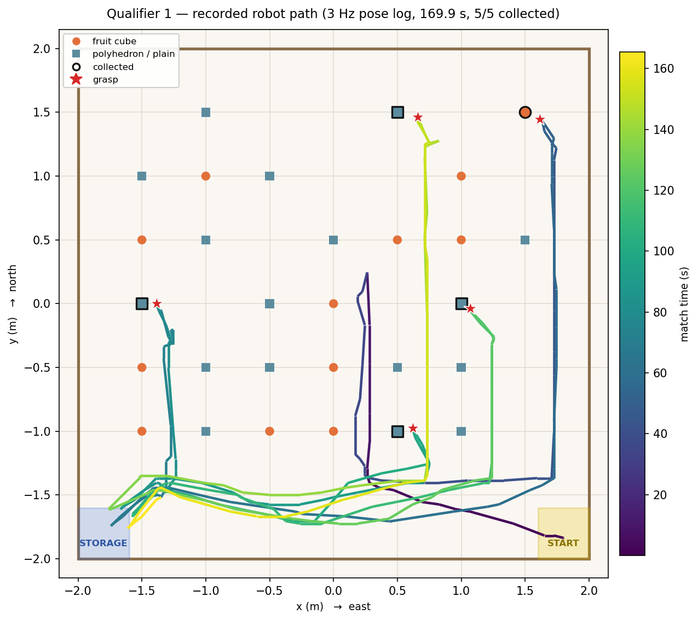
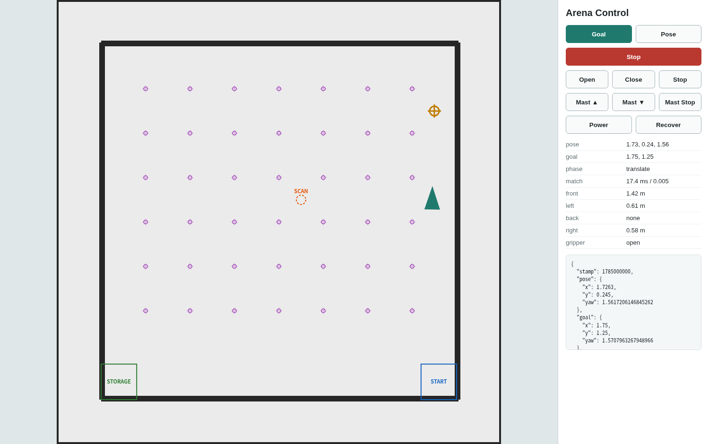
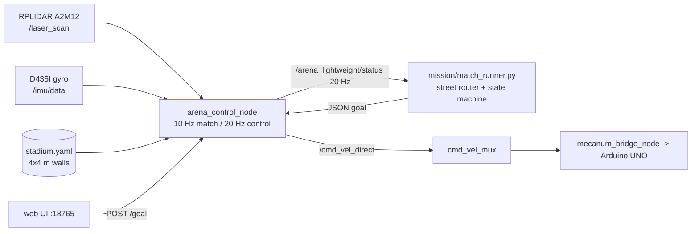

# Navigation — we deleted Nav2

This directory holds the localisation and control stack, plus `street_nav.py` — the north-locked closed loop that actually drove every match. It is the **entire** navigation system of the robot that won the SNU AI ROBOT CHALLENGE 2026 (1st of 16 teams). There is no Nav2, no AMCL, no EKF, no costmap, no global/local
planner pair, no behaviour tree, no TF tree, and no RViz.

What is here instead is one `rclpy` node. It reads a known 4 m × 4 m occupancy map, one RPLIDAR
A2M12 scan and one D435I gyro, and publishes `geometry_msgs/Twist` on `/cmd_vel_direct` at 20 Hz.
The localisation and control maths is pure Python standard library — `math`, `heapq`, `dataclasses`.
No numpy in the hot path.

| | lines | what it is |
|---|---:|---|
| `ALC/arena_control_node.py` | 1384 | the runtime node: scan → pose, goal → Twist, status JSON |
| `ALC/map_localization.py` | 1004 | PGM/YAML map loader, wall-range matcher, distance-field matcher |
| `ALC/controllers.py` | 218 | `DiffDriveController`, `MecanumController`, one shared config dataclass |
| `ALC/web_ui.py` | 514 | the whole operator console, `http.server` + one embedded HTML string |
| `ALC/tk_ui.py` | 745 | optional Tk desktop UI (disabled on match day) |
| `launch/lightweight_real.launch.py` | 370 | the single launch file |

> Throughout this directory, `ALC/` abbreviates
> `navigation/ros2/arena_lightweight_control/arena_lightweight_control/`.

---

<p align="center">
  
</p>
<p align="center"><em>Every metre the robot drove in Qualifier 1, from its own 3 Hz pose log
(the one match recorded with <code>--frame-rec-fps 3</code>). The shape is the whole strategy:
one highway along the south edge, straight northward legs up a street to each target, and back.
Heading is locked north on every leg — the gripper sticks out 26 cm past the lidar centre, so
turning into a 21 cm corridor is what a sideways sweep costs.</em></p>

<p align="center">
  
</p>
<p align="center"><em>What replaced RViz. <code>arena_control_node</code> serves this page itself on
port 18765 — click anywhere on the arena to set a goal, and the same panel drives the gripper and
the mast. No Nav2, no TF tree, no RViz on the robot. Shown here filled with a pose and a
localisation result recorded during Qualifier 1.</em></p>

<!-- Isaac Sim screenshot of the arena with the robot mid-route
     -> media/simulation/isaac-arena.jpg, then uncomment. -->

## Why we deleted it

We started on the standard stack: Isaac Sim + Nav2 + AMCL + EKF, `map → odom → base_link`, RViz
goals. It ran. It was also, for this specific problem, the wrong tool, and we have the measurement
that convinced us.

On **2026-07-04**, full known-map scan matching — a generic occupancy-grid correlative matcher over
a distance field, i.e. the honest general-purpose approach — was measured at **345–449 ms per scan**
in a real robot run (the 22:54 log). To be explicit, that is the latency of the approach we
*abandoned*, not of anything in this directory.

At that latency the pose estimate is more than three LiDAR periods stale. This was not a
theoretical concern: in the same log the node injected `wz = 0.416, -0.538, 0.521` while the robot
was supposed to be driving straight. Yaw jumped, the controller chased the jumps, and the straight
lines bent.

The arena, however, is a **known empty rectangle**. Nothing in the arena is taller than 8 cm; the
LiDAR plane sits at 0.32 m. Every single return is a wall. That is an enormously strong prior, and
the general matcher throws all of it away.

Rewriting the matcher to score each beam against the *analytically expected wall range* of a
rectangle brought the same job to **~20.35 ms** on a synthetic 1080-beam scan — a 17–22× reduction —
and made the whole Nav2 layer above it unnecessary. The rewrite is ~90 lines
(`ALC/map_localization.py:706-771`).

### Before → after

| Nav2 component | what we run instead |
|---|---|
| `nav2_amcl` particle filter | closed-form wall-range grid search, ~200 candidates/scan (`WallRangeLocalizer`) |
| `robot_localization` EKF | gyro-z integration fed **forward** into the pose yaw between scans |
| global + local costmap | a static 25 cm "street" grid derived from the rulebook object layout |
| NavFn / Smac planner | `plan_route()` — direct → axis-aligned L → street grid → verified detour |
| DWB / MPPI controller | `MecanumController`: proportional holonomic command, 20 Hz, ~40 lines |
| behaviour tree + recovery | an explicit Python state machine in `mission/match_runner.py` |
| TF tree (`map→odom→base_link`) | one `Pose2D` in map frame, guarded by a revision counter |
| RViz | a dependency-free web page on port 18765 |

---

## Measured results

> The first row is the approach this stack **replaced**, not this stack. Everything
> below it is `wall_range`, what actually shipped.

| quantity | value | where measured |
|---|---|---|
| ✗ *replaced:* generic occupancy-grid matcher (the Nav2/AMCL approach) | 345–449 ms | real-robot run log, 2026-07-04 22:54 — the reason for the rewrite |
| ✓ wall-range matcher latency | ~20.35 ms | synthetic 1080-beam scan, 2026-07-04 (32 beams, ~272 coarse+refine candidates) |
| ✓ wall-range matcher, yaw-locked global solve | 8–10 ms | offline, 2026-07-07 |
| ✓ on-robot localisation latency (Jetson Orin Nano) | median **28.2 ms**, mean 38.9 ms, p95 185 ms, max 300 ms (n = 2132 scans) | `loc_latency_ms` in three real-arena capture sessions, 2026-07-18 |
| watchdog budget | 50 ms (`localization_warn_latency_ms`) | `ALC/arena_control_node.py:113` |
| positional accuracy vs. ground truth | 2.7–2.9 cm | Isaac kinematic parity study, 2026-07-18 |
| positional accuracy, synthetic reference scan | 2 cm | 2026-07-07 after the short-return fix |
| pose jitter while rotating in place | 1.5–2 cm | real arena, 2026-07-18 |
| route safety after the router fix | 0/28 targets intruded, min. object clearance **0.250 m** | offline replay over the real 28-cell ground-truth layout, 2026-07-20 |
| route safety before the fix | 6 cells traversed inside the inflation radius, min. clearance **4.8 cm** | real run 06:23, 2026-07-20 |
| drive speed, `fast` profile | 5.65–6.13 s over the centre-approach leg (0.51–0.56 m/s) | 25 timed runs, 2026-07-20 |
| chassis physical limit | 1.22 m/s | 2026-07-17 |

The p95 of 185 ms is not a typo and we are not hiding it: those captures ran the two-stage YOLO
pipeline on the same Jetson, and Python's GIL is shared. The mitigations — `depth=1` scan QoS so
stale scans are dropped rather than queued, and a 12.5 Hz software throttle on scan processing —
are described in [`docs/localization.md`](docs/localization.md#latency).

---

## Runtime shape



### Topic contract

| topic | type | direction | note |
|---|---|---|---|
| `/laser_scan` | `sensor_msgs/LaserScan` | in | QoS `depth=1`, sensor-data reliability |
| `/imu/data` | `sensor_msgs/Imu` | in | BEST_EFFORT subscription (RealSense publishes BEST_EFFORT) |
| `/chassis/odom` | `nav_msgs/Odometry` | in | fallback yaw prior only |
| `/arena_lightweight/goal` | `std_msgs/String` (JSON) | in | `{"x":…, "y":…, "yaw":…}` — `yaw` optional |
| `/arena_lightweight/pose` | `std_msgs/String` (JSON) | in | pose seed; **mandatory before every run** |
| `/arena_lightweight/control` | `std_msgs/String` | in | `STOP` / `CLEAR` / `CLEAR_GOAL` |
| `/cmd_vel_direct` | `geometry_msgs/Twist` | out | 20 Hz, highest-priority mux input |
| `/arena_lightweight/status` | `std_msgs/String` (JSON) | out | 20 Hz in the competition launch (the node default is 4 Hz; the street loop needs 20); pose, match score, latency, phase, stamp |
| `/gripper/command` | `std_msgs/String` | out | relayed from the UI only |

---

## The three ideas that make it work

**1. Exploit the rectangle.** For a candidate pose `(x, y, yaw)` the expected range of a beam is a
closed-form ray/rectangle intersection — four divides and a `min`
(`ALC/map_localization.py:744-771`). Scoring a candidate is ~30 float operations per beam, against
16–24 downsampled beams. No ray casting, no map lookups, no distance field.

**2. Make yaw known, then the square stops being ambiguous.** A square arena's wall-range
observation is 90°-degenerate: four poses fit the same scan equally well, and a matcher can silently
jump a quadrant. We integrate gyro-z into `pose.yaw` *continuously between scans*, so yaw is never
being estimated from the scan at all. With yaw fixed, the x/y solution is unique, so the matcher
solves **globally** every scan on a single-yaw grid (~200 candidates) instead of tracking a fragile
local window. See [`docs/localization.md`](docs/localization.md).

**3. Plan on streets, not on a costmap.** The rulebook puts objects only on a 50 cm grid. The lines
halfway between grid columns are 25 cm corridors that are free *by construction*. The router
therefore never inflates and searches — it snaps onto that fixed grid and verifies. See
[`docs/control-and-routing.md`](docs/control-and-routing.md).

---

## What you give up

Publishing this as "delete your framework" advice would be dishonest. The stack is fast because it
assumes things that are true in this competition and false almost everywhere else:

- **The map must be known, rectangular, and correct.** `WallRangeLocalizer` derives the inner wall
  rectangle from the PGM (`ALC/map_localization.py:123-159`). A non-rectangular room breaks the
  observation model outright.
- **The LiDAR plane must clear every obstacle.** Scoring assumes no occlusion (0.32 m plane vs. 8 cm
  objects). Put a person in the arena and short returns become real occlusions, not noise.
- **The initial pose must be seeded by an operator.** The square's 4-fold symmetry is resolved by
  the seed plus the gyro; there is no global relocalisation from scratch. A wrong seed produces a
  confident, wrong pose in a mirrored corner — which is exactly what happened to us twice in
  rehearsal.
- **No dynamic obstacle avoidance worth the name.** There is a front-sector emergency stop and an
  optional semantic keep-out (off by default). Everything else is planned open-loop against a static
  object list.
- **No TF.** Anything downstream that wants `map → base_link` has to be written against the JSON
  status topic instead. That is a real integration cost we paid inside `perception/fieldlib.py`.

If your arena is known, static, small, and rectangular, this is a good trade. Otherwise, use Nav2.

---

## Contents

```
navigation/
├── README.md                       this file
├── docs/
│   ├── localization.md             the wall-range matcher, the IMU yaw prior, the symmetry problem
│   └── control-and-routing.md      goal latch, mecanum controller, speed profiles, the street router
└── ros2/arena_lightweight_control/
    ├── arena_lightweight_control/  the node + matchers + controllers + web UI
    ├── launch/lightweight_real.launch.py
    └── maps/stadium.yaml, stadium_nav2_map.pgm
            5x5 m canvas at 0.02 m/px (250x250), origin [-2.5,-2.5,0], walls at +/-2 m.
            The canvas is deliberately larger than the arena so a scan origin next to a
            wall still falls inside the grid.
```

The street router itself lives with the mission layer, in `mission/match_runner.py:284-431` — it is a
set of pure functions with no ROS dependency, unit-testable offline, and it is documented in
[`docs/control-and-routing.md`](docs/control-and-routing.md#the-street-router).

## Running it

```bash
source /opt/ros/humble/setup.bash
source install/setup.bash

# full stack (hardware bridge + arena node); mecanum is the competition configuration
DRIVE_TYPE=mecanum IMU_TOPIC=/imu/data BASE_SCAN_YAW=0.0 \
  ENABLE_WEB_UI=true LAUNCH_PYTHON_UI=false \
  bash scripts/run_lightweight_arena_control.sh

# arena node only, on top of an already-running bridge (the match-day form —
# never start two motor bridges on one Arduino serial port)
ros2 launch arena_lightweight_control lightweight_real.launch.py \
  launch_bridge:=false controller_type:=mecanum \
  base_scan_yaw:=0.0 initial_pose_yaw:=1.5708

# seed the pose - mandatory, the square arena cannot resolve its own corner
ros2 topic pub --once /arena_lightweight/pose std_msgs/String \
  '{data: "{\"x\":1.8,\"y\":-1.8,\"yaw\":1.5708}"}'
```

Operator console: `http://<jetson>:18765` (click to set a goal, shift-click to seed a pose). If the
port is taken the server walks forward up to 25 ports and logs the URL it actually bound.

## Tests

```bash
python3 -m pytest tests/test_map_localization.py tests/test_controllers.py tests/test_web_ui.py
```

34 test functions covering both matchers, the global reseed escaping a bad prior, short-return handling,
both controllers, the goal latch hysteresis, and the web server's port fallback. They need only
`pytest` — no ROS, no numpy.
