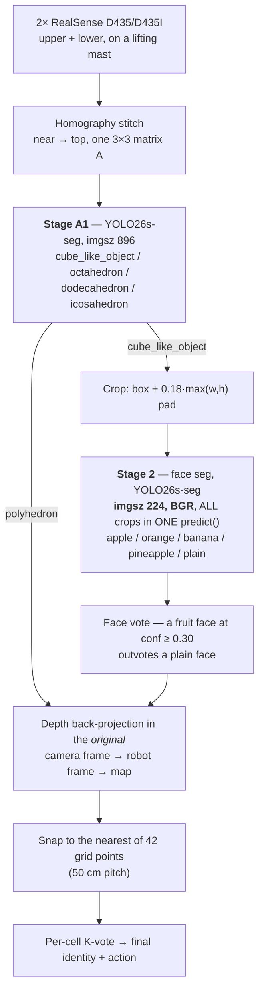
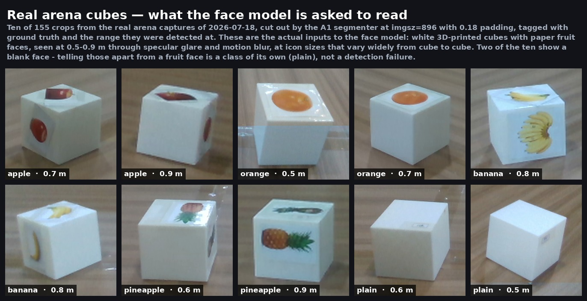

# Part 2 — Object Detection

The robot has to answer two questions about every object in a 4 m × 4 m arena, in under
three minutes: **what shape is it**, and if it is a cube, **which fruit is printed on it**.

It answers them with a two-stage segmentation pipeline that was trained on
**zero hand-labelled images** — true right up to the qualifiers. Both finals then ran a face weight fine-tuned overnight on photographs of the real arena objects, relabelled by eye. Every other weight that ran in competition was trained on
BlenderProc-rendered synthetic scenes. How that data was made — and the three ways it
failed before it worked — is in [`docs/synthetic-data.md`](docs/synthetic-data.md).

---

## The pipeline in one picture

Non-cube polyhedra short-circuit after A1 and never enter the face stage. Only the
cube-like objects pay for the second model, and all of a frame's cube crops are paid for
in a single batched forward.

---

  

<em>Shot 11 of the twelve-frame centre scan, straight off the robot during Final 1
(10 detections, all 10 voted). Left: the stitched frame with A1 boxes. Right: the boxed region
enlarged, where each label reads <code>class · confidence · range · snapped cell</code> and the red
dot is the contact pixel the range was measured at.
<a href="../media/perception/scan.mp4">Full twelve-shot scan clip</a>.</em>

## What it was trained on, and what it actually sees

Left: what the model learned from. Right: what it was then asked to read on the arena floor.
The distance between those two pictures is most of this project.

Rendered in Blender and labelled by the renderer — the polygons above are ground truth, not
predictions. Backgrounds are random COCO photographs on purpose: the model is being taught
the objects, not the room. The last panel carries **no labels at all**; roughly a fifth of
the training set is decoys like it, because every real object is a pale convex solid and
"pale convex blob ⇒ polyhedron" is a shortcut that would score well in validation and fail
in the arena.

The real thing: white 3D-printed cubes with paper fruit faces, cut out by A1 at 0.5–0.9 m,
through glare and motion blur, at icon sizes that vary a great deal between cubes. Two of
the ten show a blank face — `plain` is a class, not a miss. Recognising the *small*-icon end
of that range turned out to be a cliff rather than a slope, which is
[honest result 3](docs/synthetic-data.md#9-honest-result-3--the-recognition-cliff).

Both figures were made from the render sets and a real arena capture; the sources are the
datasets in section 10 of [`docs/synthetic-data.md`](docs/synthetic-data.md).

---

## Two runtime contracts that are not negotiable

Both were found the hard way, in the field, and both silently degrade accuracy rather
than raising an error.

| Contract | What happens if you break it |
|---|---|
| The face model **must** run at `imgsz=224` | Passing `imgsz=640` collapses face confidence from ~0.9 to 0.1–0.4 and the fruit labels start flipping. 224 is the training size; omitting `imgsz` entirely is also safe because Ultralytics reads it from the checkpoint. A1 is the opposite — it was trained at 640 and runs at 896 on the tall stitched frame. |
| The face model **must** receive **BGR** numpy arrays | Ultralytics' numpy path follows the `cv2.imread` convention. Feeding a PIL-read RGB array flips `orange ↔ plain` and `apple ↔ pineapple` (measured, not theorised). If you read with PIL, convert: `arr[:, :, ::-1]`. |

And one performance contract: **batch every crop of a frame into one `predict()` call.**
Measured on an RTX 5080, 5 crops: **10.9 ms batched vs 42.2 ms looped — 3.86×.**

These three rules cost a full day of debugging in July 2026. They also reversed an earlier
conclusion: a size-based "cube is too far, skip the face model" gate had looked essential,
but once the `imgsz`/BGR bugs were fixed the noise it was suppressing disappeared —
`cube_like_unresolved` detections went from 69 to 4 at the same threshold, and raising the
gate simply threw away good identifications. See [`docs/pipeline.md`](docs/pipeline.md) §3.

---

## What ships here

| Role | File | Architecture | Size | sha256 (first 8) |
|---|---|---|---:|---|
| A1 shape segmentation | `perception/models/a1_objectseg/best.pt` | YOLO26s-seg, 4 classes | 23,371,293 B | `08ffa8c4` |
| Face identity | `perception/models/unified_face/best.pt` | YOLO26s-seg, 5 classes, imgsz 224 | 23,291,542 B | `3d2d4dba` |
| apple↔orange verifier | `perception/models/verifiers/pair_apple_orange_v2.onnx` | MobileNetV3-Small 128 px | 6,089,237 B | `8dbca32c` |
| banana↔pineapple verifier | `perception/models/verifiers/pair_banana_pineapple_v2.onnx` | MobileNetV3-Small 128 px | 6,089,237 B | `630114ef` |

Face class order is fixed and index-dependent downstream: **0 apple, 1 orange, 2 banana,
3 pineapple, 4 plain.** Do not reorder.

One naming caveat worth knowing before you load anything: the file called
`pair_banana_pineapple_v2.onnx` is in fact the **v2_1** weight — the one retrained after a
real banana-*bunch* face flipped to pineapple at 0.758 in the field. The hash `630114ef`
matches `pair_banana_pineapple_v2_1`, not `v2`. `PairVerifier` prefers the `v2_1` name and
falls back to `v2`, and accepts either the flat `verifiers/<name>.onnx` layout used here or
the original `<name>/weights/best.onnx` training-tree layout
(`perception/fieldlib.py:405`–`423`).

Code:

- `perception/fieldlib.py` — the shared contract. `Stitcher` (exact-inverse homography),
  `PairVerifier`, `face_vote`, the six camera mounts, the model paths and every runtime
  constant (`perception/fieldlib.py:65`–`74`).
- `perception/geometry.py` — pure-math floor-plane back-projection and grasp alignment,
  no ROS, so it runs identically on the robot and in simulation.
- `perception/tools/` — the stitch calibrator, the venue photometry sweep, the live view.
- `perception/training/` — the training entry points, including
  `train_face_ft.py`, the 2026-07-24 real-photo fine-tune written the night before the
  finals.
- `perception/eval/face_model_compare.py` — the cached-crop A/B scorer that chose the
  shipped model.

---

## Three results we are publishing because they are negative

1. **The hue war.** Five face models scored 0.858–0.9024 mask mAP50-95 on synthetic
   validation and *all five lost* on the real robot. Root cause was triple: a renderer bug
   that clamped apple's hue *before* the per-channel BGR gains re-shifted it (50 % leakage
   into the orange band, 0.0 % after the fix), a realism asymmetry in which only apple had
   photographic cutout textures, and — worst — every render machine using the same default
   seed, so only ~22.8 k of 53.7 k scenes were unique and duplicates leaked across the
   train/val split. Details: [`docs/synthetic-data.md`](docs/synthetic-data.md) §7.

2. **`val = train` is not a number.** A1 read 0.9941 box mAP50 on a validation split that
   *was* its training set. A purpose-built held-out arena set (60 scenes, 573 objects) put
   it at 0.831 box mAP50 / 0.558 mask mAP50-95. A low-LR extra fine-tune gained +0.0002 on
   the fake validation and lost 1.5–2.5 pp on every held-out metric; it was rejected.

3. **The recognition cliff.** Recognition collapses when a printed icon covers roughly
   11–16 % of a cube face. Real arena icons cover 8–10 %. The training data only covered
   ~30 %. Enlarging failing crops recovered 25/30 of them — the model could read the icons,
   it had just never been shown small ones. A sparse-icon booster took recorded real-orange
   recognition from 65.1 % to 95.3 %.

The pair verifiers are a fourth: two measurements of them disagree, and both are published.
An offline 155-crop study says they help (+3 points); a robot-side 780-combination sweep on
175 real face patches says verifiers **off** is best (85.7 % vs 74.3 %). See
[`docs/pipeline.md`](docs/pipeline.md) §6.

---

## Documents

| Document | Contents |
|---|---|
| [`docs/pipeline.md`](docs/pipeline.md) | Stage-by-stage detail, every threshold with its reason, measured timings |
| [`docs/synthetic-data.md`](docs/synthetic-data.md) | How the training set was rendered in Blender, and the three failures that shaped it |
| [`docs/models.md`](docs/models.md) | Weight standard, inference rules, Jetson `.engine`/`.pt` fallback, deprecation list |
| [`docs/stitching-and-calibration.md`](docs/stitching-and-calibration.md) | The exact-inverse stitch, resolution-independent calibration, photometry lock |
| [`docs/grid-voting.md`](docs/grid-voting.md) | 42-cell snapping and the asymmetric fruit vote |
