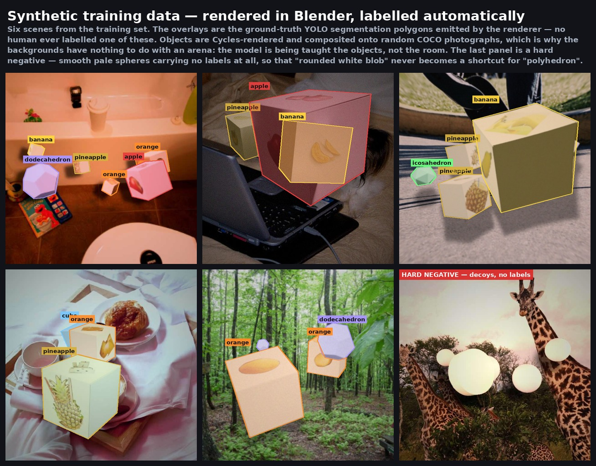

# Synthetic Training Data: How It Was Made, and Why It Worked

**Not one training image was hand-labelled until the night before the finals.** Then an operator relabelled about 74 real crops by eye and dropped 60 more, and that set produced the face weight and the banana/pineapple verifier that played the finals. Every other weight that ran on the
competition robot was trained on scenes rendered by a single BlenderProc script — 4,365
lines of it, with one late exception (§7.6) — and the entire engineering story is the story
of closing the gap between that renderer and a 4 m × 4 m arena floor.

The generation scripts were developed in a separate repository (`Data_Generation_Blender`)
and are referred to below by their names there. The training entry points that consumed
their output are published here under `perception/training/`.

**Contents**

1. [Why synthetic at all](#1-why-synthetic-at-all)
2. [The geometry is analytic](#2-the-geometry-is-analytic)
3. [The fruit cube, and the one decision everything else depends on](#3-the-fruit-cube-and-the-one-decision-everything-else-depends-on)
4. [The render is a hybrid](#4-the-render-is-a-hybrid)
5. [Pixels are dirty, labels are clean](#5-pixels-are-dirty-labels-are-clean)
6. [Visibility gates](#6-visibility-gates)
7. [Honest result 1 — the hue war](#7-honest-result-1--the-hue-war)
8. [Honest result 2 — `val = train` is not a number](#8-honest-result-2--val--train-is-not-a-number)
9. [Honest result 3 — the recognition cliff](#9-honest-result-3--the-recognition-cliff)
10. [The datasets](#10-the-datasets)

---

## 1. Why synthetic at all

The competition objects are 8 cm white 3D-printed polyhedra and 8 cm white cubes with fruit
photographs printed on three faces. Hand-labelling enough of those, under enough lighting
and viewpoint conditions, was not going to happen in the available weeks — and every time
the organisers clarified a rule (the blank face is on the *bottom*, not the side) the whole
label set would have had to change.

Rendering has the opposite cost profile: expensive to build once, free to change. When the
arena rule arrived on 2026-07-18, the fix was three lines
(`FRUIT_FACE_NORMALS` from `{+X, −X, +Y}` to `{+Z, +Y, −Y}`) and a re-render, not a
re-annotation.

The governing design principle, stated in the original documentation, is:

> **Images varied and dirty; labels conservative and clean.**

Camera noise, lighting, blur, JPEG artefacts and background variety are pushed hard. The
labels are computed from the render, from *only the pixels the camera can actually see*,
and are never touched by any of that augmentation.

The visibility policy that follows from it, verbatim from the source docs:

> Do not classify a hidden fruit.
> A cube-like object is not a confirmed plain cube.
> A fruit cube can look like a plain cube in Task 1 too.
> Do not confirm a Task 1 cube pickup from a single view.
> Only a *visible* fruit-face crop counts as fruit-class evidence.

This same rule governs the runtime: a cube whose fruit face is not visible is
`cube_like_unresolved`, not `plain`.

---

## 2. The geometry is analytic

`make_polyhedron_objs.py` (233 lines) writes four OBJs with no modelling and no
dependencies beyond numpy:

- **cube** — the eight ±1 vertices.
- **octahedron** — the six axis vertices.
- **icosahedron** — the golden-ratio vertex set, `φ = (1 + √5)/2`, as
  `(±1, ±φ, 0)`, `(0, ±1, ±φ)`, `(±φ, 0, ±1)`, with the standard 20-triangle face list.
- **dodecahedron** — constructed as the **exact dual of the icosahedron**. Each of the 20
  triangle centroids, normalised to the unit sphere, becomes a dodecahedron vertex; each of
  the 12 icosahedron vertices becomes a pentagonal face, its five adjacent face-centres
  sorted by angle in a plane perpendicular to that vertex's axis.

Every face is then oriented outward (flip the winding if the face normal points away from
the centroid) and every mesh is rescaled so that its **maximum bounding-box extent is
0.08 m** — matching the real 8 cm objects, so the projected pixel size in a render matches
the projected pixel size in the arena.

```bash
python scripts/make_polyhedron_objs.py --out assets/generated --size 0.08
```

The four OBJs total about 24 KB and are checked in, so the pipeline runs without
regenerating them.

---

## 3. The fruit cube, and the one decision everything else depends on

Fruit cubes are not loaded from OBJ. `create_fruit_cube()` builds one:

```python
bpy.ops.mesh.primitive_cube_add(size=0.08, location=[0, 0, 0])   # off-white PLA material
```

and then attaches **three textured quad overlay planes**, one per fruit face, each sitting
**0.45 mm proud of the ±0.040 m cube face**:

```python
def face_vertices_for_normal(normal, half=0.040, offset=0.00045):
```

Each overlay is a separate Blender object carrying its own custom property:

```python
face_obj.set_cp("category_id", FRUIT_FACE_HELPER_CATEGORY_ID)   # 900
```

**This is the decision that makes every downstream gate possible.** Because the printed
faces are separate instances with their own category id, BlenderProc's instance
segmentation map reports **printed-face visibility independently of cube visibility**. The
renderer can therefore answer two different questions about the same object:

```
obj_vis   = visible object mask pixels / full projected object area
fruit_vis = visible fruit-face mask pixels / full projected cube area
```

Without that separation there is no way to express "the cube is clearly visible but its
apple photograph is not", which is exactly the case that must *not* be labelled `apple`.

Class hygiene is enforced at generation time, not in review: if a texture file's declared
class differs from the cube's class, the renderer raises `RuntimeError` and stops. Every
face's texture path and class is written into the per-image metadata. A cube can carry
different *source* textures on its three faces, but they are always the same class.

Fruit-face placement follows the arena rule (2026-07-18):

```python
FRUIT_FACE_NORMALS = [("pos_z", (0,0,1)), ("pos_y", (0,1,0)), ("neg_y", (0,-1,0))]
```

`+Z` is the top; `+Y` and `−Y` are an opposing pair of sides. That is the competition rule
exactly — fruit on the top and on one opposing side pair, blank on the bottom and the other
side pair ([`docs/01-competition-and-rules.md` §3](../../docs/01-competition-and-rules.md)) —
and it makes the robot's top camera the one fruit channel that does not depend on how the
cube was set down.

Cubes are kept mostly upright to match — per-tier tilt of 12°/22°/30°, only 8 % fully
tumbled. The earlier `{+X, −X, +Y}` normals put a blank face on *top*, making the
synthetic top-camera distribution the exact inverse of the real arena's.

White polyhedra get randomised off-white colour and roughness rather than one pure white,
so the model cannot key on a single RGB value.

---

## 4. The render is a hybrid

Each 640×640 image is composited, not rendered end to end:

1. **Cycles renders only the objects**, at 16–48 samples (`--samples`, code default 48,
   production 16). The scene has randomised world colour, key light, fill light and
   optional under-light and ring-light, mixing warm and cool, area/point/sun.
2. The instance mask is softened (`soften_mask()`) to take the edge off the synthetic
   silhouette, and the foreground is **alpha-composited onto a background**: a random crop
   of a COCO 2017 image, or (5 % of scenes, `--arena_background_ratio 0.05`) a procedural
   arena background keyed to the real venue's colours — SUN-111 beige/yellow plywood floor
   with subtle grain, SUN-168 matte beige fence. The background itself gets blur, gain/bias
   and mild texture noise.
3. A **fake shadow** — the object mask, shifted, blurred and used to darken the background —
   is added to **92 %** of scenes. It is not physically correct. Its purpose is to make the
   model comfortable with a dark contact region under an object, which real floors have and
   pure compositing does not.
4. **Negative scenes** (`--negative_ratio 0.18`) contain white cylinders and spheres on
   COCO backgrounds with no labels at all, so "white object ⇒ cube or polyhedron" cannot be
   memorised.

Every object in the arena is a pale, matte, roughly convex solid, which makes "pale convex
blob" an extremely tempting shortcut for the network — and one that would score well on any
validation set drawn from the same renderer. Nearly a fifth of the training set exists to
punish exactly that: decoy spheres and cylinders, rendered with the same materials and
lighting as the real objects, carrying **no labels at all**. The correct answer to those
scenes is silence.



*Five labelled scenes and one hard negative. The overlays are written by the renderer, not
by a person. Backgrounds are random COCO photographs because the objects, not the room, are
what the model needs to learn — the arena floor is handled separately by the procedural
background branch above.*

Object placement is not uniform. Some objects are deliberately spawned near existing ones
to create occlusion and near-contact, subject to a minimum centre distance. Each object's
transform is sampled up to **300 times for fruit cubes and 120 times for plain shapes**,
scored on frame margin (0.08), projected area, estimated fruit-face pixels and target
visibility tier; if no perfect candidate is found the best-scoring one is used, so
generation never stalls. Scale is drawn from a **triangular** distribution, not a uniform
one, so small objects exist without dominating.

---

## 5. Pixels are dirty, labels are clean

After compositing, two families of degradation are applied — **to the pixels only.** The
labels come from the segmentation map computed *before* any of it.

### Lens distortion (Brown–Conrady)

`apply_lens_distortion()` draws up to **80 candidate parameter sets**:

```
k1 ∈ [−0.30, 0.22]   k2 ∈ [−0.10, 0.08]   p1, p2 ∈ [−0.006, 0.006]
centre ∈ 0.47–0.53 of the frame,  focal ∈ 0.72–1.15 of the frame
```

A candidate is **accepted only if the remap never samples outside the frame**. If none of
the 80 qualifies, the image simply gets no distortion. This is deliberate: an earlier
version cropped away the invalid black border and rescaled to 640×640, which shifted every
label. The current design would rather lose an augmentation than corrupt a label. Applied
with probability `--lens_distortion_prob 0.35`, and when applied, the image, the instance
segmap and the background are remapped with the *same* map.

### The camera-artefact stack

`apply_camera_artifacts()`, in order, each with its own probability:

| Artefact | p | Range |
|---|---:|---|
| Per-channel gain | 0.80 | B 0.82–1.22, G 0.88–1.12, R 0.80–1.28 |
| Brightness gain + bias | 0.85 | gain 0.68–1.22, bias −30…+18 |
| Gamma | 0.65 | 0.78–1.35 |
| Gaussian noise | 0.50 | σ 2.0–13.0 |
| Gaussian blur | 0.25 | k = 3 or 5 |
| Horizontal/vertical motion blur | 0.18 | k = 3, 5 or 7 |
| Down-up resample | 0.55 | scale 0.34–0.82 |
| Vignette | 0.65 | up to 55 % falloff |
| JPEG compression | 0.88 | quality 38–92 |
| Over-bright / over-dark correction | conditional | if >22 % of pixels are near-white, or mean luma <35 |

**None of this touches the labels.** Labels are derived from the rendered segmap: largest
external contour per instance (`--seg_contour_mode largest`), simplified with
`cv2.approxPolyDP` at `--seg_contour_epsilon_ratio 0.01` — 1 % of the contour *perimeter*,
chosen to remove bevel and pixel-stair artefacts without eroding fruit-face boundaries.

---

## 6. Visibility gates

Three gates, at three different costs.

### Gate 1 — before paying for a render (`--ideal_visibility`)

Before a single Cycles sample is spent, the layout is validated using ideal geometry only:
each mesh face and each fruit-face overlay is projected and a simple depth buffer produces
an instance map. The layout is accepted only if

```
target fruit tier == actual fruit tier
obj_vis   > 0.10
fruit_vis ≥ 0.10
visible fruit-face pixels ≥ 300
visible fruit-face bbox width and height ≥ 10 px
```

and otherwise the whole placement is resampled, up to `--ideal_visibility_max_attempts 80`
times.

### Gate 2 — fruit label, or demotion to `cube`

A fruit cube keeps its fruit class only if it passes all of the production thresholds.
**Note that the code defaults differ from the production values** — this bit the team once
and must be passed explicitly when reproducing:

| Option | Code default | Production | Why |
|---|---:|---:|---|
| `--min_fruit_visible_ratio` | 0.10 | **0.22** | Fraction of the cube's projected area that must be printed face |
| `--min_fruit_face_pixels` | 300 | **1800** | Absolute information content of the printed face |
| `--min_fruit_face_side` | — | **36** | Prevents thin sliver fruit labels |
| `--hard_min_fruit_visible_ratio` | — | **0.10** | Relaxed floor, hard tier only |
| `--hard_min_fruit_face_pixels` | — | **900** | Relaxed floor, hard tier only |
| `--min_projected_area` | — | **900** | Drops objects too small to learn from |
| `--min_object_visible_ratio` | — | **0.10** | Below this the object is treated as absent |
| `--max_covered_ratio` | — | **0.80** | Over-occluded layouts are resampled |

A cube that fails is **not dropped** — it is relabelled `cube`. In the preview it reads:

```
cube  from=banana  fallback
```

meaning: this started as a banana-textured cube, but in the final render the banana
photograph was not visible enough to be trained as `banana`. The sample is harmful for
fruit classification and still useful for cube detection, so it changes class instead of
disappearing.

### Gate 3 — visibility tiers

To stop the model from only ever seeing head-on fruit faces, each cube is assigned a target
tier with its own `fruit_photo_cube_ratio` band:

| Tier | Weight | Fruit-face / object area | Geometry |
|---|---:|---|---|
| easy | 50 % | ≥ 0.50 | small tilt, slightly larger scale |
| mid | 45 % | 0.20–0.50 | larger tilt |
| hard | 5 % | 0.10–0.20 | near-random rotation, smaller scale |

Hard samples are needed but must not dominate the distribution, hence 5 %.

### The metadata schema that makes it auditable

`--meta_v2` writes, per image: object visible **and** full masks; per-face visible and full
masks; face `quad_xy` (where the face would be with no occlusion) and `quad_xy_raw`;
per-corner visibility; occluder object ids; camera intrinsics and extrinsics; and a scene
snapshot capped at 512 vertices / 512 polygons. Each face carries `face_kind` (fruit/plain),
`fruit_class`, `visible_pixels`, `visible_ratio` and a `quality` flag (good/partial/bad).

This is why the 94,210-crop cube-face training set could be **re-derived from the 50,000
scene render without re-rendering anything** — the crops are a metadata recombination.

Three quality tools ran before every large render, and are the reason the pipeline is
trustworthy rather than merely large: per-class texture contact sheets, a 100-image label
and visibility preview panel (tier, `fruit_vis`, `obj_vis`, OK/fallback), and an automated
audit enforcing the no-mixed-texture invariant.

---

## 7. Honest result 1 — the hue war

**Symptom.** Real printed **orange** faces were confidently read as **apple**. In the
2026-07-18 round, five newly trained face models scored **0.858–0.9024 mask mAP50-95** on
synthetic validation and **all five lost** to the incumbent on the robot's 22-cell arena
benchmark (incumbent 21/22 with one wrong confirmation; challengers 16–18/22 with 4–6).
Orange was the failure axis: incumbent 3/4, challengers 0–2/4.

Three independent causes were found. Each was fixed **in the data**, not in a threshold.

### 7.1 The renderer bug: clamp before gain

Apple textures are hue-jittered and then clamped back into a red band so an apple never
drifts into the orange band. The clamp ran **before** the per-channel BGR gains — and the
gains then shifted the hue right back out. Measured over 200 strong-jitter trials:

| | Apple hue leaking into the orange band |
|---|---:|
| Clamp before colour operations | **50 %** |
| Clamp moved to the final step | **0.0 %** |

Fixed in commit `86defe7`, along with an apple texture gate (`red ≥ 0.08`) and an increase
of the orange class weight from 1.35 to 1.60.

A direct consequence for training: once the renderer clamps hue, **hue augmentation during
training must be disabled** (`hsv_h = 0.0`), or it re-introduces exactly the leakage the
clamp removes.

### 7.2 Realism asymmetry: an attractor made of photographs

Only **apple** had photographic cutout textures. The other classes were dominated by
studio-lab imagery. The model learned an unintended shortcut — *photo-realistic ⇒ apple* —
which fires on real camera input by construction.

The fix was to rebuild the texture pool so realism was not class-correlated. The v3 pack:

| Class | Cutout-v2 textures |
|---|---:|
| **orange** | **4,643** (the largest of any class) |
| apple | 2,131 |
| pineapple | 1,866 |
| banana | 1,440 (legacy lab set) |

### 7.3 The one that hid the other two: a shared random seed

Rendering was distributed across four machines. Every machine used **the same default seed
with the same image ids** — so the machines rendered **the same scenes**. Of 53,700 round-1
scenes, only about **22,800 were unique**, and the duplicates landed on *both sides* of the
train/validation split.

That is why five models could score 0.858–0.9024 on synthetic validation and lose on the
robot. The validation set was partly the training set. The hue leak and the realism
asymmetry were both invisible behind it.

Fixed by assigning a distinct seed per machine:

| Machine | GPU | Scenes | Seed |
|---|---|---:|---:|
| local | RTX 5080 | 3,700 | 31,000,000 |
| school cluster | A6000 (PBS) | 8,100 | 32,000,000 |
| spare 1 | 2080 Ti | 3,800 | 33,000,000 |
| spare 2 | 5070 Ti | 14,400 | 20,260,513 |

30,000 v3 scenes, four machines, four seeds. The crop exporter also gained a
`--crop_prefix` flag: without it, identical metadata stems from different render sets
silently collide and crops are dropped (~3 k lost in round 1).

**The lesson we would tell anyone doing distributed synthetic generation:** count your
unique scenes. Do not count your files.

### 7.4 Did it work?

The first model trained on the corrected v3 render, `topfruit_face_s_v3ft`, was the first
new model to beat the incumbent on the real 70-crop holdout:

| Model | Fruit correct | Wrong-confirm | Missed | Plain correct | False fruit | orange | pineapple | apple | banana |
|---|---:|---:|---:|---:|---:|---|---|---|---|
| incumbent (`preferred_v2`) | 35 | 13 | 2 | 15 | 5 | 8/15 | 13/21 | 7/7 | 7/7 |
| **`s_v3ft` (shipped here)** | **43** | **6** | 1 | 17 | **3** | 10/15 | **19/21** | 7/7 | 7/7 |

Five of the six residual errors are still orange → apple, but at confidence 0.50–0.86
instead of the incumbent's confident 0.93–0.98 — i.e. they moved into the range a verifier
can catch.

### 7.5 The same lesson twice: banana bunches

A real cube printed with a *bunch* of bananas was read as **pineapple at 0.758**. Cause:
92 % of the v3 banana texture pool was single bananas, so the dark shadows between adjacent
bananas in a bunch were out of distribution. Fixed in data — 5,000 synthetic bunch
composites (2–4 filtered single-banana cutouts overlapped 30–52 % with explicit blurred
seam shadows) plus 5,000 real cutout patches, giving 15,029 banana patches:

| | Before | After |
|---|---:|---:|
| Bunch-holdout flip rate (1,051 unseen patches) | 25.02 % | **0.00 %** |
| Pineapple regression | 0.50 % | 0.40 % (none) |
| Real bunch cube | pineapple 0.758 | banana ≥ 0.996, 4/4 correct |

A related capacity ablation is worth recording as a negative: swapping MobileNetV3-Small
for EfficientNet-B0 gave 6/15 real oranges render-only (worse), 12/15 with anchors (an
exact tie) and ran 2.5× slower. **The bottleneck was data, not capacity.**

### 7.6 And then it happened again, at the competition

In the qualifiers the apple printed on the arena objects was a **yellowish, under-ripe
apple**, not the red one that had been announced beforehand. The face model read it as
orange at 0.95. Same failure family as §7.1 — a colour domain gap between what was
rendered and what was printed — arriving from the opposite direction, and this time with
no rendering time left to fix it.

The response was the largest use of real photographs in this project (an earlier anchor fine-tune on 07-19 had already used 64 real crops), and the only one that reached a competition weight for the face model — in this project's training:
crops harvested from one end-to-end run on 2026-07-23 (the 15:45 match on the final objects), its own driving recorder frames and phone photos, mixed with the synthetic set and
fine-tuned overnight. The recipe is published as `perception/training/train_face_ft.py`,
and its comments record the reasoning:

```python
# Start from the model CURRENTLY DEPLOYED on the robot. Keep the existing training
# contract, but drop hsv_h from 0.015 to 0.005: hue jitter smears the apple/orange
# boundary, and that boundary is the axis this misclassification sits on
# (an under-ripe apple read as orange 0.95).
```

Mixing real with synthetic is itself non-trivial — 121,597 synthetic instances against 807
real ones means the real data is 0.7 % of the signal and disappears, while dropping the
synthetic data collapses `pineapple` and `plain` through catastrophic forgetting. The
published `105_build_mix_dataset.py` handles it by capping synthetic instances per class
with a greedy pass that prefers images containing rare classes, and by listing each real
image N times in the training manifest instead of duplicating files.

---

## 8. Honest result 2 — `val = train` is not a number

The A1 object segmenter was trained with its validation split *equal to* its training set.
It read **0.9941 box mAP50**. That number means nothing about generalisation, and it was
quoted internally for weeks.

A held-out evaluation set was built from a 3D replica of the real arena — 60 scenes, 573
objects (`cube_like_object` 320 / octahedron 88 / dodecahedron 75 / icosahedron 90),
rendered with the mimic-arena script and never used for training. The same weights:

| Metric | `val = train` (fit) | Held-out arena (generalisation) |
|---|---:|---:|
| box mAP50 | 0.9941 | **0.831** |
| box mAP50-95 | 0.9784 | **0.729** |
| mask mAP50 | 0.9942 | **0.821** |
| mask mAP50-95 | 0.9537 | **0.558** |

The same experiment then rejected a change that looked like an improvement. A low-LR extra
fine-tune (AdamW, `lr0 = 1e-5`, 30 epochs, run to completion):

- on `val = train`: **+0.0002 to +0.0008** — noise, or memorisation of the training set;
- on the held-out arena set: **−1.5 to −2.5 pp on all four metrics** (box mAP50 −2.5 pp).

Textbook overfitting, and **invisible in the `val = train` setting**. The original A1
weight was kept and the fine-tune marked `rejected`. That weight, `08ffa8c4…`, landed on
2026-07-02 and was never changed again — it is the weight in
`perception/models/a1_objectseg/best.pt`.

---

## 9. Honest result 3 — the recognition cliff

**Symptom.** A recorded set of real orange cubes was recognised only **65.1 %** of the time
(56/86 crops) by a model with a 0.894 mask mAP50-95 on synthetic validation.

**Diagnosis.** It was not colour. It was **composition**. A sweep over synthetic icon area
found a *cliff*: recognition collapses when the printed icon covers roughly **11–16 %** of
the face. Real arena icons cover **8–10 %** — below the cliff. The training data covered
about **30 %** — dense icons, well above it. And the decisive test: simply **enlarging** the
failing crops turned **25 of 30** of them correct. The model could read the icons. It had
never been shown small ones.

*(One internal index records the cliff band as 11–20 %; the presentation figure and the
booster recipe both use 11–16 %.)*

**Fix.** A booster targeted precisely at the cliff, using **no real imagery at all** — a
strict policy in this project, since the recorded set was the evaluation holdout. Four
iterations, each 100 scenes, each scored against the current model:

| Version | Change | Fruit top-class error | Verdict |
|---|---|---:|---|
| v1 | Icon area 0.38–0.62 linear (area only) | 6.4 % | Too easy — area alone is not enough |
| v2 | + `realistic_webcam_hard` degradation, area 0.30–0.52 | 10.6 % | Capture degradation is the key second axis |
| v3 | + print flattening (bilateral + k-means posterise, 75 %) | 12.1 % | Minor contribution |
| **v4** | **Area 0.24–0.40, matching the recorded icon geometry** | **17.8 %** | **Adopted — reproduces the real 65 % difficulty** |

The v4 recipe (`realistic_a4_sparse_icon`): printed patch covering **6–16 %** of the face,
posterised print flattening, webcam-grade degradation (white balance, exposure, gamma,
noise, low-res resample, vignette, JPEG). 10,000 scenes were rendered with it and used for
a low-LR fine-tune (120 epochs, best epoch 47).

| Metric | Base (`readd`) | Sparse-icon fine-tune |
|---|---:|---:|
| Recorded real-orange recognition | 65.1 % (56/86) | **95.3 % (82/86)** |
| orange−apple margin, p10 | −0.385 | **+0.111** |
| Arena probe apple / orange | 68.8 % / 69.7 % | **81.2 % / 78.8 %** |
| Mixed-val mask mAP50-95 | 0.894 | 0.894 (no regression) |

One regression remained: weak (0.2–0.4) fruit detections on blank crops, 17 of 25. It was
handled at runtime rather than in data, with the `fruit_min_conf = 0.45` guard described in
[`pipeline.md`](pipeline.md) §5 — a threshold derived from the same holdout, keeping 100 %
of true-orange faces while rejecting ~88 % of blank-crop false positives.

**This model is not the one that ran on the robot.** The sparse-icon fine-tune is the last
face model promoted here; the robot ran an earlier face weight throughout. The July
retraining round was therefore benchmarked against a checkpoint that was not the best
available, so some of the round-1 rejection verdicts were measured against a weaker baseline
than they should have been. Read those verdicts with that in mind.

---

## 10. The datasets

The rendered datasets are **not published**. Together they run to tens of
gigabytes, and hosting that is not something this project can maintain. What is
published is the recipe: every rule that decides a scene, a label and a rejection
is written out above, the seeds and counts are recorded per bundle below, and the
training entry points that consumed the output are in `perception/training/`.
Regenerating is the intended path — the renderer settings that matter are in §4,
§5 and §7, and the visibility gates in §6.

The table below is therefore a record of what was rendered and what each bundle
was for, not a download index.

| Bundle | Size | Contents |
|---|---|---|
| `meta_v2_50000_coco_texture_v1` | 50,000 scenes (40 k train / 5 k val / 5 k test) | The flagship render, full meta_v2 metadata. Every shipped model traces to it. |
| `meta_v2_topfruit_v3_{local,sp1,sp2,server}` | 30,000 scenes | The July v3 render — corrected fruit-face rule, hue-clamp-last, **per-machine seeds**. Bundled per machine so seed provenance stays visible. |
| `meta_v2_50000_cube_face_unified_v1` | 94,210 crops @ 224 px | Cube-face crops re-derived from the 50 k render with no re-rendering (pad 0.18, seed 20260628). Empty crops deliberately kept as hard negatives. |
| `face_crops_phase5` | 41,715 crops (37,621 / 4,094) | The final face training set. See below. |
| `face_crops_full` (round 1) | 47,081 / 4,957 crops | **ARCHIVE ONLY — DEFECTIVE.** The duplicate-seed set. Published deliberately: it is the counterexample that makes the seed-hygiene lesson concrete. Every round-1 validation number computed on it is inflated. |
| verifier patch sets | 12,667–15,029 per class | 224 px mask-quad perspective warps, balanced 50:50, 30 % capture-degraded. **Exclude the v1 sets** — contaminated by pre-hue-fix renders. |
| `banana_bunch_patches` | 5,000 + 1,051 holdout | The bunch composites and the holdout that measured 25.02 % → 0.00 %. |
| `arena_v3_a1_eval_v1` | 60 scenes / 573 objects | The held-out A1 evaluation set from §8. The only honest generalisation number A1 has. |

`face_crops_phase5` rebalancing is worth spelling out, because raw synthetic instance
counts are always wrong:

- Raw: apple 16,070 / orange 15,920 / banana 16,337 / pineapple 16,449 / **plain 77,914
  (54.6 %)**.
- Plain subsampled to 43,094 (**40.0 %**); apple capped at 15,920 to match orange *exactly*
  — since apple↔orange was the failure axis, an apple majority is a thumb on the scale.
- **30.0 % of training crops (11,305) were degraded in place**: gamma 1.2–2.2, contrast
  0.55–0.85, warm white balance (R ×1.03–1.15, B ×0.85–0.97), Gaussian noise σ 3–9,
  JPEG q 35–60, blur k3/k5.

### What is *not* redistributed

**The fruit texture pool is not published.** It is 6,400 images: Kaggle Fruits-360 at 65 %
(CC BY-SA — share-alike may propagate to derived renders), a 10 % FruitSeg30 slice whose
licence is not documented anywhere in the source repo, and a 25 % slice produced by
scraping a search engine, which is not redistributable. The COCO 2017 backgrounds are under
Flickr terms.

What *is* published is the **recipe**: the preparation scripts, the fixed 65 / 25 / 10
ratio (1,040 / 400 / 160 images per class, 1,600 per class total), the HSV colour-gate
thresholds, and the contact sheets. `download_generic_fruit_textures.py` (Wikimedia
Commons) is the sanctioned clean-rebuild path; the search-engine scraper is deliberately
not released.

This licensing question is unresolved and may encumber the *rendered* bundles above, not
only the texture pack. If you intend to build on these datasets commercially, establish
the Fruits-360 share-alike and FruitSeg30 provenance questions first.

### Reproducibility caveat

BlenderProc downloads and manages its own Blender binary, and **no log, document or
lockfile in either repository records which Blender version was used**. The environment
pins `blenderproc==2.8.0` and `bpy==5.0.1`. Run `blenderproc run` once and record the
printed version before claiming bit-level reproducibility.
