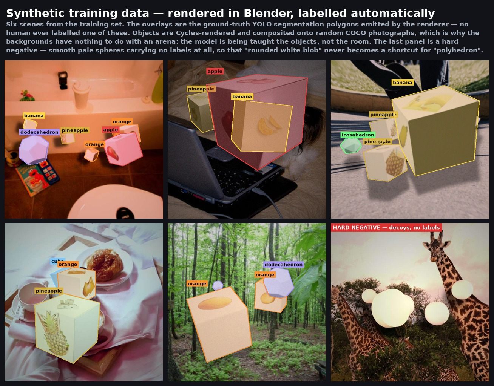

# Synthetic Training Data: Design and Label Policy

This page documents the renderer's design and label policy. The scripts are now part of
this repository under [`../generation/`](../generation/). For commands that reproduce the
public baseline from a clean checkout, see
[`synthetic-data-reproduction.md`](synthetic-data-reproduction.md). Historical results,
rejected approaches and the dataset provenance record are in
[`synthetic-data-experiments.md`](synthetic-data-experiments.md).

**Contents**

1. [Why synthetic at all](#1-why-synthetic-at-all)
2. [The geometry is analytic](#2-the-geometry-is-analytic)
3. [The fruit cube](#3-the-fruit-cube-and-the-one-decision-everything-else-depends-on)
4. [The render is a hybrid](#4-the-render-is-a-hybrid)
5. [Pixels are dirty, labels are clean](#5-pixels-are-dirty-and-labels-are-clean)
6. [Visibility gates](#6-visibility-gates)

---

## 1. Why synthetic at all

The competition objects are 8 cm white 3D-printed polyhedra and 8 cm white cubes with fruit
photographs printed on three faces. Hand-labelling enough of those, under enough lighting
and viewpoint conditions, was not going to happen in the available weeks — and every time
the organisers clarified a rule (the blank face is on the *bottom*, not the side) the whole
label set would have had to change.

Rendering has the opposite cost profile: expensive to build once, free to change. When the
arena rule arrived on 2026-07-18, the fix was three lines
(`FRUIT_FACE_NORMALS` from `{+X, −X, +Y}` to `{+Z, +Y, −Y}`) and a re-render, not a
re-annotation.

The governing design principle, stated in the original documentation, is:

> **Images varied and dirty; labels conservative and clean.**

Camera noise, lighting, blur, JPEG artefacts and background variety are pushed hard. The
labels are computed from the render, from *only the pixels the camera can actually see*,
and are never touched by any of that augmentation.

The visibility policy that follows from it, verbatim from the source docs:

> Do not classify a hidden fruit.
> A cube-like object is not a confirmed plain cube.
> A fruit cube can look like a plain cube in Task 1 too.
> Do not confirm a Task 1 cube pickup from a single view.
> Only a *visible* fruit-face crop counts as fruit-class evidence.

This same rule governs the runtime: a cube whose fruit face is not visible is
`cube_like_unresolved`, not `plain`.

---

## 2. The geometry is analytic

`make_polyhedron_objs.py` (233 lines) writes four OBJs with no modelling and no
dependencies beyond numpy:

- **cube** — the eight ±1 vertices.
- **octahedron** — the six axis vertices.
- **icosahedron** — the golden-ratio vertex set, `φ = (1 + √5)/2`, as
  `(±1, ±φ, 0)`, `(0, ±1, ±φ)`, `(±φ, 0, ±1)`, with the standard 20-triangle face list.
- **dodecahedron** — constructed as the **exact dual of the icosahedron**. Each of the 20
  triangle centroids, normalised to the unit sphere, becomes a dodecahedron vertex; each of
  the 12 icosahedron vertices becomes a pentagonal face, its five adjacent face-centres
  sorted by angle in a plane perpendicular to that vertex's axis.

Every face is then oriented outward (flip the winding if the face normal points away from
the centroid) and every mesh is rescaled so that its **maximum bounding-box extent is
0.08 m** — matching the real 8 cm objects, so the projected pixel size in a render matches
the projected pixel size in the arena.

```bash
python scripts/make_polyhedron_objs.py --out assets/generated --size 0.08
```

The four OBJs total about 24 KB and are checked in, so the pipeline runs without
regenerating them.

---

## 3. The fruit cube, and the one decision everything else depends on

Fruit cubes are not loaded from OBJ. `create_fruit_cube()` builds one:

```python
bpy.ops.mesh.primitive_cube_add(size=0.08, location=[0, 0, 0])   # off-white PLA material
```

and then attaches **three textured quad overlay planes**, one per fruit face, each sitting
**0.45 mm proud of the ±0.040 m cube face**:

```python
def face_vertices_for_normal(normal, half=0.040, offset=0.00045):
```

Each overlay is a separate Blender object carrying its own custom property:

```python
face_obj.set_cp("category_id", FRUIT_FACE_HELPER_CATEGORY_ID)   # 900
```

**This is the decision that makes every downstream gate possible.** Because the printed
faces are separate instances with their own category id, BlenderProc's instance
segmentation map reports **printed-face visibility independently of cube visibility**. The
renderer can therefore answer two different questions about the same object:

```
obj_vis   = visible object mask pixels / full projected object area
fruit_vis = visible fruit-face mask pixels / full projected cube area
```

Without that separation there is no way to express "the cube is clearly visible but its
apple photograph is not", which is exactly the case that must *not* be labelled `apple`.

Class hygiene is enforced at generation time, not in review: if a texture file's declared
class differs from the cube's class, the renderer raises `RuntimeError` and stops. Every
face's texture path and class is written into the per-image metadata. A cube can carry
different *source* textures on its three faces, but they are always the same class.

Fruit-face placement follows the arena rule (2026-07-18):

```python
FRUIT_FACE_NORMALS = [("pos_z", (0,0,1)), ("pos_y", (0,1,0)), ("neg_y", (0,-1,0))]
```

`+Z` is the top; `+Y` and `−Y` are an opposing pair of sides. That is the competition rule
exactly — fruit on the top and on one opposing side pair, blank on the bottom and the other
side pair ([`docs/01-competition-and-rules.md` §3](../../docs/01-competition-and-rules.md)) —
and it makes the robot's top camera the one fruit channel that does not depend on how the
cube was set down.

Cubes are kept mostly upright to match — per-tier tilt of 12°/22°/30°, only 8 % fully
tumbled. The earlier `{+X, −X, +Y}` normals put a blank face on *top*, making the
synthetic top-camera distribution the exact inverse of the real arena's.

White polyhedra get randomised off-white colour and roughness rather than one pure white,
so the model cannot key on a single RGB value.

---

## 4. The render is a hybrid

Each 640×640 image is composited, not rendered end to end:

1. **Cycles renders only the objects**, at 16–48 samples (`--samples`, code default 48,
   production 16). The scene has randomised world colour, key light, fill light and
   optional under-light and ring-light, mixing warm and cool, area/point/sun.
2. The instance mask is softened (`soften_mask()`) to take the edge off the synthetic
   silhouette, and the foreground is **alpha-composited onto a background**: a random crop
   of a COCO 2017 image, or (5 % of scenes, `--arena_background_ratio 0.05`) a procedural
   arena background keyed to the real venue's colours — SUN-111 beige/yellow plywood floor
   with subtle grain, SUN-168 matte beige fence. The background itself gets blur, gain/bias
   and mild texture noise.
3. A **fake shadow** — the object mask, shifted, blurred and used to darken the background —
   is added to **92 %** of scenes. It is not physically correct. Its purpose is to make the
   model comfortable with a dark contact region under an object, which real floors have and
   pure compositing does not.
4. **Negative scenes** (`--negative_ratio 0.18`) contain white cylinders and spheres on
   COCO backgrounds with no labels at all, so "white object ⇒ cube or polyhedron" cannot be
   memorised.

Every object in the arena is a pale, matte, roughly convex solid, which makes "pale convex
blob" an extremely tempting shortcut for the network — and one that would score well on any
validation set drawn from the same renderer. Nearly a fifth of the training set exists to
punish exactly that: decoy spheres and cylinders, rendered with the same materials and
lighting as the real objects, carrying **no labels at all**. The correct answer to those
scenes is silence.



*Five labelled scenes and one hard negative. The overlays are written by the renderer, not
by a person. Backgrounds are random COCO photographs because the objects, not the room, are
what the model needs to learn — the arena floor is handled separately by the procedural
background branch above.*

Object placement is not uniform. Some objects are deliberately spawned near existing ones
to create occlusion and near-contact, subject to a minimum centre distance. Each object's
transform is sampled up to **300 times for fruit cubes and 120 times for plain shapes**,
scored on frame margin (0.08), projected area, estimated fruit-face pixels and target
visibility tier; if no perfect candidate is found the best-scoring one is used, so
generation never stalls. Scale is drawn from a **triangular** distribution, not a uniform
one, so small objects exist without dominating.

---

## 5. Pixels are dirty, labels are clean

After compositing, two families of degradation are applied — **to the pixels only.** The
labels come from the segmentation map computed *before* any of it.

### Lens distortion (Brown–Conrady)

`apply_lens_distortion()` draws up to **80 candidate parameter sets**:

```
k1 ∈ [−0.30, 0.22]   k2 ∈ [−0.10, 0.08]   p1, p2 ∈ [−0.006, 0.006]
centre ∈ 0.47–0.53 of the frame,  focal ∈ 0.72–1.15 of the frame
```

A candidate is **accepted only if the remap never samples outside the frame**. If none of
the 80 qualifies, the image simply gets no distortion. This is deliberate: an earlier
version cropped away the invalid black border and rescaled to 640×640, which shifted every
label. The current design would rather lose an augmentation than corrupt a label. Applied
with probability `--lens_distortion_prob 0.35`, and when applied, the image, the instance
segmap and the background are remapped with the *same* map.

### The camera-artefact stack

`apply_camera_artifacts()`, in order, each with its own probability:

| Artefact | p | Range |
|---|---:|---|
| Per-channel gain | 0.80 | B 0.82–1.22, G 0.88–1.12, R 0.80–1.28 |
| Brightness gain + bias | 0.85 | gain 0.68–1.22, bias −30…+18 |
| Gamma | 0.65 | 0.78–1.35 |
| Gaussian noise | 0.50 | σ 2.0–13.0 |
| Gaussian blur | 0.25 | k = 3 or 5 |
| Horizontal/vertical motion blur | 0.18 | k = 3, 5 or 7 |
| Down-up resample | 0.55 | scale 0.34–0.82 |
| Vignette | 0.65 | up to 55 % falloff |
| JPEG compression | 0.88 | quality 38–92 |
| Over-bright / over-dark correction | conditional | if >22 % of pixels are near-white, or mean luma <35 |

**None of this touches the labels.** Labels are derived from the rendered segmap: largest
external contour per instance (`--seg_contour_mode largest`), simplified with
`cv2.approxPolyDP` at `--seg_contour_epsilon_ratio 0.01` — 1 % of the contour *perimeter*,
chosen to remove bevel and pixel-stair artefacts without eroding fruit-face boundaries.

---

## 6. Visibility gates

Three gates, at three different costs.

### Gate 1 — before paying for a render (`--ideal_visibility`)

Before a single Cycles sample is spent, the layout is validated using ideal geometry only:
each mesh face and each fruit-face overlay is projected and a simple depth buffer produces
an instance map. The layout is accepted only if

```
target fruit tier == actual fruit tier
obj_vis   > 0.10
fruit_vis ≥ 0.10
visible fruit-face pixels ≥ 300
visible fruit-face bbox width and height ≥ 10 px
```

and otherwise the whole placement is resampled, up to `--ideal_visibility_max_attempts 80`
times.

### Gate 2 — fruit label, or demotion to `cube`

A fruit cube keeps its fruit class only if it passes all of the production thresholds.
**Note that the code defaults differ from the production values** — this bit the team once
and must be passed explicitly when reproducing:

| Option | Code default | Production | Why |
|---|---:|---:|---|
| `--min_fruit_visible_ratio` | 0.10 | **0.22** | Fraction of the cube's projected area that must be printed face |
| `--min_fruit_face_pixels` | 300 | **1800** | Absolute information content of the printed face |
| `--min_fruit_face_side` | — | **36** | Prevents thin sliver fruit labels |
| `--hard_min_fruit_visible_ratio` | — | **0.10** | Relaxed floor, hard tier only |
| `--hard_min_fruit_face_pixels` | — | **900** | Relaxed floor, hard tier only |
| `--min_projected_area` | — | **900** | Drops objects too small to learn from |
| `--min_object_visible_ratio` | — | **0.10** | Below this the object is treated as absent |
| `--max_covered_ratio` | — | **0.80** | Over-occluded layouts are resampled |

A cube that fails is **not dropped** — it is relabelled `cube`. In the preview it reads:

```
cube  from=banana  fallback
```

meaning: this started as a banana-textured cube, but in the final render the banana
photograph was not visible enough to be trained as `banana`. The sample is harmful for
fruit classification and still useful for cube detection, so it changes class instead of
disappearing.

### Gate 3 — visibility tiers

To stop the model from only ever seeing head-on fruit faces, each cube is assigned a target
tier with its own `fruit_photo_cube_ratio` band:

| Tier | Weight | Fruit-face / object area | Geometry |
|---|---:|---|---|
| easy | 50 % | ≥ 0.50 | small tilt, slightly larger scale |
| mid | 45 % | 0.20–0.50 | larger tilt |
| hard | 5 % | 0.10–0.20 | near-random rotation, smaller scale |

Hard samples are needed but must not dominate the distribution, hence 5 %.

### The metadata schema that makes it auditable

`--meta_v2` writes, per image: object visible **and** full masks; per-face visible and full
masks; face `quad_xy` (where the face would be with no occlusion) and `quad_xy_raw`;
per-corner visibility; occluder object ids; camera intrinsics and extrinsics; and a scene
snapshot capped at 512 vertices / 512 polygons. Each face carries `face_kind` (fruit/plain),
`fruit_class`, `visible_pixels`, `visible_ratio` and a `quality` flag (good/partial/bad).

This is why the 94,210-crop cube-face training set could be **re-derived from the 50,000
scene render without re-rendering anything** — the crops are a metadata recombination.

Three quality tools ran before every large render, and are the reason the pipeline is
trustworthy rather than merely large: per-class texture contact sheets, a 100-image label
and visibility preview panel (tier, `fruit_vis`, `obj_vis`, OK/fallback), and an automated
audit enforcing the no-mixed-texture invariant.

---

## Further reading

- [Reproduce the dataset and train the models](synthetic-data-reproduction.md).
- [Historical experiments and dataset provenance](synthetic-data-experiments.md).
