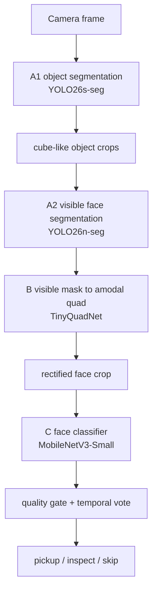

# Data Generation Blender

BlenderProc 기반 합성 데이터 생성, YOLO segmentation 학습, 그리고 로봇 경기용 fruit-cube 인식 파이프라인을 실험하는 저장소입니다.

이 문서는 전체 흐름을 빠르게 다시 잡기 위한 요약본입니다. 이전에 고려했던 세부 판단, 폐기한 방향, 실험 로그까지 보려면 [readme_specific.md](./readme_specific.md)를 보세요.

## 한 줄 결론

기존 100k 8-class YOLO 데이터셋을 계속 땜질해서 쓰는 방향은 접고, 앞으로는 Meta V2 metadata를 처음부터 저장하는 새 데이터 생성 구조에서 A1/A2/B/C 모델을 모두 다시 학습하는 방향입니다.

현재 다음 큰 단계는 50k Meta V2 dataset 생성과 A1/A2/B/C 연속 학습입니다.

## 지금까지 한 일

### 1. 기본 BlenderProc YOLO 생성기 구축

처음에는 BlenderProc로 cube, fruit cube, polyhedron을 합성 렌더링하고 YOLO segmentation 데이터셋을 만드는 구조를 만들었습니다.

기존 8-class 구조:

```text
0 banana
1 orange
2 pineapple
3 apple
4 cube
5 octahedron
6 dodecahedron
7 icosahedron
```

이 단계에서 한 일:

- COCO 배경 합성
- fruit texture 준비
- YOLO segmentation label 생성
- visibility threshold와 ideal visibility retry 추가
- 병렬 생성 스크립트 추가
- 학습 상태 메일 모니터링 추가
- 100k 규모 데이터셋과 YOLO26 학습 실험

### 2. 100k 데이터셋 기반 실험

기존 100k synthetic dataset은 object 전체 segmentation에는 쓸 수 있었지만, face-level 학습에는 부족했습니다.

확인된 한계:

- fruit face segment는 일부 metadata에 존재
- 모든 cube face의 4점 quad가 없음
- plain face mask가 없음
- occlusion 관계와 face별 visible/full mask가 충분하지 않음
- 모델 구조가 바뀌면 다시 Blender 렌더링을 해야 하는 문제가 있음

그래서 기존 100k를 A2/B/C 학습의 주 데이터로 쓰는 방향은 폐기했습니다.

### 3. Motion blur와 흔들림 대응

실제 카메라에서 흔들린 물체 인식이 약하다는 문제가 있었습니다.

검토한 방향:

- 기존 데이터셋 이미지에 상하좌우 motion blur augmentation
- 기존 best.pt에서 fine-tuning
- blur preview 100장 생성
- blur 강도 조절

결론:

- blur augmentation 자체는 도움이 될 수 있음
- 하지만 face classification에서 심한 blur는 softmax confidence만 믿으면 위험
- runtime에서 quality gate와 temporal vote가 필요

### 4. Arena booster 실험

공식 경기장 환경 적응을 위해 SUN-111 floor와 SUN-168 fence/wall 기반 arena booster 옵션을 추가했습니다.

추가한 개념:

- `--arena_booster_mode`
- SUN-111 wood floor
- SUN-168 matte beige low fence/panel
- robot camera view
- wall/corner scene
- wall contact placement
- motion blur hard negative
- plain cube hard negative
- apple/orange boost

중간 결론:

- 초기 arena booster는 실내 방 벽처럼 보여 수정이 필요했음
- 낮은 fence, top edge, corner view, floor contact, contact shadow 정책으로 개선
- 다만 현재는 Meta V2 구조 안정화가 먼저라 arena booster는 보류
- 50k 기준 학습은 우선 COCO 배경으로 진행

### 5. Task 1 / Task 2 분리 논의

한때 Task 1과 Task 2를 완전히 분리하거나, shape-only 모델을 따로 만들자는 방향을 검토했습니다.

검토한 내용:

- Task 1에는 cube, octahedron, dodecahedron, icosahedron만 학습
- fruit cube는 cube로 볼지, 별도 candidate로 볼지
- 기존 100k에서 fruit 없는 shape-only subset을 뽑을지
- shape-only booster를 별도 생성할지

최종 판단:

- 과일 사진이 안 보이는 fruit cube는 plain cube와 물리적으로 구분하기 어려움
- Task 기준으로 모델을 쪼개기보다 perception role 기준으로 나누는 편이 더 합리적
- 따라서 A1/A2/B/C 구조로 방향 전환

### 6. A1/A2/B/C 구조로 전환

현재 기준 모델 구조:



모델별 역할:

| 모델 | 입력 | 출력 | 현재 baseline |
| --- | --- | --- | --- |
| A1 | 640x640 전체 카메라 이미지 | `cube_like_object`, `octahedron`, `dodecahedron`, `icosahedron` segmentation | `yolo26s-seg.pt` |
| A2 | A1에서 나온 cube-like object crop | 보이는 `plain_face`, `fruit_face` segmentation | `yolo26n-seg.pt` |
| B | A2가 만든 visible-face mask crop | occlusion이 없었다면 있어야 할 face 4-corner quad | TinyQuadNet |
| C | B quad로 warp한 face crop | `apple`, `orange`, `banana`, `pineapple`, `plain`, `unknown` | MobileNetV3-Small |

중요한 정책:

- A2는 실제 보이는 face만 segment
- B는 visible mask에서 amodal quad 복원
- C는 실제 occlusion이 들어간 crop을 자연스럽게 받음
- 숨겨진 과일은 한 frame에서 억지로 분류하지 않음

### 7. Meta V2 metadata 도입

Meta V2는 모델 구조가 바뀌어도 Blender 재렌더링 없이 학습 target을 다시 만들 수 있게 하기 위한 metadata입니다.

Meta V2에 저장하는 것:

- object visible/full mask
- face visible/full mask
- face `quad_xy`, `quad_xy_raw`
- occluder object id
- visible ratio, bbox, polygon, quality
- 카메라 intrinsics/extrinsics
- lens distortion 정보
- object 3D location, rotation, scale, matrix_world
- material/custom property
- scene snapshot

현재 핵심 생성 스크립트:

- `scripts/generate_yolo_coco_composite.py`
- `scripts/run_yolo_parallel.py`
- `scripts/export_meta_v2_model_datasets.py`

### 8. C 모델 apple/orange hard-case 실험

C classifier에서 orange crop이 apple로 가거나, 반대로 apple이 orange로 가는 문제가 있었습니다.

검토한 방향:

- 2D mimic C dataset 100k 생성
- web orange texture 다운로드
- semantic filter 없는 web orange 제거
- orange-only hard fine-tune
- apple/orange balanced fine-tune
- 실제 hard-case pair anchor fine-tune

최종 선택:

```text
runs/meta_v2_c_facecls/c_mobilenetv3small_anchor_pair_exp006
```

로컬 최종 weight:

```text
weights/c_mobilenetv3small_final.pt
```

GitHub에는 weight가 올라가지 않으므로 metadata만 추적합니다.

```text
weights/c_mobilenetv3small_final.json
```

핵심 결과:

| case | result |
| --- | ---: |
| orange hard case, top_label_whitened | orange 0.999999 |
| apple target case, top_label_whitened | apple 0.9972 |
| original C val acc | 0.9854 |

관련 상세 로그:

- `reports/c_orange_hard_case_experiment_log.md`

### 9. 50k용 texture 정리

과일 texture는 기존 비율을 유지한 채 50k용 production pack으로 분리했습니다.

```text
datasets/fruit_textures/production_meta_v2_50000_v1
```

class별 수량:

| class | count |
| --- | ---: |
| apple | 1600 |
| orange | 1600 |
| banana | 1600 |
| pineapple | 1600 |

source type 비율:

| source type | count per class | ratio |
| --- | ---: | ---: |
| lab | 1040 | 65% |
| original_filtered | 400 | 25% |
| fruitseg30 | 160 | 10% |

web orange 실험 texture는 production에 직접 섞지 않고 archive로 이동했습니다.

```text
datasets/fruit_textures/_archive_experimental_20260623_c_hardcase
```

50k generation에서는 class/source sampling 비율은 유지하고, render-time texture 다양성만 늘립니다.

```text
--fruit_texture_aug strong
--fruit_texture_layout mixed
--fruit_texture_collage_prob 0.35
```

## 현재 실행할 것

50k Meta V2 생성과 A1/A2/B/C 학습:

```powershell
conda activate ai_robotics
cd C:\Users\user\Documents\Data_Generation_Blender

powershell -ExecutionPolicy Bypass -File scripts\run_meta_v2_50000_training_pipeline.ps1
```

50k pipeline 기본값:

```text
source dataset: datasets/meta_v2_50000_coco_texture_v1
model datasets: datasets/meta_v2_50000_coco_texture_v1_models
texture pack:   datasets/fruit_textures/production_meta_v2_50000_v1
texture layout: mixed
collage prob:   0.35
log dir:        logs/meta_v2_50000_pipeline
```

pipeline 순서:

```text
1. Meta V2 COCO image 50,000장 생성
2. A1/A2/B/C dataset export
3. C unknown hard negative 추가
4. A1 YOLO26s-seg 학습
5. A2 YOLO26n-seg 학습
6. B TinyQuadNet 학습
7. C MobileNetV3-Small 학습
```

## 주요 파일

| 파일 | 역할 |
| --- | --- |
| `readme_specific.md` | 상세 의사결정 기록 |
| `scripts/run_meta_v2_50000_training_pipeline.ps1` | 50k end-to-end pipeline |
| `scripts/run_meta_v2_10000_training_pipeline.ps1` | 10k/parameterized pipeline base |
| `scripts/export_meta_v2_model_datasets.py` | Meta V2에서 A1/A2/B/C dataset export |
| `scripts/train_tiny_quadnet.py` | B 모델 학습 |
| `scripts/train_face_mobilenetv3.py` | C 모델 학습 |
| `scripts/generate_c_anchor_pair_dataset.py` | C hard-case anchor pair dataset 생성 |
| `reports/c_orange_hard_case_experiment_log.md` | C 실험 상세 로그 |

## Git에 올라가지 않는 것

`.gitignore` 기준으로 다음은 로컬 산출물입니다.

```text
datasets/
runs/
logs/
*.pt
```

따라서 GitHub에는 코드, README, 실험 로그, 모델 metadata JSON만 올라가고, 실제 dataset과 학습 weight는 로컬에 남습니다.

## 다음 TODO

1. 50k pipeline 실행
2. 생성 중 Meta V2 mask/quad 품질 spot check
3. A1/A2/B/C validation 결과 비교
4. 실제 validation 이미지에서 end-to-end preview 확인
5. C에는 blur quality gate와 temporal vote 추가
6. Meta V2 안정화 후 arena booster 재개
