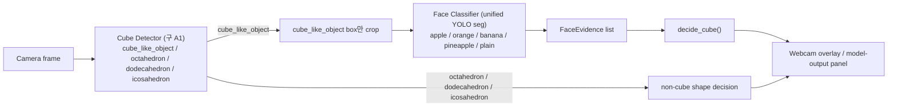

# Data Generation Blender

기준일: 2026-07-08

## 이 프로젝트는 무엇인가 (처음 보는 분용)

**로봇 경기에서 카메라로 물체를 알아보는 시스템**을 만드는 저장소입니다. 경기장에는 물체 28개가 놓입니다 — 도형 4종(정육면체류/8면체/12면체/20면체) 각 4개 + **과일 그림이 인쇄된 흰 큐브** 4종(apple/orange/banana/pineapple) 각 3개. 로봇은 웹캠으로 이 물체들을 보고 "저 큐브에 어떤 과일이 인쇄돼 있는지"를 판단해 집을지(pickup) 피할지(avoid) 결정해야 합니다.

문제는 학습 사진을 손으로 다 찍을 수 없다는 것 → **Blender(BlenderProc)로 가짜지만 사실적인 학습 이미지를 대량 합성**해서 YOLO 모델을 학습합니다. 이 저장소에는 ① 데이터를 합성하는 파이프라인, ② 학습/평가 스크립트, ③ PC와 Jetson Orin Nano에서 웹캠으로 실행하는 runtime이 모두 들어 있습니다.

인식은 2단계로 동작합니다:

1. **Cube Detector** — 화면 전체에서 "큐브 같은 물체"와 도형들을 찾습니다.
2. **Face Classifier** — 찾아낸 큐브 부분만 잘라(crop) 그 안에서 보이는 면이 어떤 과일인지/빈 면(plain)인지 판별합니다. **화면 전체에 직접 돌리는 모델이 아닙니다.**

### 처음이라면 이 순서로 보세요

1. 이 문서의 [용어 사전](#용어-사전)과 [Runtime 구조](#runtime-구조) — 시스템 큰 그림 (5분)
2. [빠른 시작](#빠른-시작) — 웹캠 preview 직접 실행해보기
3. Jetson에 올리려면 → [jetson/README.md](./jetson/README.md) (설치부터 문제 해결까지)
4. 데이터를 다시 만들거나 학습하려면 → [readme_specific.md](./readme_specific.md) (재현 명령 전문)
5. "이 실험 해봤나? 결과는?" → [EXPERIMENTS.md](./EXPERIMENTS.md) (모든 실험의 상태 색인)
6. "왜 이런 구조가 됐지?" → [HISTORY.md](./HISTORY.md) (발전 서사 + 과거 문서 복원 보관소)

## 용어 사전

역사적 이유로 코드/경로에는 옛 ABC cascade 시절 이름이 남아 있습니다. **문서에서는 아래 새 이름을 쓰고, 경로는 호환성 때문에 옛 이름을 유지합니다.** 코드 alias에는 이제 새 이름(`cube-detector` / `face-classifier`)이 추가되었고, 옛 alias(`preferred-a1`, `preferred-unified`, `preferred-unified-onnx`, `latest-unified`)도 legacy로 계속 동작합니다.

| 새 이름 (문서 기준) | 코드 alias (신규 / legacy 모두 동작) | 옛 이름 (코드/경로에 남아있음) | 역할 |
| --- | --- | --- | --- |
| **Cube Detector** | `cube-detector` (ONNX: `cube-detector-onnx`) — legacy `preferred-a1` | `A1`, `preferred-a1`, `meta_v2_a1_objectseg` | full frame에서 `cube_like_object` / `octahedron` / `dodecahedron` / `icosahedron` 탐지·분할 (YOLO26s-seg) |
| **Face Classifier** | `face-classifier` (ONNX: `face-classifier-onnx`) — legacy `preferred-unified` | `cube-face unified`, `preferred-unified` | Cube Detector가 찾은 **cube crop 안에서만** 실행. 보이는 면을 apple/orange/banana/pineapple/plain으로 분할·분류 (YOLO26n-seg) |
| **ABC cascade** (fallback) | — | `A1→A2→B→C` | 옛 4단계 구조: A1 object → A2 face seg → B quad → C classifier. 현재는 debug/비교용 |
| 모델 보관 경로 | — | `jetson/ABC_model/` | 이름과 달리 현재 runtime 모델도 여기 있음 (호환성 유지) |

현재 기본 runtime = **Cube Detector + Face Classifier 2단계 파이프라인** (구 명칭 "A1 + unified").

## 모델 발전 타임라인

git 이력과 리포트 기준 요약. **발전 서사와 각 시기의 교훈, 과거 문서 원문 위치는 [HISTORY.md](./HISTORY.md)**, 실험별 상태 표는 [EXPERIMENTS.md](./EXPERIMENTS.md).

| 시기 | 세대 | 무엇이 바뀌었나 | 왜 |
| --- | --- | --- | --- |
| 2026-05-14~30 | Object-only YOLO | 8-class 객체 탐지 단일 모델 + Blender 데이터 생성 파이프라인 구축 | 출발점. visible face 판별 불가 → deprecated |
| 2026-06-22~23 | Meta V2 + ABC cascade | face mask/quad/occlusion 메타데이터(Meta V2) 도입, A1→A2→B→C 4단계 완성 (~20-21 FPS, face match 98.26%) | face 단위 판단 필요. 다만 다단계 overhead 큼 |
| 2026-06-28~29 | Face Classifier(unified) v1→v2 | A2+B+C를 YOLO seg 하나로 통합 (cube crop 입력), whole-fruit/plain-hard balanced v2 | 속도(이후 47 FPS 확인)와 단순화. ABC는 fallback으로 |
| 2026-07-02~03 | verified fruit → flat-icon boundary | 검증 과일 balanced booster → 인쇄 아이콘 경계 booster, crop 정책 runtime/학습 정렬 | 실물 webcam에서 orange 아이콘이 apple로 흔들리는 문제 대응 시작 |
| 2026-07-04 | HSV stronger + color-outlier pruned | HSV 색 변형 booster 후 색 outlier 텍스처 pruning (mask mAP50 0.972) | 색 robustness 확대 + 오염 텍스처 제거. runtime distance/ambiguity guard 추가 |
| 2026-07-05~07 | Readd color-outlier base | pruning이 과잉 제거한 실물 텍스처 13,465장 복구 후 fine-tune (best epoch 83) | pruning이 hue 경계를 좁혀 실물 사진 대응 약화 → 게이트(6.16%≥5%) 통과 후 복구. 실물 세트 61.6→65.1% |
| 2026-07-08 | Sparse printed-icon booster (**완료·현재 preferred**) | 실패 원인을 "흰 면 위 6~16% 면적 인쇄 아이콘 + webcam 열화 구성 gap"으로 확정, `realistic_a4_sparse_icon` 10k 생성 후 120 epoch fine-tune (best epoch 47) | **실물 recorded orange 65.1% → 95.3%** (목표 80% 초과), arena probe apple/orange 68.8/69.7 → 81.2/78.8%. holdout 학습 미사용 |

## 데이터 생성 로직 (요약)

학습 데이터는 전부 Blender(BlenderProc) 합성입니다. 완전판(철학, 수치, 재현 명령 전문)은 **[docs/DATA_GENERATION.md](./docs/DATA_GENERATION.md)** — 아래는 핵심만.

**철학**: "이미지는 다양하고 지저분하게, 라벨은 보수적이고 깨끗하게." 라벨은 최종 렌더에서 **실제 보이는 픽셀만** 사용하고, **과일 사진 면이 보이지 않는 cube는 절대 과일로 학습시키지 않습니다** (숨겨진 과일은 분류하지 않는다 — 데이터와 런타임 양쪽에 같은 원칙).

**Visibility 수치 규칙** — fruit cube가 과일 class 라벨을 받으려면 전부 통과해야 합니다:

- `fruit_vis >= 0.10` (보이는 과일 면 픽셀 / full projected cube 면적)
- visible fruit face pixels `>= 300`, face bbox 가로/세로 `>= 10px`
- target visibility tier == actual tier
- 미달 시 과일이 아니라 `cube`로 fallback (버리지 않고 cube 검출 학습에 재활용)
- 생성 권장 하한은 더 보수적: `min_fruit_visible_ratio 0.22`, `min_fruit_face_pixels 1800` (단일 object는 2200), hard tier만 0.10/900 허용
- `obj_vis <= 0.10` object는 라벨에서 제외, `max_covered_ratio 0.80`

**난이도 tier**: easy 50% / mid 45% / hard 5% (easy=과일 면이 크게, mid=부분, hard=작거나 비스듬히). hard는 필요하지만 주력 분포가 되면 안 된다는 실험 결론으로 5% 고정.

**Texture 정책**: class별 1,600장 고정 pool — **lab(Fruits-360) 65% / crawled·original 25% / FruitSeg30 누끼 10%**. 한 cube는 한 class(3면), 같은 class 내 다른 texture 허용. texture class 불일치는 생성 즉시 실패(poison data 방지).

**Negative**: `negative_ratio 0.18` — 흰 cylinder/sphere distractor + 배경-only 장면으로 "흰 물체=cube" 암기 방지. 렌더 전 ideal geometry gate(최대 80회 재샘플링)로 비싼 render 낭비 없이 배치 품질을 보장합니다.

왜 이런 값이 됐는지(confusion 관찰→판단→조치 기록), 카메라 artifact/lens distortion 설계, Meta V2 스키마, 병렬 생성/`--resume` 규칙, 50k 재현 명령 전문, 최신 `realistic_a4_sparse_icon` 프로파일까지 → [docs/DATA_GENERATION.md](./docs/DATA_GENERATION.md).

## 한 줄 요약

- 기본 runtime: **Cube Detector + Face Classifier** (구 A1 + unified).
- Face Classifier는 cube crop 전용 — full frame에 직접 돌리면 안 됩니다.
- 현재 preferred checkpoint: `cube_face_unified_yolo26n_seg_sparse_icon_from_readd_adamw_lr1e5_ft_v1` best (epoch 47) — 실물 recorded orange 95.3%.
- ABC cascade는 fallback/debug 비교 기준으로 유지.
- 실험 상태 기준 문서: [EXPERIMENTS.md](./EXPERIMENTS.md) / Jetson 가이드: [jetson/README.md](./jetson/README.md).

## 빠른 시작

### 개발 PC에서 웹캠 Preview 실행

```powershell
cd C:\Users\user\Documents\Data_Generation_Blender
git lfs install
git lfs pull
python jetson\realtime_seg_cam.py --list-model-aliases

powershell -ExecutionPolicy Bypass -File jetson\run_webcam_preview.ps1 `
  -Python "C:\Users\user\anaconda3\envs\yolo\python.exe" `
  -Pipeline unified `
  -Camera 0 `
  -Device 0 `
  -TargetShape cube `
  -TargetFruit apple `
  -PrintModelOutput
```

`-PrintModelOutput`은 temporal vote 없이 매 frame의 Cube Detector/Face Classifier 출력과 `decide_cube()` 결과를 보여줍니다.

### Jetson Orin Nano에서 실행

```bash
cd ~/Data_Generation_Blender
git lfs install
git lfs pull
python3 jetson/realtime_seg_cam.py --list-model-aliases

./jetson/run_webcam_preview.sh \
  --pipeline unified \
  --camera 0 \
  --camera-backend v4l2 \
  --device 0 \
  --target-shape cube \
  --target-fruit apple \
  --print-model-output
```

Jetson 설치, TensorRT export, overlay 의미는 [jetson/README.md](./jetson/README.md)를 보세요.

### Unified Dataset 다시 만들기

```powershell
python scripts\export_meta_v2_cube_face_unified_dataset.py `
  --source_dataset datasets\meta_v2_50000_coco_texture_v1 `
  --output_root datasets\meta_v2_50000_cube_face_unified_v1 `
  --crop_size 224 `
  --crop_pad 0.18
```

### Face Classifier Fine-Tune

```powershell
powershell -ExecutionPolicy Bypass -File scripts\run_cube_face_unified_booster_finetune.ps1 `
  -SkipGenerate `
  -Epochs 120 `
  -Batch 512 `
  -Workers 4 `
  -Patience 30
```

새 학습은 기존 production weights를 덮어쓰지 말고 새 `runs/*` 이름으로만 진행합니다.

### 실험 기록 찾기

1. [EXPERIMENTS.md](./EXPERIMENTS.md)의 표에서 `status`, `판단`, `report path` 확인.
2. 상세 기술 근거는 [readme_specific.md](./readme_specific.md).

## Runtime 구조



중요한 제한:

- `preferred-unified`(Face Classifier)는 cube crop 모델입니다. full frame에 직접 돌리면 배경/모서리/벽을 face처럼 잡을 수 있습니다.
- Cube Detector가 `cube_like_object`를 찾은 crop에 대해서만 Face Classifier를 실행합니다.
- non-cube shape은 Face Classifier에 넣지 않고 Cube Detector 결과만으로 `decide_shape()`가 처리합니다.

## Runtime 판단 로직

webcam unified path는 `jetson/realtime_seg_cam.py`에서 cube crop을 만들고, Face Classifier 결과를 `FaceEvidence`로 바꿔 `jetson/abc_inference.py`의 `decide_cube()`를 호출합니다.

| Evidence | 판단 | action 규칙 | 설명 |
| --- | --- | --- | --- |
| Detector = `octahedron`/`dodecahedron`/`icosahedron` | shape identity | `--target-shape` 일치 시 `pickup`, 아니면 `skip`/`inspect` | Face Classifier 미실행 |
| Detector = `cube_like_object`, bbox 너무 작음 | `cube_too_far` | `inspect` | face 판별 불가 크기면 crop 생성 안 함 |
| Detector = `cube_like_object` | crop → Face Classifier | face evidence 단계로 | cube-like crop만 입력 |
| fruit class 1종 검출 | `fruit_cube:<fruit>` | target 일치 `pickup` / 불일치 `avoid` / target 없음 `inspect` | 신뢰 가능한 fruit face가 보이면 plain 아님 |
| fruit class 여러 종 | `conflicting_fruit_cube` | `inspect` | 규칙상 충돌 |
| reliable face 없음 | `cube_like_unresolved` | `inspect` | cube만 보고 plain 확정 금지 |
| unknown/reject face 존재 | `cube_like_unresolved` | `inspect` | unified는 low-confidence/no-detection reject로 처리 |
| plain face 1개만 | `blank_only_cube_ambiguous` | `inspect` | 저각도에서 위쪽 fruit면이 프레임 밖일 수 있음 |
| reliable plain face 2개 이상, fruit/unknown 없음 | `plain_cube` | `--target-shape cube`면 `pickup` | 규칙상 fruit면이 위로 배치되어 2 blank면은 fruit cube 불가 |

반드시 지켜야 할 정책:

- `cube_like_object`만 보인다고 `plain_cube` 확정 금지.
- `cube_too_far`는 crop이 없으므로 face output도 없음.
- fruit face가 하나라도 신뢰되면 plain cube 아님.
- plain-only는 1면이면 ambiguous, 2면 이상이면 `plain_cube` (규칙상 fruit면이 위로 와서 hidden fruit 불가).
- `decide_cube()`는 내부 temporal vote/track memory가 없음. 반복 evidence는 caller/tracker에서.
- runtime threshold는 [jetson/runtime_policy.py](./jetson/runtime_policy.py): `CUBE_TOO_FAR_*`(작은 cube gate).

## FaceEvidence 구조

`FaceEvidence`는 [jetson/abc_inference.py](./jetson/abc_inference.py)에 정의.

| 필드 | 의미 |
| --- | --- |
| `face_index` | object/crop 안 face index |
| `kind` | `fruit_face` / `plain_face` / `unknown_face` |
| `label` | `apple`/`orange`/`banana`/`pineapple`/`plain`/`unknown` |
| `confidence` | decision rule이 쓰는 class confidence |
| `detector_confidence` | seg/detector confidence (unified mode에서는 `confidence`와 동일) |
| `box_xyxy` | frame 좌표 face box |
| `quad_xy` | face 4점 quad (unified는 box quad, ABC는 refined 가능) |
| `visible_pixels` | mask/visible area 추정 |
| `raw_quad_xy` | refinement 전 quad |
| `segments_xy` | segmentation polygon |
| `source` | `A1+Unified` 또는 `A2+B+C` |

object-level wrapper는 `ObjectEvidence` (detector class/conf, object box/mask, face list, `ObjectDecision`).

## Threshold 기준

코드 기본값이며 경기 최종값 아님 — 실물 카메라 replay로 튜닝 필요.

| Threshold | 기본값 | 위치 | 의미 |
| --- | ---: | --- | --- |
| Cube Detector confidence | `0.25` | `realtime_seg_cam.py --unified-a1-conf` | full-frame detection gate |
| Face Classifier confidence | `0.25` | `realtime_seg_cam.py --conf` | cube crop 안 face gate |
| Overlap suppression | `0.6` | `realtime_seg_cam.py --overlap` | preview 겹침 box 숨김 |
| ABC A2 confidence | `0.20` | `abc_inference.py --a2-conf` | (fallback) face seg gate |
| ABC C confidence | `0.55` | `abc_inference.py --c-conf` | 미만이면 `unknown` |
| ABC min face pixels | `120` | `abc_inference.py` | A2 face size filter |
| ABC min face-object overlap | `0.45` | `abc_inference.py --min-face-object-overlap` | object mask 밖 face reject |

unified runtime에는 explicit top1-top2 margin threshold와 내부 temporal vote가 없습니다 (per-frame evidence).

## 필요한 Weights

fresh clone은 Git LFS 필요: `git lfs install && git lfs pull`. alias 확인: `python jetson/realtime_seg_cam.py --list-model-aliases`

| Alias | 경로 | 역할 |
| --- | --- | --- |
| `preferred-a1` | `jetson/ABC_model/meta_v2_a1_objectseg/a1_yolo26s_seg_meta_v2_50000/weights/best.pt` | Cube Detector |
| `preferred-unified` | `jetson/ABC_model/cube_face_unified/preferred_v2/weights/best.pt` | Face Classifier |
| `latest-unified` | `latest_experiment`가 있으면 그것, 없으면 preferred | 실험용 — production은 `preferred-unified` |

## 현재 Preferred Checkpoint

2026-07-08 기준:

```text
runs/segment/cube_face_unified_yolo26n_seg_readd_coloroutlier_base_from_pruned_adamw_lr1e5_ft_v1/weights/best.pt
jetson/ABC_model/cube_face_unified/preferred_v2/weights/best.pt
```

선택 이유와 상태:

- 직전 preferred(HSV pruned color-outlier)에서 출발, pruning 때 제거된 실물 텍스처(kind=base) 13,465장을 복구한 mix(train 64,604 / val 6,466)로 fine-tune. 학습 전 게이트: 직전 모델 f2f 오류 6.16% ≥ 5% 통과.
- AdamW `lr0=1e-5`, `lrf=0.05`, `warmup 0`, `batch 512`, `imgsz 224`, `cache=disk`, `workers 8`. patience 35로 epoch 118 조기 종료, best epoch 83.
- mix val: all mask mAP50/mAP50-95 `0.970 / 0.894`, box `0.970 / 0.923`.
- 직전 대비: readd 게이트 f2f 6.16% → 5.15%, 실물 orange 녹화 세트 orange 인식 61.6% → 65.1%.
- 남은 한계: 실물 printed-icon 구성(흰 면 위 8~10% 아이콘)은 목표(80%) 미달 — 원인은 composition gap으로 확정 ([why 분석](./reports/cube_face_unified_eval/why_recorded_set_fails_20260708/analysis.md)). 대응 booster(`realistic_a4_sparse_icon` 10k) 학습 진행 중 ([레시피/검증](./reports/cube_face_unified_eval/sparse_icon_probe_iterations_20260708/summary.md)).
- blank/sliver 크롭의 저신뢰 fruit 오탐 → **runtime fruit-conf guard(`--fruit-min-conf 0.45`)로 방어됨** (2026-07-08): decide_cube가 저신뢰 fruit face를 `cube_like_unresolved`로 처리. recorded holdout 기준 정답 orange 100% 유지 + blank 오탐 88% 제거. 값은 실측 튜닝 대상.
- Jetson `preferred_v2/weights/best.pt`로 복사되어 `preferred-unified` alias로 로드. `best.engine`은 stale이라 제거됨 — Jetson에서 새 `best.onnx`로 재빌드 필요.

## Dataset / Texture 정책

| Source | 상태 | 허용 | 금지 | 승격 조건 |
| --- | --- | --- | --- | --- |
| Meta V2 synthetic dataset | current | base training/validation/전 모델 export | 없음 | production lineage |
| production texture mix | current | base 합성 생성 | report 없는 ratio 변경 | report + validation |
| whole-fruit/plain-hard materialized v2 | training source | conservative fine-tune | production weights 직접 덮어쓰기 | validation + runtime probe |
| web cutout sets | rejected | probing/error 분석 | direct training | manual cleanup + balanced validation |
| **사용자 orange webcam crops + 실물 녹화 세트** (`reports/unified_recorded_input_frame_sort_20260706_165440`) | **evaluation-only holdout** | 평가/진단/회귀 확인 | **모든 형태의 training (원본/크롭/증강/합성 재료) 절대 금지** | 영구 평가 전용 |
| AI whole-fruit / printed full-square booster | candidate | low-ratio booster 실험 | 자동 production 교체 | validation + real camera replay |
| sparse printed-icon booster (`realistic_a4_sparse_icon`) | candidate (학습 중) | 실패 regime 커버 booster | holdout 재료 사용 | 면적 스윕 게이트 + recorded 평가-only 80% + val 회귀 없음 |

Face Classifier class set: `0 apple / 1 orange / 2 banana / 3 pineapple / 4 plain`.
explicit `unknown` class는 없습니다 — low-confidence/no-detection reject로 처리. `plain`은 blank cube face이지 unknown/background가 아닙니다.

## 주요 결과

FPS는 측정 조건이 같을 때만 비교.

| 항목 | 값 | 장치 | 형식 | 입력 | 조건 | Report |
| --- | ---: | --- | --- | --- | --- | --- |
| 현재 preferred mask mAP50-95 | `0.894` | RTX 5080 | `.pt` | pruned+readd mix val (6,466) | face instances | run `..._readd_coloroutlier_base_..._ft_v1` best ep83 |
| 현재 preferred box mAP50-95 | `0.923` | RTX 5080 | `.pt` | 동일 | face instances | 동일 |
| 실물 orange 녹화 세트 orange 인식 | `65.1%` (직전 61.6%) | RTX 5080 | `.pt` | recorded 86 crops (평가 전용) | fruit top | [비교](./reports/cube_face_unified_eval/recorded_hardset_old_vs_readd_final_20260708/summary.md) |
| Orange hard-case 2장 | `1/2 orange`, `1/2 apple(0.604)` | RTX 5080 | `.pt` | 사용자 제공 crops (평가 전용) | fruit top | [summary](./reports/cube_face_unified_eval/pruned_coloroutlier_best_val_20260704/summary.md) |
| sparse-icon booster 10k에 대한 현재 모델 | fruit 오류 16.7%, apple 72.9% | RTX 5080 | `.pt` | booster val 1,427 | fruit top | [반복 기록](./reports/cube_face_unified_eval/sparse_icon_probe_iterations_20260708/summary.md) |
| Flat-icon 세대 mask mAP50-95 | `0.901` | RTX 5080 | `.pt` | flat-icon mix val | face instances | run `..._flat_icon_boundary_..._ft_v1` ep46 |
| Verified-fruit 세대 mask mAP50-95 | `0.896` | RTX 5080 | `.pt` | verified mix val | face instances | run `..._verified_fruit_balanced_..._ft_v1` |
| Unified v2 mask mAP50-95 | `0.87483` | RTX 5080 | `.pt` | materialized v2 val | face instances | [summary](./reports/cube_face_unified_eval/balanced_v2_20260629/summary.md) |
| Plain mask recall (baseline→v2) | `0.78489 → 0.89644` | RTX 5080 | `.pt` | materialized v2 val | plain faces | 동일 |
| Detector TensorRT + Face `.pt` benchmark | mean `47.45 FPS` | RTX 5080 | `.engine`+`.pt` | benchmark images | 평균 4.05 objects/11.65 faces | [json](./reports/cube_face_unified_eval/unified_runtime_benchmark_a1engine_ptface.json) |
| Webcam 공정 비교 unified vs ABC | `3.83` vs `1.29 FPS` | dev PC(cpu) | `.pt` | 같은 30s capture | 동일 capture | [summary](./reports/share/fair_30s_compare_20260702_155104/summary.md) |
| 최적화 ABC cascade (fallback) | `20-21 FPS`, face match `98.26%` | RTX 5080 | mixed | 4-object benchmark | ~12 faces | [log](./jetson/OPTIMIZATION_EXPERIMENTS.md) |

## 알려진 약점

- `decide_cube()`는 per-frame rule — track memory/temporal vote 없음. plain cube pickup은 보수적으로.
- explicit `unknown` class 없음 — low-confidence reject가 대행.
- 실물 printed-icon 구성 미해결 (recorded 65.1%, 목표 80%) — sparse-icon booster 진행 중.
- blank/sliver 저신뢰 fruit 오탐 → runtime fruit-conf guard(`--fruit-min-conf 0.45`)로 방어. 정확한 값은 실측 튜닝 대상.
- banana confidence가 낮은 whole-fruit case 다수, pineapple↔banana 흔들림 가능.
- 사용자 orange hard-case 2장 중 1장 여전히 apple.
- web cutout은 noisy — production training 직접 투입 금지.
- unified는 real 4-corner keypoint 미출력 (mask+box quad 사용, ABC가 더 풍부한 geometry).

## 권장 다음 실험

1. **sparse printed-icon booster 학습 완료 및 게이트 판정** (진행 중 — 30ep 프로브 후 120ep).
2. plain cube decision에 track-memory gate (여러 frame plain evidence 반복 후 승격).
3. banana hard-case / pineapple-vs-banana booster.
4. unified crop background에 대한 explicit unknown/reject policy.
5. unified mask 기반 cube fitting을 ABC geometry와 비교.
6. booster checkpoint 승격 전 real robot camera replay.

## 문서 지도

| 문서 | 역할 | 이런 질문일 때 |
| --- | --- | --- |
| [readme.md](./readme.md) | overview, 용어, quick start, runtime 구조/판단 로직 | "이 프로젝트 뭐지? 일단 돌려보자" |
| [docs/DATA_GENERATION.md](./docs/DATA_GENERATION.md) | 데이터 생성 로직 완전판 — visibility 철학/수치, 권장 기본값 표, 텍스처 파이프라인, 운영 절차 | "데이터를 왜/어떻게 이렇게 만들었나" |
| [readme_specific.md](./readme_specific.md) | 기술 reference — 재현 명령 전문, booster 규칙, validation 절차, 배포 이력 archive | "데이터/학습을 정확히 재현하려면?" |
| [EXPERIMENTS.md](./EXPERIMENTS.md) | 모든 실험의 상태(preferred/fallback/rejected) 색인 | "이 실험 해봤나? 써도 되나?" |
| [HISTORY.md](./HISTORY.md) | 발전 서사 + 과거 삭제 문서 복원 보관소 (`docs/history/`) | "왜 이런 구조가 됐지? 옛 정책 원문은?" |
| [jetson/README.md](./jetson/README.md) | Jetson Orin Nano 설치→실행→문제해결 가이드 | "Jetson에 올리자" |
| [jetson/OPTIMIZATION_EXPERIMENTS.md](./jetson/OPTIMIZATION_EXPERIMENTS.md) | ABC runtime 최적화 실험 E000~E042 로그 | "ABC를 왜/어떻게 최적화했나" |
| `jetson/ABC_model/cube_face_unified/preferred_v2/MODEL_VERSION.md` | 현재 배포 checkpoint 상세 (계보/지표/해시) | "지금 배포된 모델 정확히 뭐야?" |
| [BACKUP_MANIFEST.md](./BACKUP_MANIFEST.md) | 2026-05-16 구세대 백업 스냅샷 (보존용) | 초기 상태 복구 |
